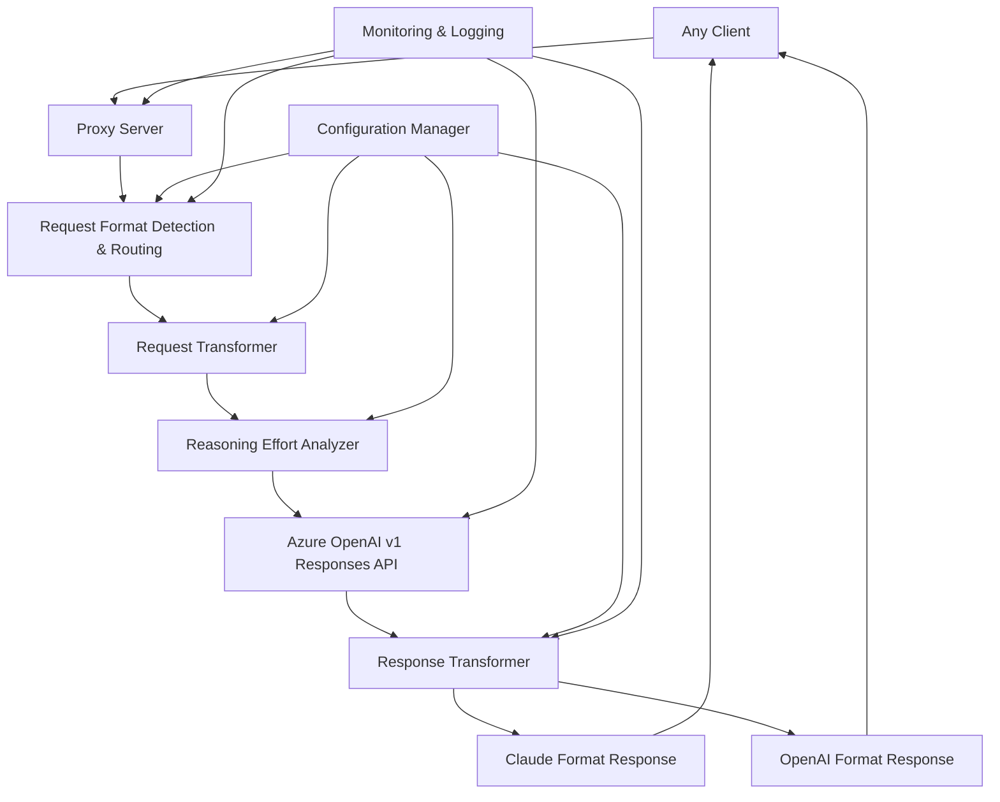

# Design Document

## Overview

This design outlines the migration from Azure OpenAI Chat Completions API to the Responses API to fully leverage GPT-5-Codex's advanced reasoning capabilities across multiple development environments. The migration will use the latest Azure OpenAI v1 API with API key authentication, maintaining full compatibility with Claude Code CLI and various development tools (Android Studio, VS Code, IntelliJ IDEA) while providing language-specific optimizations for Python, Java, Spring Cloud, TypeScript, React, Vue, shell scripts, and other programming languages. The system unlocks enhanced reasoning, structured outputs, and improved conversation management tailored to different technology stacks.

## Design Decisions and Rationales

### 1. Universal Request Processing Architecture

**Decision**: Implement a universal request processor that detects request format and routes to appropriate transformers, responding in the same format as the request.

**Rationale**: This design supports any client that can send Claude-format or OpenAI-format requests (Requirements 10.1, 10.2) while maintaining backward compatibility. The focus on request format detection rather than client identification simplifies the architecture and makes it more robust and client-agnostic.

### 2. Intelligent Reasoning Effort Analysis

**Decision**: Implement dynamic reasoning effort adjustment based on task complexity analysis and language-specific optimizations.

**Rationale**: This maximizes the value of GPT-5-Codex's reasoning capabilities (Requirement 2.2, 2.3) while optimizing for performance across multiple programming languages. Complex tasks in Java/Spring Cloud, Python/Django, React/Vue, and Android development get enhanced reasoning (Requirements 10.3-10.7, 10.12), while simple code completion requests use minimal effort for speed (Requirement 10.8).

### 3. Dual Format Support

**Decision**: Support both Claude and OpenAI request/response formats, responding in the same format as the request.

**Rationale**: Any client can send requests in either format (Requirements 10.1, 10.2), and responding in the matching format (Requirements 10.5, 10.6) ensures optimal compatibility and user experience regardless of the client used.

### 4. Conversation Context Management

**Decision**: Implement conversation tracking with previous_response_id for enhanced context continuity.

**Rationale**: The Responses API's conversation management features (Requirement 5.1, 5.2) provide better context understanding for multi-turn coding sessions, especially important for iterative development in Xcode (Requirement 10.7).

### 5. Comprehensive Security Layer

**Decision**: Implement input validation, sanitization, rate limiting, and secure error handling throughout the system.

**Rationale**: Security requirements (Requirement 11) mandate comprehensive protection while maintaining functionality. The design ensures no sensitive data exposure while providing detailed internal logging for debugging.

### 6. Fallback Strategy Implementation

**Decision**: Implement graceful degradation when Responses API is unavailable rather than complete failure.

**Rationale**: Requirement 4.5 mandates appropriate fallback behavior. This ensures service continuity even during API outages, maintaining user productivity.

### 7. Multi-Language Content-Based Optimizations

**Decision**: Implement content-based reasoning adjustments with language-specific task detection for Python, Java, Spring Cloud, TypeScript, React, Vue, Android development, and shell scripting.

**Rationale**: Users benefit from enhanced reasoning for complex development tasks across multiple technology stacks (Requirements 10.3-10.7, 10.12, 11.1-11.9) while maintaining fast responses for simple completions (Requirement 10.8). This balances quality and performance based on the actual content, programming language, and complexity of requests rather than client type, providing optimal assistance for diverse development environments.

### 8. Language-Specific Context and Framework Detection

**Decision**: Implement intelligent detection of programming languages, frameworks, and development contexts to provide tailored assistance.

**Rationale**: Different programming languages and frameworks have unique patterns, best practices, and complexity considerations (Requirement 11). By detecting Python/Django, Java/Spring Boot, React/Vue patterns, Android development contexts, and DevOps scenarios, the system can provide more accurate and contextually relevant assistance. This ensures developers receive language-appropriate suggestions and framework-specific optimizations regardless of their development environment.

### 9. Multi-Environment Development Support

**Decision**: Design the system to be client-agnostic while providing optimized experiences for different development environments (Android Studio, VS Code, IntelliJ IDEA, etc.).

**Rationale**: Modern development teams use diverse toolchains and environments. By focusing on request content and programming language context rather than specific client identification, the system can provide optimal assistance across all development environments while maintaining a single, maintainable codebase. This approach supports Requirements 10.1-10.12 and 11.1-11.9 by ensuring consistent, high-quality assistance regardless of the development tool being used.

## Architecture

### High-Level Architecture



### API Client Architecture

```mermaid
graph LR
    A[OpenAI Client] --> B[Azure OpenAI v1 Endpoint]
    A --> C[API Key Authentication]
    A --> D[Responses API Interface]
    
    B --> E[https://RESOURCE-NAME.openai.azure.com/openai/v1/?api-version=2025-04-01-preview]
    C --> F[Bearer Token Header]
    D --> G[client.responses.create()]
```

## Components and Interfaces

### 1. Request Format Detection and Routing

```typescript
interface FormatDetector {
  detectRequestFormat(request: IncomingRequest): RequestFormat;
  getResponseFormat(requestFormat: RequestFormat): ResponseFormat;
}

type RequestFormat = 'claude' | 'openai';
type ResponseFormat = 'claude' | 'openai';

interface IncomingRequest {
  headers: Record<string, string>;
  body: unknown;
  path: string;
  userAgent?: string;
}

class FormatDetectionService implements FormatDetector {
  detectRequestFormat(request: IncomingRequest): RequestFormat {
    // Detect request format based on request structure
    if (this.isClaudeFormat(request.body)) return 'claude';
    if (this.isOpenAIFormat(request.body)) return 'openai';
    return 'claude'; // Default to Claude format for backward compatibility
  }
  
  getResponseFormat(requestFormat: RequestFormat): ResponseFormat {
    // Response format always matches request format
    return requestFormat;
  }
  
  private isClaudeFormat(body: unknown): boolean {
    // Check for Claude-specific format indicators
    return typeof body === 'object' && 
           body !== null && 
           (('anthropic-version' in (body as any)) ||
            ('system' in (body as any)) ||
            this.hasClaudeContentBlocks(body));
  }
  
  private isOpenAIFormat(body: unknown): boolean {
    // Check if request matches OpenAI API format
    return typeof body === 'object' && 
           body !== null && 
           'messages' in body &&
           !this.isClaudeFormat(body) &&
           this.hasOpenAIStructure(body);
  }
  
  private hasClaudeContentBlocks(body: unknown): boolean {
    // Check if messages contain Claude-style content blocks
    if (typeof body === 'object' && body !== null && 'messages' in (body as any)) {
      const messages = (body as any).messages;
      return Array.isArray(messages) && 
             messages.some(msg => 
               Array.isArray(msg.content) && 
               msg.content.some((block: any) => 
                 typeof block === 'object' && 'type' in block
               )
             );
    }
    return false;
  }
  
  private hasOpenAIStructure(body: unknown): boolean {
    // Check for OpenAI-specific structure (simple string content in messages)
    if (typeof body === 'object' && body !== null && 'messages' in (body as any)) {
      const messages = (body as any).messages;
      return Array.isArray(messages) && 
             messages.every(msg => 
               typeof msg.content === 'string' && 
               ['user', 'assistant', 'system'].includes(msg.role)
             );
    }
    return false;
  }
}
```

### 2. Azure OpenAI Client Configuration

```typescript
interface AzureOpenAIConfig {
  readonly baseURL: string; // https://RESOURCE-NAME.openai.azure.com/openai/v1/
  readonly apiKey: string;
  readonly apiVersion: string; // "2025-04-01-preview"
  readonly deployment: string; // GPT-5-Codex deployment name
  readonly timeout: number;
  readonly maxRetries: number;
}

interface ResponsesAPIClient {
  create(params: ResponsesCreateParams): Promise<ResponsesResponse>;
  createStream(params: ResponsesCreateParams): AsyncIterable<ResponsesStreamChunk>;
}
```

### 3. Request Transformation Layer

```typescript
interface UniversalTransformer {
  transformRequest(request: UniversalRequest, clientType: ClientType): ResponsesCreateParams;
  transformResponse(response: ResponsesResponse, format: ResponseFormat): UniversalResponse;
  transformStreamChunk(chunk: ResponsesStreamChunk, format: ResponseFormat): UniversalStreamChunk;
}

interface ClaudeToResponsesTransformer {
  transformRequest(claudeRequest: ClaudeRequest): ResponsesCreateParams;
  transformResponse(responsesResponse: ResponsesResponse): ClaudeResponse;
  transformStreamChunk(chunk: ResponsesStreamChunk): ClaudeStreamChunk;
}

interface OpenAIToResponsesTransformer {
  transformRequest(openaiRequest: OpenAIRequest): ResponsesCreateParams;
  transformResponse(responsesResponse: ResponsesResponse): OpenAIResponse;
  transformStreamChunk(chunk: ResponsesStreamChunk): OpenAIStreamChunk;
}

interface ResponsesCreateParams {
  model: string;
  input: string | ResponseMessage[];
  max_output_tokens?: number;
  reasoning?: {
    effort: 'low' | 'medium' | 'high'; // GPT-5-Codex supported values only
  };
  stream?: boolean;
  temperature?: number;
  top_p?: number;
  previous_response_id?: string;
  tools?: ResponsesTool[];
  tool_choice?: 'auto' | 'none' | { type: 'function'; function: { name: string } };
  response_format?: {
    type: 'text' | 'json_object' | 'json_schema';
    json_schema?: JsonSchema;
  };
}

interface ResponsesTool {
  type: 'function';
  function: {
    name: string;
    description: string;
    parameters: JsonSchema;
  };
}
```

### 3. Reasoning Effort Intelligence

```typescript
interface ReasoningEffortAnalyzer {
  analyzeRequest(request: ClaudeRequest): ReasoningEffort | undefined;
  shouldApplyReasoning(request: ClaudeRequest): boolean;
  detectComplexityFactors(request: ClaudeRequest): ComplexityFactors;
  adjustEffortBasedOnContext(context: ConversationContext, factors: ComplexityFactors): ReasoningEffort | undefined;
  detectLanguageContext(request: ClaudeRequest): LanguageContext;
}

// GPT-5-Codex Responses API supported reasoning effort values
type ReasoningEffort = 'low' | 'medium' | 'high';

interface ComplexityFactors {
  readonly contentLength: number;
  readonly messageCount: number;
  readonly codeBlockCount: number;
  readonly languageContext: LanguageContext;
  readonly hasArchitecturalKeywords: boolean;
  readonly hasAlgorithmicKeywords: boolean;
  readonly hasDebuggingKeywords: boolean;
  readonly isSimpleCompletion: boolean;
  readonly conversationDepth: number;
  readonly hasMultipleLanguages: boolean;
  readonly hasComplexFrameworkPatterns: boolean;
}

interface LanguageContext {
  readonly primaryLanguage: ProgrammingLanguage;
  readonly frameworks: Framework[];
  readonly complexity: TaskComplexity;
  readonly developmentType: DevelopmentType;
}

type ProgrammingLanguage = 
  | 'python' | 'java' | 'kotlin' | 'typescript' | 'javascript' 
  | 'shell' | 'bash' | 'swift' | 'go' | 'rust' | 'unknown';

type Framework = 
  | 'django' | 'fastapi' | 'flask' | 'spring-boot' | 'spring-cloud'
  | 'react' | 'vue' | 'angular' | 'android-sdk' | 'express'
  | 'nestjs' | 'next' | 'nuxt' | 'unknown';

type TaskComplexity = 'simple' | 'medium' | 'complex' | 'architectural';
type DevelopmentType = 'completion' | 'debugging' | 'architecture' | 'testing' | 'devops';

interface TaskComplexityIndicators {
  readonly algorithmKeywords: string[];
  readonly architectureKeywords: string[];
  readonly debuggingKeywords: string[];
  readonly simpleTaskKeywords: string[];
  readonly languageSpecific: Record<ProgrammingLanguage, LanguageIndicators>;
}

interface LanguageIndicators {
  readonly complexityKeywords: string[];
  readonly frameworkKeywords: string[];
  readonly simplePatterns: string[];
  readonly architecturalPatterns: string[];
}

interface LanguageDetector {
  detectPrimaryLanguage(content: string): ProgrammingLanguage;
  detectFrameworks(content: string, language: ProgrammingLanguage): Framework[];
  analyzeTaskComplexity(content: string, language: ProgrammingLanguage): TaskComplexity;
  determineDevelopmentType(content: string): DevelopmentType;
}

interface ComplexityAnalyzer {
  analyzeContentComplexity(request: ClaudeRequest): ComplexityFactors;
  shouldUseReasoning(factors: ComplexityFactors): boolean;
  determineReasoningLevel(factors: ComplexityFactors): ReasoningEffort;
  
  // Content-based analysis
  analyzeContentLength(content: string): 'short' | 'medium' | 'long';
  countCodeBlocks(messages: ClaudeMessage[]): number;
  detectArchitecturalPatterns(content: string): boolean;
  detectAlgorithmicComplexity(content: string): boolean;
  isSimpleCompletion(content: string): boolean;
  
  // Context-based analysis
  analyzeConversationDepth(messageCount: number): 'shallow' | 'medium' | 'deep';
  detectMultiLanguageContext(messages: ClaudeMessage[]): boolean;
  analyzeFrameworkComplexity(frameworks: Framework[], content: string): boolean;
}

interface ReasoningDecisionEngine {
  // Main decision logic - returns undefined if no reasoning needed
  decideReasoningEffort(factors: ComplexityFactors): ReasoningEffort | undefined;
  
  // Decision criteria
  readonly simpleCompletionThreshold: number; // Content length below which we skip reasoning
  readonly complexityThreshold: number; // Content length above which we consider reasoning
  readonly architecturalKeywordWeight: number;
  readonly algorithmicKeywordWeight: number;
  readonly frameworkComplexityWeight: number;
  readonly conversationDepthWeight: number;
}
```

### 4. Tool Usage and Structured Outputs

```typescript
interface ToolCallHandler {
  handleToolCalls(toolCalls: ResponsesToolCall[]): Promise<ToolCallResult[]>;
  transformClaudeToolCall(claudeToolCall: ClaudeToolCall): ResponsesToolCall;
  transformResponsesToolResult(result: ResponsesToolResult): ClaudeToolResult;
}

interface ResponsesToolCall {
  id: string;
  type: 'function';
  function: {
    name: string;
    arguments: string;
  };
}

interface ClaudeToolCall {
  type: 'tool_use';
  id: string;
  name: string;
  input: Record<string, unknown>;
}

interface StructuredOutputHandler {
  validateStructuredOutput(output: unknown, schema?: JsonSchema): boolean;
  transformToClaudeFormat(structuredOutput: unknown): ClaudeContentBlock[];
  transformToOpenAIFormat(structuredOutput: unknown): OpenAIMessage;
}

interface JsonSchema {
  type: string;
  properties?: Record<string, JsonSchema>;
  required?: string[];
  items?: JsonSchema;
}
```

### 5. Conversation Management

```typescript
interface ConversationManager {
  trackConversation(conversationId: string, responseId: string): void;
  getPreviousResponseId(conversationId: string): string | undefined;
  cleanupOldConversations(): void;
  getConversationMetrics(conversationId: string): ConversationMetrics;
}

interface ConversationContext {
  readonly conversationId: string;
  readonly messageCount: number;
  readonly previousResponseId?: string;
  readonly taskComplexity: 'simple' | 'medium' | 'complex';
  readonly totalTokensUsed: number;
  readonly averageResponseTime: number;
}

interface ConversationMetrics {
  readonly messageCount: number;
  readonly totalTokensUsed: number;
  readonly reasoningTokensUsed: number;
  readonly averageResponseTime: number;
  readonly errorCount: number;
}
```

## Data Models

### Request/Response Models

```typescript
// Azure OpenAI Responses API Models
interface ResponsesResponse {
  id: string;
  object: 'response';
  created: number;
  model: string;
  output: ResponseOutput[];
  usage: ResponseUsage;
}

interface ResponseOutput {
  type: 'text' | 'reasoning' | 'tool_call' | 'tool_result';
  text?: string;
  reasoning?: {
    content: string;
    status: 'in_progress' | 'completed';
  };
  tool_call?: ResponsesToolCall;
  tool_result?: {
    tool_call_id: string;
    content: string;
    is_error?: boolean;
  };
}

interface ResponseUsage {
  prompt_tokens: number;
  completion_tokens: number;
  total_tokens: number;
  reasoning_tokens?: number;
}

// Claude API Compatibility Models
interface ClaudeRequest {
  model: string;
  messages: ClaudeMessage[];
  max_tokens?: number;
  temperature?: number;
  top_p?: number;
  stream?: boolean;
  system?: string;
}

interface ClaudeMessage {
  role: 'user' | 'assistant' | 'system';
  content: string | ClaudeContentBlock[];
}

interface ClaudeContentBlock {
  type: 'text' | 'image' | 'tool_use' | 'tool_result';
  text?: string;
  source?: {
    type: 'base64';
    media_type: string;
    data: string;
  };
  id?: string;
  name?: string;
  input?: Record<string, unknown>;
  tool_use_id?: string;
  content?: string | ClaudeContentBlock[];
  is_error?: boolean;
}

// OpenAI API Compatibility Models (for Xcode 26)
interface OpenAIRequest {
  model: string;
  messages: OpenAIMessage[];
  max_tokens?: number;
  temperature?: number;
  top_p?: number;
  stream?: boolean;
  response_format?: {
    type: 'text' | 'json_object';
  };
}

interface OpenAIMessage {
  role: 'user' | 'assistant' | 'system' | 'tool';
  content: string | null;
  tool_calls?: OpenAIToolCall[];
  tool_call_id?: string;
  name?: string;
}

interface OpenAIToolCall {
  id: string;
  type: 'function';
  function: {
    name: string;
    arguments: string;
  };
}

interface OpenAIResponse {
  id: string;
  object: 'chat.completion' | 'chat.completion.chunk';
  created: number;
  model: string;
  choices: OpenAIChoice[];
  usage?: OpenAIUsage;
}

interface OpenAIChoice {
  index: number;
  message?: OpenAIMessage;
  delta?: Partial<OpenAIMessage>;
  finish_reason: 'stop' | 'length' | 'content_filter' | 'tool_calls' | null;
}

interface OpenAIUsage {
  prompt_tokens: number;
  completion_tokens: number;
  total_tokens: number;
}

// Universal Models for Internal Processing
type UniversalRequest = ClaudeRequest | OpenAIRequest;
type UniversalResponse = ClaudeResponse | OpenAIResponse;
type UniversalStreamChunk = ClaudeStreamChunk | OpenAIStreamChunk;
```

### Configuration Models

```typescript
interface ProxyConfiguration {
  readonly azure: AzureOpenAIConfig;
  readonly reasoning: ReasoningConfig;
  readonly conversation: ConversationConfig;
  readonly monitoring: MonitoringConfig;
  readonly security: SecurityConfig;
}

interface SecurityConfig {
  readonly enableInputValidation: boolean;
  readonly maxRequestSize: number;
  readonly rateLimitConfig: {
    readonly windowMs: number;
    readonly maxRequests: number;
    readonly clientSpecificLimits: Record<ClientType, number>;
  };
  readonly authenticationConfig: {
    readonly enableBearerToken: boolean;
    readonly enableApiKey: boolean;
    readonly tokenValidationEndpoint?: string;
  };
}

interface ReasoningConfig {
  readonly enableIntelligentRouting: boolean;
  readonly enableDynamicAdjustment: boolean; // Requirement 6.2
  readonly skipReasoningByDefault: boolean; // Default to no reasoning unless complexity detected
  
  readonly complexityThresholds: {
    readonly simpleCompletionMaxLength: number; // Skip reasoning below this length
    readonly mediumComplexityMinLength: number; // Consider 'medium' reasoning above this
    readonly highComplexityMinLength: number; // Consider 'high' reasoning above this
    readonly maxCodeBlocksForSimple: number; // Skip reasoning if fewer code blocks
    readonly minConversationDepthForReasoning: number; // Conversation turns before considering reasoning
  };
  
  readonly decisionWeights: {
    readonly contentLengthWeight: number;
    readonly codeBlockWeight: number;
    readonly architecturalKeywordWeight: number;
    readonly algorithmicKeywordWeight: number;
    readonly frameworkComplexityWeight: number;
    readonly conversationDepthWeight: number;
    readonly multiLanguageWeight: number;
  };
  
  readonly languageOptimizations: {
    readonly enableLanguageDetection: boolean; // Requirements 10.3-10.12, 11.1-11.9
    readonly python: LanguageOptimizationConfig;
    readonly java: LanguageOptimizationConfig;
    readonly kotlin: LanguageOptimizationConfig;
    readonly typescript: LanguageOptimizationConfig;
    readonly javascript: LanguageOptimizationConfig;
    readonly shell: LanguageOptimizationConfig;
    readonly swift: LanguageOptimizationConfig;
  };
  
  readonly frameworkOptimizations: {
    readonly django: FrameworkOptimizationConfig;
    readonly fastapi: FrameworkOptimizationConfig;
    readonly springBoot: FrameworkOptimizationConfig;
    readonly springCloud: FrameworkOptimizationConfig;
    readonly react: FrameworkOptimizationConfig;
    readonly vue: FrameworkOptimizationConfig;
    readonly androidSdk: FrameworkOptimizationConfig;
  };
}

interface LanguageOptimizationConfig {
  readonly enabled: boolean;
  readonly keywords: string[];
  readonly complexityKeywords: string[];
  readonly shouldTriggerReasoning: boolean; // Whether this language should trigger reasoning
  readonly complexityThreshold: number; // Content length threshold for complexity
}

interface FrameworkOptimizationConfig {
  readonly enabled: boolean;
  readonly keywords: string[];
  readonly architecturalKeywords: string[];
  readonly shouldTriggerReasoning: boolean;
  readonly complexityThreshold: number;
  readonly minContentLength: number; // Minimum content length to consider framework complexity
}

interface ConversationConfig {
  readonly maxConversationAge: number; // milliseconds
  readonly cleanupInterval: number; // milliseconds
  readonly maxStoredConversations: number;
}

interface MonitoringConfig {
  readonly enableMetrics: boolean;
  readonly metricsPort: number;
  readonly logLevel: 'debug' | 'info' | 'warn' | 'error';
  readonly enablePerformanceTracking: boolean;
  readonly enableSecurityAuditing: boolean;
  readonly correlationIdHeader: string;
  readonly enableReasoningMetrics: boolean; // Requirement 6.1
  readonly enableDynamicConfig: boolean; // Requirement 6.2
}

interface DynamicConfigManager {
  updateReasoningConfig(config: Partial<ReasoningConfig>): Promise<void>; // Requirement 6.2
  getCurrentConfig(): ProxyConfiguration;
  validateConfigChange(config: Partial<ProxyConfiguration>): boolean;
  reloadConfiguration(): Promise<void>;
  getConfigHistory(): ConfigChangeEvent[];
}

interface ConfigChangeEvent {
  readonly timestamp: string;
  readonly correlationId: string;
  readonly configSection: string;
  readonly changes: Record<string, { old: unknown; new: unknown }>;
  readonly appliedBy: string;
}

interface PerformanceMetrics {
  readonly requestCount: number;
  readonly averageResponseTime: number;
  readonly reasoningTokensUsed: number;
  readonly totalTokensUsed: number;
  readonly errorRate: number;
  readonly concurrentRequests: number;
}

interface SecurityAuditLog {
  readonly timestamp: string;
  readonly correlationId: string;
  readonly eventType: 'authentication' | 'validation' | 'rate_limit' | 'suspicious_activity';
  readonly clientInfo: {
    readonly userAgent?: string;
    readonly ipAddress?: string;
    readonly clientType: ClientType;
  };
  readonly details: Record<string, unknown>;
}
```

## Error Handling

### Error Types and Mapping

```typescript
interface ErrorHandler {
  handleResponsesAPIError(error: ResponsesAPIError): ClaudeError;
  handleTransformationError(error: TransformationError): ClaudeError;
  handleTimeoutError(error: TimeoutError): ClaudeError;
}

interface ResponsesAPIError {
  type: 'invalid_request' | 'authentication' | 'rate_limit' | 'server_error';
  code: string;
  message: string;
  param?: string;
}

interface ClaudeError {
  type: 'error';
  error: {
    type: 'invalid_request_error' | 'authentication_error' | 'rate_limit_error' | 'api_error';
    message: string;
  };
}
```

### Retry Strategy and Fallback Behavior

```typescript
interface RetryStrategy {
  shouldRetry(error: ResponsesAPIError, attempt: number): boolean;
  getRetryDelay(attempt: number): number;
  getMaxRetries(): number;
}

interface FallbackStrategy {
  shouldFallback(error: ResponsesAPIError): boolean;
  getFallbackResponse(request: UniversalRequest): UniversalResponse;
  logFallbackEvent(error: ResponsesAPIError, correlationId: string): void;
}

// Exponential backoff with jitter
class ExponentialBackoffRetry implements RetryStrategy {
  private readonly baseDelay = 1000; // 1 second
  private readonly maxDelay = 30000; // 30 seconds
  private readonly maxRetries = 3;
  
  shouldRetry(error: ResponsesAPIError, attempt: number): boolean {
    return attempt < this.maxRetries && 
           ['rate_limit', 'server_error'].includes(error.type);
  }
  
  getRetryDelay(attempt: number): number {
    const delay = Math.min(this.baseDelay * Math.pow(2, attempt), this.maxDelay);
    return delay + Math.random() * 1000; // Add jitter
  }
}

// Fallback behavior when Responses API is unavailable (Requirement 4.5)
class ResponsesAPIFallback implements FallbackStrategy {
  shouldFallback(error: ResponsesAPIError): boolean {
    return ['server_error', 'authentication'].includes(error.type) ||
           error.message.includes('service unavailable');
  }
  
  getFallbackResponse(request: UniversalRequest): UniversalResponse {
    // Return appropriate error response indicating service degradation
    return {
      type: 'error',
      error: {
        type: 'api_error',
        message: 'Service temporarily unavailable. Please try again later.'
      }
    } as any;
  }
  
  logFallbackEvent(error: ResponsesAPIError, correlationId: string): void {
    // Log fallback event for monitoring and alerting
  }
}
```

## Testing Strategy

### Unit Testing

```typescript
// Test coverage requirements: >90% overall, 100% for security functions
describe('ClaudeToResponsesTransformer', () => {
  describe('transformRequest', () => {
    it('should map Claude messages to Responses API input format');
    it('should convert max_tokens to max_output_tokens');
    it('should handle system messages correctly');
    it('should preserve temperature and top_p parameters');
    it('should transform tool calls correctly');
    it('should handle structured output requests');
  });
  
  describe('transformResponse', () => {
    it('should extract text content from Responses API output');
    it('should handle reasoning content appropriately');
    it('should map usage statistics correctly');
    it('should transform tool call responses');
    it('should handle structured outputs');
  });
});

describe('ReasoningEffortAnalyzer', () => {
  describe('Complexity Analysis', () => {
    it('should analyze content length and determine complexity');
    it('should count code blocks and factor into complexity');
    it('should detect architectural keywords and patterns');
    it('should detect algorithmic complexity indicators');
    it('should identify simple completion requests by length and pattern');
    it('should analyze conversation depth for context complexity');
    it('should detect multi-language contexts');
  });
  
  describe('Reasoning Decision Logic', () => {
    it('should skip reasoning for simple completions under threshold');
    it('should apply low reasoning for medium complexity tasks');
    it('should apply medium reasoning for complex architectural tasks');
    it('should apply high reasoning for highly complex algorithmic tasks');
    it('should return undefined when no reasoning is needed');
    it('should consider multiple complexity factors in decision');
  });
  
  describe('Language Detection', () => {
    it('should detect Python/Django development tasks');
    it('should detect Java/Spring Boot development tasks');
    it('should detect Android/Kotlin development tasks');
    it('should detect React/Vue frontend development tasks');
    it('should detect TypeScript development tasks');
    it('should detect shell scripting and DevOps tasks');
    it('should detect Swift/iOS development tasks');
  });
  
  describe('Framework Detection', () => {
    it('should detect Django framework patterns');
    it('should detect Spring Boot/Spring Cloud patterns');
    it('should detect React hooks and component patterns');
    it('should detect Vue Composition API patterns');
    it('should detect Android SDK patterns');
  });
  
  describe('Context-Based Adjustments', () => {
    it('should consider conversation depth in reasoning decisions');
    it('should factor in framework complexity with content length');
    it('should adjust for multi-language project complexity');
    it('should maintain fast responses for simple completions regardless of language');
    it('should escalate reasoning for complex patterns even in simple languages');
  });
});

describe('ToolCallHandler', () => {
  it('should transform Claude tool calls to Responses API format');
  it('should handle tool call results correctly');
  it('should validate tool call parameters');
  it('should handle tool call errors gracefully');
});

describe('StructuredOutputHandler', () => {
  it('should validate structured outputs against schemas');
  it('should transform structured outputs to Claude format');
  it('should transform structured outputs to OpenAI format');
  it('should handle invalid structured outputs');
});
```

### Integration Testing

```typescript
describe('Responses API Integration', () => {
  it('should successfully create non-streaming responses');
  it('should handle streaming responses correctly');
  it('should manage conversation continuity');
  it('should handle API errors gracefully');
  it('should respect rate limits');
});

describe('Claude Code CLI Compatibility', () => {
  it('should maintain response format compatibility');
  it('should handle all Claude message types');
  it('should preserve streaming behavior');
  it('should maintain error response format');
});

describe('Multi-Format Compatibility', () => {
  it('should handle Claude-format requests from any client');
  it('should handle OpenAI-format requests from any client');
  it('should provide Claude-compatible responses when request is Claude format');
  it('should provide OpenAI-compatible responses when request is OpenAI format');
  it('should maintain conversation context for iterative development');
  it('should handle various client headers and user agents');
  it('should optimize reasoning effort for development tasks based on content');
  it('should provide fast responses for code completion requests');
  
  describe('Multi-Language Support', () => {
    it('should support Python/Django specific coding tasks with enhanced reasoning');
    it('should support Java/Spring Boot microservices development with appropriate reasoning');
    it('should support Android/Kotlin development with SDK-specific optimizations');
    it('should support React/Vue frontend development with component-focused reasoning');
    it('should support TypeScript development with type-safety focused assistance');
    it('should support shell scripting and DevOps tasks with system administration context');
    it('should support Swift/iOS specific coding tasks with enhanced reasoning');
  });
  
  describe('Framework-Specific Optimizations', () => {
    it('should detect and optimize for Django patterns and best practices');
    it('should detect and optimize for Spring Cloud microservices architecture');
    it('should detect and optimize for React hooks and modern patterns');
    it('should detect and optimize for Vue Composition API patterns');
    it('should detect and optimize for Android SDK and Kotlin best practices');
  });
});

describe('Format Detection and Routing', () => {
  it('should correctly detect Claude request format');
  it('should correctly detect OpenAI request format');
  it('should distinguish between Claude and OpenAI request formats accurately');
  it('should route Claude format requests to Claude transformer');
  it('should route OpenAI format requests to OpenAI transformer');
  it('should handle mixed format scenarios correctly');
});

describe('Format Detection', () => {
  it('should correctly identify Claude format requests');
  it('should correctly identify OpenAI format requests');
  it('should handle unknown formats gracefully with fallback to Claude');
  it('should determine appropriate response format based on request format');
  
  describe('Language Context Detection', () => {
    it('should detect Python development context for content optimization');
    it('should detect Java/Spring development context for enterprise patterns');
    it('should detect Android/Kotlin development context for mobile optimization');
    it('should detect React/Vue development context for frontend optimization');
    it('should detect TypeScript development context for type-safety focus');
    it('should detect shell scripting context for system administration tasks');
    it('should detect Swift/iOS development context for mobile optimization');
    it('should detect DevOps and infrastructure-as-code contexts');
  });
});
```

### Security Testing

```typescript
describe('Security', () => {
  it('should validate all input parameters using express-validator');
  it('should sanitize error responses and never expose internal details');
  it('should never log API keys, tokens, or sensitive data');
  it('should handle malformed requests safely without crashing');
  it('should implement proper rate limiting with sliding windows');
  it('should validate authentication tokens securely');
  it('should implement correlation ID tracking without exposing sensitive data');
  it('should prevent injection attacks through input sanitization');
  it('should handle tool call validation securely');
  it('should validate structured output schemas safely');
});

describe('Code Quality', () => {
  it('should use strict TypeScript with no any types'); // Requirement 9.1
  it('should have ZERO TypeScript errors and warnings'); // Strict requirement
  it('should have explicit return types on all functions'); // Requirement 9.3
  it('should use ES modules with .js extensions in imports'); // Requirement 9.4
  it('should follow immutable patterns with readonly types');
  it('should have comprehensive JSDoc comments'); // Requirement 9.3
  it('should pass ESLint with ZERO errors and warnings'); // Requirement 9.2 - Strict
  it('should pass Prettier formatting checks with no violations'); // Strict requirement
  it('should validate all type assertions with proper type guards');
});

describe('End-to-End Testing', () => {
  it('should ensure Claude Code CLI compatibility with real-world scenarios'); // Requirement 8.4
  it('should validate complete request-response transformation cycles');
  it('should test multi-turn conversation scenarios with context preservation');
  it('should verify streaming behavior matches Claude API expectations');
  it('should test error scenarios and graceful degradation');
  it('should validate performance under load with reasoning token tracking');
});

describe('API Transformation Testing', () => {
  it('should validate Claude-to-Responses API request mapping accuracy'); // Requirement 8.2
  it('should validate OpenAI-to-Responses API request mapping accuracy'); // Requirement 8.2
  it('should test parameter mapping (max_tokens to max_output_tokens)'); // Requirement 7.2
  it('should verify temperature and top_p parameter preservation'); // Requirement 7.1
  it('should test system message handling in Responses API context'); // Requirement 7.4
  it('should validate streaming parameter mapping'); // Requirement 7.3
});

describe('Streaming Functionality Testing', () => {
  it('should test streaming response transformation for Claude format'); // Requirement 8.3
  it('should test streaming response transformation for OpenAI format'); // Requirement 8.3
  it('should validate streaming error handling and recovery'); // Requirement 8.3
  it('should test streaming event flow and formatting consistency'); // Requirement 8.3
  it('should verify streaming behavior matches client expectations'); // Requirement 4.4
});
```

## Implementation Details

### Azure OpenAI Client Setup

```typescript
import { OpenAI } from 'openai';

class AzureResponsesClient {
  private client: OpenAI;
  
  constructor(config: AzureOpenAIConfig) {
    this.client = new OpenAI({
      baseURL: `${config.baseURL}?api-version=${config.apiVersion}`, // https://RESOURCE-NAME.openai.azure.com/openai/v1/?api-version=2025-04-01-preview
      apiKey: config.apiKey,
      timeout: config.timeout,
      maxRetries: config.maxRetries
    });
  }
  
  async createResponse(params: ResponsesCreateParams): Promise<ResponsesResponse> {
    return await this.client.responses.create({
      model: params.model,
      input: params.input,
      max_output_tokens: params.max_output_tokens,
      reasoning: params.reasoning,
      stream: false,
      temperature: params.temperature,
      top_p: params.top_p,
      previous_response_id: params.previous_response_id
    });
  }
  
  async *createResponseStream(params: ResponsesCreateParams): AsyncIterable<ResponsesStreamChunk> {
    const stream = await this.client.responses.create({
      ...params,
      stream: true
    });
    
    for await (const chunk of stream) {
      yield chunk;
    }
  }
}
```

### Tool Usage Implementation

```typescript
class ToolCallProcessor {
  constructor(
    private toolRegistry: ToolRegistry,
    private securityValidator: ToolSecurityValidator
  ) {}
  
  async processToolCalls(toolCalls: ResponsesToolCall[]): Promise<ToolCallResult[]> {
    const results: ToolCallResult[] = [];
    
    for (const toolCall of toolCalls) {
      try {
        // Validate tool call security
        await this.securityValidator.validateToolCall(toolCall);
        
        // Execute tool call
        const result = await this.toolRegistry.executeToolCall(toolCall);
        results.push({
          tool_call_id: toolCall.id,
          content: JSON.stringify(result),
          is_error: false
        });
      } catch (error) {
        results.push({
          tool_call_id: toolCall.id,
          content: `Tool execution failed: ${error.message}`,
          is_error: true
        });
      }
    }
    
    return results;
  }
  
  transformClaudeToolsToResponses(claudeTools: ClaudeToolCall[]): ResponsesTool[] {
    return claudeTools.map(tool => ({
      type: 'function',
      function: {
        name: tool.name,
        description: tool.description || '',
        parameters: this.convertClaudeSchemaToJsonSchema(tool.input_schema)
      }
    }));
  }
  
  transformResponsesToClaudeTools(responsesTools: ResponsesToolCall[]): ClaudeContentBlock[] {
    return responsesTools.map(tool => ({
      type: 'tool_use',
      id: tool.id,
      name: tool.function.name,
      input: JSON.parse(tool.function.arguments)
    }));
  }
}

class StructuredOutputProcessor {
  validateStructuredOutput(output: unknown, schema?: JsonSchema): boolean {
    if (!schema) return true;
    
    // Implement JSON schema validation
    return this.validateAgainstSchema(output, schema);
  }
  
  transformToClaudeFormat(structuredOutput: unknown): ClaudeContentBlock[] {
    if (typeof structuredOutput === 'string') {
      return [{ type: 'text', text: structuredOutput }];
    }
    
    return [{
      type: 'text',
      text: JSON.stringify(structuredOutput, null, 2)
    }];
  }
  
  transformToOpenAIFormat(structuredOutput: unknown): OpenAIMessage {
    return {
      role: 'assistant',
      content: typeof structuredOutput === 'string' 
        ? structuredOutput 
        : JSON.stringify(structuredOutput, null, 2)
    };
  }
}
```

### Universal Request Processing

```typescript
class UniversalRequestProcessor {
  constructor(
    private clientDetector: ClientDetector,
    private claudeTransformer: ClaudeToResponsesTransformer,
    private openaiTransformer: OpenAIToResponsesTransformer,
    private responsesClient: AzureResponsesClient
  ) {}
  
  async processRequest(request: IncomingRequest): Promise<UniversalResponse> {
    const clientType = this.clientDetector.detectClient(request);
    const requestFormat = this.clientDetector.detectRequestFormat(request);
    const responseFormat = this.clientDetector.getResponseFormat(clientType, requestFormat);
    
    let responsesParams: ResponsesCreateParams;
    
    // Transform request based on detected format, not client type
    switch (requestFormat) {
      case 'claude':
        responsesParams = this.claudeTransformer.transformRequest(request.body as ClaudeRequest);
        break;
      case 'openai':
        responsesParams = this.openaiTransformer.transformRequest(request.body as OpenAIRequest);
        break;
      default:
        // Default to Claude format for unknown request formats
        responsesParams = this.claudeTransformer.transformRequest(request.body as ClaudeRequest);
    }
    
    // Reasoning is already determined during request transformation based on content analysis
    
    const responsesResponse = await this.responsesClient.createResponse(responsesParams);
    
    // Handle tool calls if present
    if (this.hasToolCalls(responsesResponse)) {
      const toolResults = await this.toolCallProcessor.processToolCalls(
        this.extractToolCalls(responsesResponse)
      );
      // Continue conversation with tool results if needed
    }
    
    // Transform response based on determined response format
    switch (responseFormat) {
      case 'claude':
        return this.claudeTransformer.transformResponse(responsesResponse);
      case 'openai':
        return this.openaiTransformer.transformResponse(responsesResponse);
      default:
        return this.claudeTransformer.transformResponse(responsesResponse);
    }
  }
  
}

### Multi-Language Reasoning Analysis Implementation

```typescript
class MultiLanguageReasoningAnalyzer implements ReasoningEffortAnalyzer {
  constructor(
    private config: ReasoningConfig,
    private languageDetector: LanguageDetector,
    private complexityAnalyzer: ComplexityAnalyzer
  ) {}
  
  analyzeRequest(request: ClaudeRequest): ReasoningEffort | undefined {
    const factors = this.complexityAnalyzer.analyzeContentComplexity(request);
    
    if (!this.shouldApplyReasoning(request)) {
      return undefined; // No reasoning needed
    }
    
    return this.determineReasoningLevel(factors);
  }
  
  shouldApplyReasoning(request: ClaudeRequest): boolean {
    const factors = this.complexityAnalyzer.analyzeContentComplexity(request);
    
    // Skip reasoning for simple completions
    if (factors.isSimpleCompletion && factors.contentLength < this.config.complexityThresholds.simpleCompletionMaxLength) {
      return false;
    }
    
    // Skip reasoning for very short requests
    if (factors.contentLength < this.config.complexityThresholds.simpleCompletionMaxLength && 
        factors.codeBlockCount <= this.config.complexityThresholds.maxCodeBlocksForSimple) {
      return false;
    }
    
    // Apply reasoning if any complexity indicators are present
    return factors.hasArchitecturalKeywords || 
           factors.hasAlgorithmicKeywords || 
           factors.hasComplexFrameworkPatterns ||
           factors.contentLength >= this.config.complexityThresholds.mediumComplexityMinLength ||
           factors.conversationDepth >= this.config.complexityThresholds.minConversationDepthForReasoning;
  }
  
  private determineReasoningLevel(factors: ComplexityFactors): ReasoningEffort {
    let score = 0;
    
    // Content length factor
    if (factors.contentLength >= this.config.complexityThresholds.highComplexityMinLength) {
      score += this.config.decisionWeights.contentLengthWeight * 3;
    } else if (factors.contentLength >= this.config.complexityThresholds.mediumComplexityMinLength) {
      score += this.config.decisionWeights.contentLengthWeight * 2;
    } else {
      score += this.config.decisionWeights.contentLengthWeight;
    }
    
    // Code complexity factors
    if (factors.codeBlockCount > 3) {
      score += this.config.decisionWeights.codeBlockWeight * 2;
    } else if (factors.codeBlockCount > 1) {
      score += this.config.decisionWeights.codeBlockWeight;
    }
    
    // Keyword-based complexity
    if (factors.hasArchitecturalKeywords) {
      score += this.config.decisionWeights.architecturalKeywordWeight;
    }
    if (factors.hasAlgorithmicKeywords) {
      score += this.config.decisionWeights.algorithmicKeywordWeight;
    }
    
    // Framework and language complexity
    if (factors.hasComplexFrameworkPatterns) {
      score += this.config.decisionWeights.frameworkComplexityWeight;
    }
    if (factors.hasMultipleLanguages) {
      score += this.config.decisionWeights.multiLanguageWeight;
    }
    
    // Conversation depth
    if (factors.conversationDepth > 5) {
      score += this.config.decisionWeights.conversationDepthWeight;
    }
    
    // Determine reasoning level based on score
    if (score >= 8) return 'high';
    if (score >= 4) return 'medium';
    return 'low';
  }
  
  detectLanguageContext(request: ClaudeRequest): LanguageContext {
    const content = this.extractContent(request);
    const primaryLanguage = this.languageDetector.detectPrimaryLanguage(content);
    const frameworks = this.languageDetector.detectFrameworks(content, primaryLanguage);
    const complexity = this.languageDetector.analyzeTaskComplexity(content, primaryLanguage);
    const developmentType = this.languageDetector.determineDevelopmentType(content);
    
    return {
      primaryLanguage,
      frameworks,
      complexity,
      developmentType
    };
  }
  
  private extractContent(request: ClaudeRequest): string {
    return request.messages
      .map(msg => typeof msg.content === 'string' ? msg.content : JSON.stringify(msg.content))
      .join(' ');
  }
}

### Request Transformation Logic

class OpenAIToResponsesTransformer implements OpenAIToResponsesTransformer {
  constructor(
    private reasoningAnalyzer: ReasoningEffortAnalyzer,
    private conversationManager: ConversationManager
  ) {}
  
  transformRequest(openaiRequest: OpenAIRequest): ResponsesCreateParams {
    // Analyze request complexity and determine if reasoning is needed
    const reasoningEffort = this.reasoningAnalyzer.analyzeRequest({
      messages: openaiRequest.messages.map(msg => ({
        role: msg.role,
        content: msg.content
      }))
    } as any);
    
    const conversationId = this.extractConversationId(openaiRequest);
    const previousResponseId = this.conversationManager.getPreviousResponseId(conversationId);
    
    const params: ResponsesCreateParams = {
      model: this.mapModel(openaiRequest.model),
      input: openaiRequest.messages.map(msg => ({
        role: msg.role,
        content: msg.content
      })),
      max_output_tokens: openaiRequest.max_tokens || 4000,
      stream: openaiRequest.stream || false,
      temperature: openaiRequest.temperature,
      top_p: openaiRequest.top_p,
      previous_response_id: previousResponseId
    };
    
    // Only add reasoning if analysis determines it's needed
    if (reasoningEffort) {
      params.reasoning = { effort: reasoningEffort };
    }
    
    return params;
      max_output_tokens: openaiRequest.max_tokens || 4000,
      reasoning: {
        effort: reasoningEffort
      },
      stream: openaiRequest.stream || false,
      temperature: openaiRequest.temperature,
      top_p: openaiRequest.top_p,
      previous_response_id: previousResponseId
    };
  }
  
  transformResponse(responsesResponse: ResponsesResponse): OpenAIResponse {
    const textOutput = responsesResponse.output
      .filter(output => output.type === 'text')
      .map(output => output.text)
      .join('');
    
    return {
      id: responsesResponse.id,
      object: 'chat.completion',
      created: responsesResponse.created,
      model: responsesResponse.model,
      choices: [{
        index: 0,
        message: {
          role: 'assistant',
          content: textOutput
        },
        finish_reason: 'stop'
      }],
      usage: {
        prompt_tokens: responsesResponse.usage.prompt_tokens,
        completion_tokens: responsesResponse.usage.completion_tokens,
        total_tokens: responsesResponse.usage.total_tokens
      }
    };
  }
}

class ClaudeToResponsesTransformer implements ClaudeToResponsesTransformer {
  constructor(
    private reasoningAnalyzer: ReasoningEffortAnalyzer,
    private conversationManager: ConversationManager
  ) {}
  
  transformRequest(claudeRequest: ClaudeRequest): ResponsesCreateParams {
    // Analyze reasoning effort needed
    const reasoningEffort = this.reasoningAnalyzer.analyzeRequest(claudeRequest);
    
    // Get conversation context
    const conversationId = this.extractConversationId(claudeRequest);
    const previousResponseId = this.conversationManager.getPreviousResponseId(conversationId);
    
    // Transform messages
    const input = this.transformMessages(claudeRequest.messages, claudeRequest.system);
    
    return {
      model: this.mapModel(claudeRequest.model),
      input,
      max_output_tokens: claudeRequest.max_tokens || 4000,
      reasoning: {
        effort: reasoningEffort
      },
      stream: claudeRequest.stream || false,
      temperature: claudeRequest.temperature,
      top_p: claudeRequest.top_p,
      previous_response_id: previousResponseId
    };
  }
  
  private transformMessages(messages: ClaudeMessage[], system?: string): string | ResponseMessage[] {
    const transformedMessages: ResponseMessage[] = [];
    
    // Add system message if present
    if (system) {
      transformedMessages.push({
        role: 'system',
        content: system
      });
    }
    
    // Transform Claude messages to Responses API format
    for (const message of messages) {
      transformedMessages.push({
        role: message.role === 'assistant' ? 'assistant' : 'user',
        content: this.extractTextContent(message.content)
      });
    }
    
    return transformedMessages;
  }
}
```

### Reasoning Effort Analysis

```typescript
class ReasoningEffortAnalyzer implements ReasoningEffortAnalyzer {
  private readonly complexityIndicators: TaskComplexityIndicators = {
    algorithmKeywords: ['algorithm', 'optimize', 'complexity', 'performance', 'efficient'],
    architectureKeywords: ['architecture', 'design pattern', 'system design', 'scalability'],
    debuggingKeywords: ['debug', 'error', 'fix', 'troubleshoot', 'issue'],
    simpleTaskKeywords: ['complete', 'finish', 'add', 'simple', 'quick']
  };
  
  analyzeRequest(request: ClaudeRequest): ReasoningEffort {
    const content = this.extractAllTextContent(request.messages);
    const complexity = this.calculateComplexity(content);
    
    if (complexity >= 0.8) return 'high';
    if (complexity >= 0.6) return 'medium';
    if (complexity >= 0.3) return 'low';
    return 'minimal';
  }
  
  private calculateComplexity(content: string): number {
    const lowerContent = content.toLowerCase();
    let score = 0;
    
    // Check for complexity indicators
    score += this.countKeywords(lowerContent, this.complexityIndicators.algorithmKeywords) * 0.3;
    score += this.countKeywords(lowerContent, this.complexityIndicators.architectureKeywords) * 0.25;
    score += this.countKeywords(lowerContent, this.complexityIndicators.debuggingKeywords) * 0.2;
    
    // Reduce score for simple task indicators
    score -= this.countKeywords(lowerContent, this.complexityIndicators.simpleTaskKeywords) * 0.1;
    
    // Consider message length and code blocks
    if (content.length > 1000) score += 0.1;
    if (content.includes('```')) score += 0.15;
    
    return Math.max(0, Math.min(1, score));
  }
}
```

## Security Considerations

### API Key Management

- Store Azure OpenAI API keys in environment variables
- Never log API keys in application logs
- Use secure headers for API key transmission
- Implement API key rotation support

### Input Validation and Sanitization

- Validate all incoming requests using express-validator with comprehensive schemas (Requirement 11.1)
- Sanitize user input before transformation to prevent injection attacks
- Implement strict request size limits (body, headers, query parameters)
- Validate model names against allowed list and parameters against expected ranges
- Use correlation IDs for all requests to enable secure tracing without exposing sensitive data (Requirement 11.3)
- Implement comprehensive input validation for tool calls and structured outputs
- Validate Claude model parameters and map them correctly to Responses API parameters (Requirement 7.1, 7.2)
- Ensure proper handling of Claude system messages in Responses API context (Requirement 7.4)

### Authentication and Authorization

- Implement Bearer token authentication with secure token validation (Requirement 11.5)
- Support API key authentication with proper key management (Requirement 4.3)
- Never log authentication credentials or tokens (Requirement 11.5)
- Implement secure session management for multi-turn conversations
- Use secure headers and HTTPS enforcement
- Maintain compatibility with existing API keys from current system (Requirement 4.3)

### Error Response Sanitization

- Never expose internal Azure OpenAI error details or stack traces
- Map all errors to client-compatible format with sanitized messages
- Remove sensitive information from error messages (API keys, internal paths, etc.)
- Log detailed errors internally with correlation IDs for debugging
- Implement structured error responses with consistent format
- Use generic error messages for security-sensitive failures
- Provide appropriate fallback behavior when Responses API is unavailable (Requirement 4.5)

### Rate Limiting and Abuse Prevention

- Implement client-side rate limiting with configurable limits per client type (Requirement 11.4)
- Use sliding window rate limiting for better user experience
- Monitor API usage patterns and implement anomaly detection
- Track reasoning token consumption and implement cost controls (Requirement 6.1)
- Alert on unusual usage patterns or potential abuse
- Implement circuit breakers for external API protection
- Handle API limits gracefully with appropriate error responses (Requirement 6.4)

### Secure Logging and Monitoring

- Use structured JSON logging with appropriate log levels
- Include correlation IDs in all log entries for request tracing
- Never log sensitive data (API keys, user content, authentication tokens)
- Implement security event logging for audit trails
- Monitor for suspicious activities and potential security threats
- Use secure log storage and transmission

## Code Quality Standards

### TypeScript Requirements

- Use strict TypeScript mode with all compiler checks enabled
- **ZERO ERRORS AND ZERO WARNINGS** - TypeScript type-check must pass completely
- No `any` types allowed - use `unknown` with proper type guards
- Explicit return types required on all functions and methods
- Use `readonly` types for immutable data structures
- Comprehensive JSDoc comments for all public interfaces and functions
- All type assertions must be validated with proper type guards

### Import/Export Patterns

- Use ES modules with `.js` extensions in all imports
- Group imports: external dependencies → types → internal utilities
- Use barrel exports from index files for clean module interfaces
- Follow consistent naming conventions (camelCase, PascalCase, kebab-case)

### Development Standards

- **ZERO ERRORS AND ZERO WARNINGS** - ESLint must pass completely with strict configuration
- Use Prettier for consistent code formatting - no formatting violations allowed
- Follow immutable patterns where possible
- Implement comprehensive error handling with proper error types
- Use correlation IDs for request tracing and debugging
- All code must pass quality checks before commit:
  - `pnpm lint` - 0 errors, 0 warnings
  - `pnpm type-check` - 0 errors, 0 warnings
  - `pnpm format:check` - no formatting issues

## Performance Optimization

### Caching Strategy

- Cache conversation context for multi-turn sessions with configurable TTL
- Implement response caching for identical requests with cache invalidation
- Use memory-efficient conversation storage with automatic cleanup
- Implement LRU cache eviction policies for optimal memory usage
- Cache reasoning effort analysis results for similar requests

### Connection Management

- Use connection pooling for Azure OpenAI API with configurable pool sizes
- Implement proper timeout handling with exponential backoff
- Use keep-alive connections for better performance
- Monitor connection health with automatic reconnection
- Implement circuit breaker pattern for API resilience

### Monitoring and Metrics

- Track response times and latencies with percentile metrics
- Monitor reasoning token usage and cost implications (Requirement 6.1)
- Measure transformation overhead and optimization opportunities
- Alert on error rates and API failures with configurable thresholds
- Track performance metrics by client type and request complexity
- Monitor memory usage and garbage collection patterns
- Implement health check endpoints for load balancer integration
- Log reasoning effort decisions and response quality metrics (Requirement 6.1)
- Provide detailed diagnostic information for performance issues (Requirement 6.3)
- Support dynamic reasoning effort configuration changes (Requirement 6.2)
- Track conversation continuity metrics and context effectiveness
- Monitor Swift/iOS task detection accuracy and reasoning adjustments