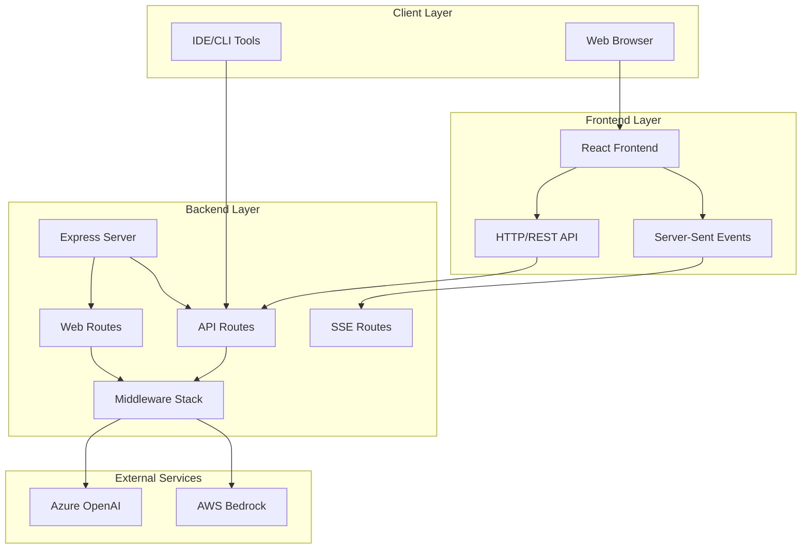
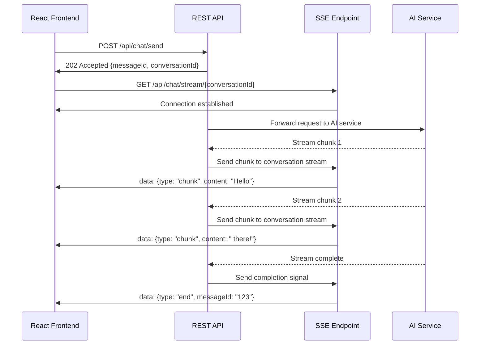

# Web Frontend Design Document

## Overview

This document outlines the design for adding a modern, accessible web frontend to the existing
Claude-to-Azure OpenAI proxy service. The frontend will be built using React 19.2 and Node.js 24+,
providing programmers with a direct web interface to interact with AI models while maintaining the
existing API functionality for IDE integrations.

The design follows a hybrid architecture where the existing Express.js backend serves both API
endpoints and the React frontend, ensuring security by keeping all authentication and API key
management on the server side. The system implements session-based isolation without requiring user
authentication, using browser session fingerprinting and secure conversation management to ensure
privacy between different browser sessions.

This design also includes a comprehensive project directory restructuring to follow industry best
practices for full-stack applications, ensuring maintainability, scalability, and developer
experience optimization.

## Project Directory Architecture

### Current vs. Optimized Structure

The current project structure mixes frontend and backend concerns at the root level. The optimized
structure follows industry best practices for monorepo organization with clear separation of
concerns.

#### Optimized Directory Structure

```
claude-to-azure-proxy/
├── README.md                          # Main project documentation
├── LICENSE                           # Project license
├── .gitignore                        # Git ignore rules
├── .nvmrc                           # Node.js version specification
├── package.json                     # Root package.json for workspace management
├── pnpm-workspace.yaml              # pnpm workspace configuration
├── docker-compose.yml               # Development environment
├── docker-compose.prod.yml          # Production environment
├── Makefile                         # Build and deployment commands
│
├── apps/                            # Application packages
│   ├── backend/                     # Backend API service
│   │   ├── src/                     # TypeScript source code
│   │   │   ├── controllers/         # Request handlers
│   │   │   ├── middleware/          # Express middleware
│   │   │   ├── routes/              # API route definitions
│   │   │   ├── services/            # Business logic
│   │   │   ├── utils/               # Utility functions
│   │   │   ├── types/               # TypeScript type definitions
│   │   │   ├── config/              # Configuration management
│   │   │   ├── errors/              # Error handling
│   │   │   ├── validation/          # Input validation
│   │   │   ├── monitoring/          # Metrics and health checks
│   │   │   ├── resilience/          # Circuit breakers, retry logic
│   │   │   ├── clients/             # External API clients
│   │   │   └── index.ts             # Application entry point
│   │   ├── tests/                   # Backend test files
│   │   ├── dist/                    # Compiled JavaScript output
│   │   ├── package.json             # Backend dependencies
│   │   ├── tsconfig.json            # TypeScript configuration
│   │   ├── vitest.config.ts         # Test configuration
│   │   ├── eslint.config.ts         # ESLint configuration
│   │   └── Dockerfile               # Backend container definition
│   │
│   └── frontend/                    # React web application
│       ├── src/                     # React source code
│       │   ├── components/          # Reusable UI components
│       │   │   ├── ui/              # Basic UI components (buttons, inputs)
│       │   │   ├── chat/            # Chat-specific components
│       │   │   ├── conversation/    # Conversation management
│       │   │   ├── settings/        # Settings and preferences
│       │   │   └── common/          # Shared components
│       │   ├── pages/               # Page-level components
│       │   ├── hooks/               # Custom React hooks
│       │   ├── contexts/            # React Context providers
│       │   ├── services/            # API clients and external services
│       │   ├── utils/               # Utility functions
│       │   ├── types/               # TypeScript type definitions
│       │   ├── styles/              # CSS and styling
│       │   ├── assets/              # Static assets (images, icons)
│       │   ├── i18n/                # Internationalization
│       │   │   ├── locales/         # Translation files
│       │   │   └── index.ts         # i18n configuration
│       │   ├── test/                # Test utilities and setup
│       │   ├── App.tsx              # Main application component
│       │   ├── main.tsx             # Application entry point
│       │   └── vite-env.d.ts        # Vite type definitions
│       ├── public/                  # Static public assets
│       ├── dist/                    # Built frontend assets
│       ├── tests/                   # Frontend test files
│       ├── package.json             # Frontend dependencies
│       ├── tsconfig.json            # TypeScript configuration
│       ├── tsconfig.node.json       # Node.js TypeScript config
│       ├── vite.config.ts           # Vite build configuration
│       ├── vitest.config.ts         # Test configuration
│       ├── eslint.config.ts         # ESLint configuration
│       └── index.html               # HTML template
│
├── packages/                        # Shared packages
│   ├── shared-types/                # Shared TypeScript types
│   │   ├── src/                     # Type definitions
│   │   ├── package.json             # Package configuration
│   │   └── tsconfig.json            # TypeScript configuration
│   │
│   ├── shared-utils/                # Shared utility functions
│   │   ├── src/                     # Utility implementations
│   │   ├── tests/                   # Utility tests
│   │   ├── package.json             # Package configuration
│   │   └── tsconfig.json            # TypeScript configuration
│   │
│   └── shared-config/               # Shared configuration
│       ├── eslint/                  # ESLint configurations
│       ├── typescript/              # TypeScript configurations
│       ├── vitest/                  # Test configurations
│       └── package.json             # Package configuration
│
├── docs/                            # Project documentation
│   ├── api/                         # API documentation
│   │   ├── openapi.yaml             # OpenAPI specification
│   │   └── README.md                # API documentation
│   ├── deployment/                  # Deployment guides
│   │   ├── aws/                     # AWS deployment
│   │   ├── docker/                  # Docker deployment
│   │   └── local/                   # Local development
│   ├── architecture/                # Architecture documentation
│   │   ├── diagrams/                # Architecture diagrams
│   │   └── decisions/               # Architecture decision records
│   ├── user-guide/                  # User documentation
│   └── developer-guide/             # Developer documentation
│
├── scripts/                         # Build and deployment scripts
│   ├── build/                       # Build scripts
│   ├── deploy/                      # Deployment scripts
│   ├── dev/                         # Development scripts
│   └── test/                        # Testing scripts
│
├── infra/                           # Infrastructure as Code
│   ├── docker/                      # Docker configurations
│   │   ├── backend/                 # Backend Docker files
│   │   ├── frontend/                # Frontend Docker files
│   │   └── nginx/                   # Nginx configuration
│   ├── k8s/                         # Kubernetes manifests
│   ├── terraform/                   # Terraform configurations
│   └── monitoring/                  # Monitoring configurations
│       ├── grafana/                 # Grafana dashboards
│       ├── prometheus/              # Prometheus configuration
│       └── alertmanager/            # Alert configurations
│
├── tools/                           # Development tools and utilities
│   ├── generators/                  # Code generators
│   ├── linters/                     # Custom linting rules
│   └── build-tools/                 # Custom build utilities
│
└── .github/                         # GitHub-specific files
    ├── workflows/                   # CI/CD workflows
    ├── ISSUE_TEMPLATE/              # Issue templates
    ├── PULL_REQUEST_TEMPLATE.md     # PR template
    └── dependabot.yml               # Dependency updates
```

### Key Architectural Decisions

#### 1. Monorepo with Workspace Management

- **pnpm workspaces** for efficient dependency management and build coordination
- **Shared packages** for common types, utilities, and configurations
- **Independent versioning** for apps while sharing common dependencies

#### 2. Clear Separation of Concerns

- **apps/** contains deployable applications (backend API, frontend web app)
- **packages/** contains reusable, shared code
- **docs/** centralizes all documentation
- **infra/** contains infrastructure and deployment configurations
- **tools/** houses development utilities and build tools

#### 3. Consistent Directory Naming

- **kebab-case** for directory names (following Node.js conventions)
- **Logical grouping** by functionality rather than file type
- **Standard locations** for configuration files and documentation

#### 4. Docker Multi-Stage Optimization

```dockerfile
# apps/backend/Dockerfile
FROM node:24-alpine AS base
WORKDIR /app
RUN corepack enable pnpm

# Dependencies stage
FROM base AS deps
COPY package.json pnpm-lock.yaml pnpm-workspace.yaml ./
COPY apps/backend/package.json ./apps/backend/
COPY packages/*/package.json ./packages/*/
RUN pnpm install --frozen-lockfile

# Build stage
FROM base AS builder
COPY --from=deps /app/node_modules ./node_modules
COPY . .
RUN pnpm build:backend

# Production stage
FROM node:24-alpine AS runner
WORKDIR /app
RUN addgroup --system --gid 1001 nodejs
RUN adduser --system --uid 1001 nextjs
COPY --from=builder --chown=nextjs:nodejs /app/apps/backend/dist ./dist
COPY --from=builder --chown=nextjs:nodejs /app/apps/backend/package.json ./
COPY --from=deps --chown=nextjs:nodejs /app/node_modules ./node_modules
USER nextjs
EXPOSE 3000
CMD ["node", "dist/index.js"]
```

#### 5. Shared Configuration Management

```typescript
// packages/shared-config/eslint/base.js
module.exports = {
  extends: ['@typescript-eslint/recommended', 'prettier'],
  parser: '@typescript-eslint/parser',
  plugins: ['@typescript-eslint'],
  rules: {
    // Shared ESLint rules
  },
};

// apps/backend/eslint.config.ts
import baseConfig from '@repo/shared-config/eslint/base';

export default [
  ...baseConfig,
  {
    // Backend-specific rules
  },
];
```

### Migration Strategy

#### Phase 1: Directory Restructuring

1. **Create new directory structure** without moving files
2. **Set up pnpm workspace configuration**
3. **Create shared packages** for types and utilities
4. **Update build scripts** to work with new structure

#### Phase 2: Code Migration

1. **Move backend code** to `apps/backend/`
2. **Move frontend code** to `apps/frontend/`
3. **Extract shared code** to `packages/`
4. **Update import paths** throughout the codebase

#### Phase 3: Configuration Updates

1. **Update Docker configurations** for new structure
2. **Modify CI/CD pipelines** to work with monorepo
3. **Update documentation** to reflect new structure
4. **Test all build and deployment processes**

### Benefits of Optimized Structure

#### Developer Experience

- **Clear mental model** of where code belongs
- **Faster navigation** with logical grouping
- **Consistent patterns** across the entire codebase
- **Easier onboarding** for new developers

#### Maintainability

- **Separation of concerns** prevents coupling between layers
- **Shared packages** eliminate code duplication
- **Centralized configuration** ensures consistency
- **Clear dependency boundaries** prevent circular dependencies

#### Scalability

- **Independent deployment** of frontend and backend
- **Horizontal scaling** with multiple backend instances
- **Easy addition** of new applications or services
- **Modular architecture** supports microservices evolution

#### DevOps and Deployment

- **Optimized Docker builds** with multi-stage approach
- **Efficient CI/CD** with workspace-aware builds
- **Infrastructure as Code** with dedicated infra directory
- **Monitoring and observability** with dedicated configurations

## Architecture

### High-Level Architecture



### Component Architecture

The frontend will be organized into the following layers:

1. **Presentation Layer**: React components with TypeScript
2. **State Management Layer**: React Context + useReducer for global state
3. **Communication Layer**: Server-Sent Events (SSE) for real-time streaming + REST for
   configuration
4. **Service Layer**: API clients and utilities
5. **Infrastructure Layer**: Build tools, testing, and deployment

## Components and Interfaces

### Frontend Components

#### Core Components

```typescript
// Main application shell
interface AppProps {
  theme: 'light' | 'dark' | 'auto';
  language: 'en' | 'zh';
  sessionId: string;
}

// Chat interface component
interface ChatInterfaceProps {
  conversation: Conversation;
  selectedModel: string;
  onModelChange: (model: string) => void;
  messages: Message[];
  onSendMessage: (content: string, files?: File[]) => void;
  isStreaming: boolean;
}

// Conversation management component
interface ConversationManagerProps {
  conversations: Conversation[];
  activeConversationId: string;
  onConversationSelect: (conversationId: string) => void;
  onConversationCreate: (title?: string) => void;
  onConversationDelete: (conversationId: string) => void;
  onConversationRename: (conversationId: string, newTitle: string) => void;
}

// Conversation sidebar component
interface ConversationSidebarProps {
  conversations: Conversation[];
  activeConversationId: string;
  onConversationSelect: (conversationId: string) => void;
  onNewConversation: () => void;
  isCollapsed: boolean;
  onToggleCollapse: () => void;
}

// Data management component
interface DataManagementProps {
  sessionId: string;
  storageUsage: { used: number; quota: number };
  onClearAllData: () => void;
  onExportData: () => void;
  onResetSession: () => void;
}

// Settings component
interface SettingsProps {
  theme: 'light' | 'dark' | 'auto';
  language: 'en' | 'zh';
  onThemeChange: (theme: 'light' | 'dark' | 'auto') => void;
  onLanguageChange: (language: 'en' | 'zh') => void;
  dataManagement: DataManagementProps;
}

// Context management component
interface ContextManagerProps {
  conversation: Conversation;
  onExtendContext: () => void;
  onCompressContext: () => void;
  onCreateCompressedConversation: (compressedContext: string) => void;
}

// Context warning component
interface ContextWarningProps {
  contextUsage: ContextUsage;
  onExtendContext: () => void;
  onCompressContext: () => void;
  onDismiss: () => void;
}

// Model selector component
interface ModelSelectorProps {
  models: ModelInfo[];
  selectedModel: string;
  onModelChange: (modelId: string) => void;
  disabled?: boolean;
}

// File upload component
interface FileUploadProps {
  acceptedTypes: string[];
  maxSize: number;
  onFilesSelected: (files: File[]) => void;
  onError: (error: string) => void;
}

// Message component with syntax highlighting
interface MessageProps {
  message: Message;
  onCopyCode: (code: string) => void;
  theme: 'light' | 'dark';
}
```

#### Accessibility Components

```typescript
// Screen reader announcements
interface AnnouncementProps {
  message: string;
  priority: 'polite' | 'assertive';
}

// Keyboard navigation helper
interface KeyboardNavigationProps {
  onEscape: () => void;
  onEnter: () => void;
  trapFocus?: boolean;
}

// High contrast mode support
interface HighContrastProps {
  enabled: boolean;
  onToggle: () => void;
}
```

### Backend Extensions

#### New Routes

```typescript
// Serve React application
app.get('/', serveReactApp);
app.get('/static/*', serveStaticAssets);

// Session management (no authentication required)
app.post('/api/session', createSessionHandler);
app.get('/api/session/:sessionId', getSessionHandler);

// Server-Sent Events endpoint for streaming responses
app.get('/api/chat/stream/:conversationId', chatSSEHandler);

// REST API endpoints for chat functionality
app.post('/api/chat/send', sendChatMessageHandler);
app.get('/api/chat/history/:conversationId', getChatHistoryHandler);

// Conversation management endpoints
app.get('/api/conversations', getSessionConversationsHandler);
app.post('/api/conversations', createConversationHandler);
app.put('/api/conversations/:conversationId', updateConversationHandler);
app.delete('/api/conversations/:conversationId', deleteConversationHandler);
app.put('/api/conversations/:conversationId/model', changeConversationModelHandler);

// Configuration endpoints for frontend
app.get('/api/config', getClientConfig);
app.get('/api/models', getAvailableModels);
app.get('/api/models/:modelId', getModelDetails);

// File upload endpoint
app.post('/api/upload', uploadFileHandler);

// Context management endpoints
app.post('/api/conversations/:conversationId/extend-context', extendContextHandler);
app.post('/api/conversations/:conversationId/compress', compressConversationHandler);
app.post(
  '/api/conversations/:conversationId/create-compressed',
  createCompressedConversationHandler
);
```

#### Server-Sent Events Handler

```typescript
interface ChatSSEHandler {
  (req: Request, res: Response): void;
  setupSSEConnection: (res: Response, conversationId: string) => void;
  sendStreamChunk: (conversationId: string, chunk: StreamChunk) => void;
  closeConnection: (conversationId: string) => void;
}

interface StreamChunk {
  type: 'start' | 'chunk' | 'end' | 'error';
  content?: string;
  messageId?: string;
  correlationId: string;
  timestamp: number;
}

interface ChatRequest {
  message: string;
  model: string;
  conversationId: string;
  files?: FileInfo[];
  correlationId: string;
  contextMessages?: Message[]; // Previous messages for context
}

interface ConversationRequest {
  title?: string;
  initialModel?: string;
}

interface ConversationUpdateRequest {
  title?: string;
  model?: string;
}

interface ConversationResponse {
  id: string;
  title: string;
  model: string;
  createdAt: string;
  updatedAt: string;
  messageCount: number;
  lastMessage?: {
    content: string;
    timestamp: string;
    role: 'user' | 'assistant';
  };
}
```

## Data Models

### Frontend State Models

```typescript
// Application state
interface AppState {
  session: SessionState;
  conversations: ConversationState;
  ui: UIState;
  config: ConfigState;
}

interface SessionState {
  sessionId: string;
  preferences: UserPreferences;
  createdAt: Date;
}

interface ConversationState {
  conversations: Map<string, Conversation>;
  activeConversationId: string | null;
  isLoading: boolean;
  error?: string;
}

interface Conversation {
  id: string;
  title: string;
  messages: Message[];
  selectedModel: string;
  createdAt: Date;
  updatedAt: Date;
  sessionId: string; // For session isolation
  isStreaming: boolean;
  streamingMessage?: Partial<Message>;
  modelHistory: ModelChange[]; // Track model changes within conversation
  contextUsage: ContextUsage; // Track context usage and limits
  parentConversationId?: string; // For compressed conversations
  compressionHistory?: CompressionEvent[]; // Track compression events
}

interface ContextUsage {
  currentTokens: number;
  maxTokens: number;
  warningThreshold: number; // Percentage (e.g., 80%)
  canExtend: boolean; // Whether model supports context extension
  extendedMaxTokens?: number; // Extended context limit if available
  isExtended: boolean; // Whether context has been extended
}

interface CompressionEvent {
  id: string;
  timestamp: Date;
  originalTokens: number;
  compressedTokens: number;
  compressionRatio: number;
  method: 'ai-summary' | 'selective-removal' | 'hierarchical';
}

interface ModelChange {
  messageId: string;
  fromModel?: string;
  toModel: string;
  timestamp: Date;
}

interface UIState {
  theme: 'light' | 'dark' | 'auto';
  language: 'en' | 'zh';
  sidebarOpen: boolean;
  isLoading: boolean;
  error?: string;
}

interface ConfigState {
  availableModels: ModelInfo[];
  maxFileSize: number;
  supportedFileTypes: string[];
  features: FeatureFlags;
}
```

### Message Models

```typescript
interface Message {
  id: string;
  role: 'user' | 'assistant';
  content: string;
  timestamp: Date;
  files?: FileInfo[];
  codeBlocks?: CodeBlock[];
  correlationId: string;
  conversationId: string;
  model?: string; // Track which model generated this message
  isComplete: boolean;
  contextTokens?: number; // Track context usage
}

interface FileInfo {
  id: string;
  name: string;
  type: string;
  size: number;
  url?: string;
  content?: string;
}

interface CodeBlock {
  id: string;
  language: string;
  code: string;
  startLine?: number;
  filename?: string;
}

interface ModelInfo {
  id: string;
  name: string;
  description: string;
  capabilities: string[];
  contextLength: number;
  isAvailable: boolean;
  provider: 'azure-openai' | 'aws-bedrock';
  category: 'general' | 'coding' | 'reasoning';
  pricing?: {
    inputTokens: number; // Cost per 1M input tokens
    outputTokens: number; // Cost per 1M output tokens
  };
}
```

### Security Models

```typescript
interface ClientConfig {
  // Only safe configuration exposed to frontend
  maxFileSize: number;
  supportedFileTypes: string[];
  availableModels: ModelInfo[];
  features: FeatureFlags;
  maxConversations: number;
  maxMessagesPerConversation: number;
  defaultModel: string;
  modelCategories: {
    general: string[];
    coding: string[];
    reasoning: string[];
  };
  // NO API keys or sensitive data
}

interface SessionInfo {
  sessionId: string;
  createdAt: string;
  // No sensitive data exposed to frontend
}

interface FeatureFlags {
  fileUpload: boolean;
  imageUpload: boolean;
  codeHighlighting: boolean;
  streamingResponses: boolean;
}
```

## Error Handling

### Frontend Error Handling

```typescript
// Error boundary for React components
class ErrorBoundary extends React.Component<ErrorBoundaryProps, ErrorBoundaryState> {
  static getDerivedStateFromError(error: Error): ErrorBoundaryState {
    return { hasError: true, error };
  }

  componentDidCatch(error: Error, errorInfo: React.ErrorInfo) {
    // Log error to monitoring service
    logger.error('React error boundary caught error', {
      error: error.message,
      stack: error.stack,
      componentStack: errorInfo.componentStack,
    });
  }
}

// Global error handler for async operations
const handleAsyncError = (error: unknown, context: string) => {
  const errorMessage = error instanceof Error ? error.message : 'Unknown error';

  // Log error
  logger.error(`Async error in ${context}`, { error: errorMessage });

  // Show user-friendly message
  showNotification({
    type: 'error',
    message: getLocalizedErrorMessage(errorMessage),
    duration: 5000,
  });
};
```

### Server-Sent Events Error Handling

```typescript
// SSE connection management with automatic reconnection
class ChatSSEClient {
  private eventSource: EventSource | null = null;
  private reconnectAttempts = 0;
  private maxReconnectAttempts = 5;
  private reconnectDelay = 1000;
  private conversationId: string;

  constructor(conversationId: string) {
    this.conversationId = conversationId;
  }

  connect() {
    try {
      const url = `/api/chat/stream/${this.conversationId}`;
      this.eventSource = new EventSource(url);
      this.setupEventHandlers();
    } catch (error) {
      this.handleConnectionError(error);
    }
  }

  private setupEventHandlers() {
    if (!this.eventSource) return;

    this.eventSource.onopen = () => {
      this.reconnectAttempts = 0;
      console.log('SSE connection established');
    };

    this.eventSource.onmessage = (event) => {
      try {
        const data = JSON.parse(event.data) as StreamChunk;
        this.handleStreamChunk(data);
      } catch (error) {
        console.error('Failed to parse SSE message:', error);
      }
    };

    this.eventSource.onerror = (error) => {
      console.error('SSE connection error:', error);
      this.handleConnectionError(error);
    };
  }

  private handleConnectionError(error: unknown) {
    if (this.eventSource) {
      this.eventSource.close();
      this.eventSource = null;
    }

    if (this.reconnectAttempts < this.maxReconnectAttempts) {
      setTimeout(
        () => {
          this.reconnectAttempts++;
          this.connect();
        },
        this.reconnectDelay * Math.pow(2, this.reconnectAttempts)
      );
    } else {
      // Show offline mode
      this.showOfflineMode();
    }
  }

  disconnect() {
    if (this.eventSource) {
      this.eventSource.close();
      this.eventSource = null;
    }
  }
}
```

## Testing Strategy

### Frontend Testing

#### Unit Testing (Vitest + React Testing Library)

```typescript
// Component testing example
describe('ChatInterface', () => {
  it('should render messages correctly', () => {
    const messages = [
      { id: '1', role: 'user', content: 'Hello', timestamp: new Date() },
      { id: '2', role: 'assistant', content: 'Hi there!', timestamp: new Date() },
    ];

    render(<ChatInterface messages={messages} onSendMessage={vi.fn()} />);

    expect(screen.getByText('Hello')).toBeInTheDocument();
    expect(screen.getByText('Hi there!')).toBeInTheDocument();
  });

  it('should handle file uploads', async () => {
    const onSendMessage = vi.fn();
    render(<ChatInterface messages={[]} onSendMessage={onSendMessage} />);

    const file = new File(['console.log("test")'], 'test.js', { type: 'text/javascript' });
    const input = screen.getByLabelText(/upload file/i);

    await user.upload(input, file);

    expect(onSendMessage).toHaveBeenCalledWith(expect.any(String), [file]);
  });
});
```

#### Integration Testing

```typescript
// Server-Sent Events integration testing
describe('Chat SSE Integration', () => {
  it('should handle streaming responses', async () => {
    // Mock SSE server
    const mockSSEServer = setupMockSSEServer('/api/chat/stream/test-conversation');

    render(<App />);

    // Send message
    const input = screen.getByPlaceholderText(/type your message/i);
    await user.type(input, 'Hello AI');
    await user.click(screen.getByRole('button', { name: /send/i }));

    // Simulate streaming response
    mockSSEServer.emit('message', {
      data: JSON.stringify({
        type: 'start',
        messageId: 'msg-123',
        correlationId: 'test-123',
        timestamp: Date.now(),
      }),
    });

    mockSSEServer.emit('message', {
      data: JSON.stringify({
        type: 'chunk',
        content: 'Hello! How can I help you?',
        messageId: 'msg-123',
        correlationId: 'test-123',
        timestamp: Date.now(),
      }),
    });

    mockSSEServer.emit('message', {
      data: JSON.stringify({
        type: 'end',
        messageId: 'msg-123',
        correlationId: 'test-123',
        timestamp: Date.now(),
      }),
    });

    expect(await screen.findByText(/Hello! How can I help you?/)).toBeInTheDocument();
  });

  it('should handle SSE connection errors gracefully', async () => {
    const mockSSEServer = setupMockSSEServer('/api/chat/stream/test-conversation');

    render(<App />);

    // Simulate connection error
    mockSSEServer.emit('error', new Error('Connection failed'));

    // Should show retry mechanism
    expect(await screen.findByText(/connection lost/i)).toBeInTheDocument();
    expect(screen.getByRole('button', { name: /retry/i })).toBeInTheDocument();
  });
});
```

#### Accessibility Testing

```typescript
// Accessibility testing with axe-core
describe('Accessibility', () => {
  it('should have no accessibility violations', async () => {
    const { container } = render(<App />);
    const results = await axe(container);
    expect(results).toHaveNoViolations();
  });

  it('should support keyboard navigation', async () => {
    render(<App />);

    // Tab through interface
    await user.tab();
    expect(screen.getByRole('combobox', { name: /select model/i })).toHaveFocus();

    await user.tab();
    expect(screen.getByRole('textbox', { name: /message input/i })).toHaveFocus();
  });

  it('should announce messages to screen readers', async () => {
    render(<App />);

    // Send message and verify announcement
    const input = screen.getByRole('textbox', { name: /message input/i });
    await user.type(input, 'Test message');
    await user.click(screen.getByRole('button', { name: /send/i }));

    expect(screen.getByRole('status')).toHaveTextContent(/message sent/i);
  });
});
```

### Backend Testing Extensions

```typescript
// Server-Sent Events endpoint testing
describe('Chat SSE Endpoint', () => {
  it('should establish SSE connection and stream responses', async () => {
    const conversationId = 'test-conversation';

    // Start SSE connection
    const sseResponse = await request(app)
      .get(`/api/chat/stream/${conversationId}`)
      .set('Accept', 'text/event-stream')
      .expect(200)
      .expect('Content-Type', /text\/event-stream/);

    // Send chat message via REST API
    const chatResponse = await request(app)
      .post('/api/chat/send')
      .send({
        message: 'Hello AI',
        model: 'gpt-4',
        conversationId,
        correlationId: 'test-123',
      })
      .expect(202); // Accepted for async processing

    // Verify SSE stream contains expected data
    expect(chatResponse.body.messageId).toBeDefined();
    expect(chatResponse.body.status).toBe('processing');
  });

  it('should handle SSE connection cleanup', async () => {
    const conversationId = 'test-conversation';

    const agent = request(app);
    const sseRequest = agent
      .get(`/api/chat/stream/${conversationId}`)
      .set('Accept', 'text/event-stream');

    // Simulate client disconnect
    sseRequest.abort();

    // Verify server cleans up resources
    // This would be tested through monitoring connection count
  });
});

// File upload testing
describe('File Upload API', () => {
  it('should handle code file uploads', async () => {
    const response = await request(app)
      .post('/api/upload')
      .attach('file', Buffer.from('console.log("test")'), 'test.js')
      .expect(200);

    expect(response.body.fileId).toBeDefined();
    expect(response.body.type).toBe('text/javascript');
  });

  it('should validate file types', async () => {
    await request(app)
      .post('/api/upload')
      .attach('file', Buffer.from('malicious content'), 'test.exe')
      .expect(400);
  });
});
```

## Security Considerations

### Frontend Security

1. **Content Security Policy (CSP)**

   ```typescript
   const cspConfig = {
     directives: {
       defaultSrc: ["'self'"],
       scriptSrc: ["'self'", "'unsafe-inline'"], // Only for development
       styleSrc: ["'self'", "'unsafe-inline'"],
       imgSrc: ["'self'", 'data:', 'blob:'],
       connectSrc: ["'self'"], // SSE uses regular HTTP connections
       fontSrc: ["'self'"],
       objectSrc: ["'none'"],
       mediaSrc: ["'self'"],
       frameSrc: ["'none'"],
     },
   };
   ```

2. **Input Sanitization**

   ```typescript
   // Sanitize user input before rendering
   const sanitizeInput = (input: string): string => {
     return DOMPurify.sanitize(input, {
       ALLOWED_TAGS: ['p', 'br', 'strong', 'em', 'code', 'pre'],
       ALLOWED_ATTR: ['class'],
     });
   };
   ```

3. **File Upload Security**

   ```typescript
   const validateFile = (file: File): ValidationResult => {
     // Check file type
     if (!ALLOWED_FILE_TYPES.includes(file.type)) {
       return { valid: false, error: 'File type not allowed' };
     }

     // Check file size
     if (file.size > MAX_FILE_SIZE) {
       return { valid: false, error: 'File too large' };
     }

     // Check file name
     if (!/^[a-zA-Z0-9._-]+$/.test(file.name)) {
       return { valid: false, error: 'Invalid file name' };
     }

     return { valid: true };
   };
   ```

### Backend Security Extensions

1. **Session-Based Access Control**

   ```typescript
   const getSessionIdFromRequest = (req: Request): string | null => {
     // Get session ID from headers or query parameters
     return (req.headers['x-session-id'] as string) || (req.query.sessionId as string) || null;
   };

   const validateSessionId = (sessionId: string): boolean => {
     // Basic session ID format validation
     return /^browser_\d+_[a-z0-9]+_[a-z0-9]+$/.test(sessionId);
   };

   // Middleware to validate session ID
   const sessionValidationMiddleware = (req: Request, res: Response, next: () => void) => {
     const sessionId = getSessionIdFromRequest(req);

     if (!sessionId || !validateSessionId(sessionId)) {
       return res.status(400).json({ error: 'Valid session ID required' });
     }

     // Add session ID to request for downstream handlers
     (req as any).sessionId = sessionId;
     next();
   };

   // Apply session validation to protected routes
   app.use('/api/conversations', sessionValidationMiddleware);
   app.use('/api/chat', sessionValidationMiddleware);
   ```

2. **File Upload Validation**
   ```typescript
   const fileUploadMiddleware = multer({
     storage: multer.memoryStorage(),
     limits: {
       fileSize: 10 * 1024 * 1024, // 10MB
       files: 5,
     },
     fileFilter: (req, file, cb) => {
       if (ALLOWED_MIME_TYPES.includes(file.mimetype)) {
         cb(null, true);
       } else {
         cb(new Error('File type not allowed'));
       }
     },
   });
   ```

## Performance Optimizations

### Frontend Performance

1. **Code Splitting**

   ```typescript
   // Lazy load components
   const ChatInterface = lazy(() => import('./components/ChatInterface'));
   const FileUpload = lazy(() => import('./components/FileUpload'));

   // Route-based code splitting
   const routes = [
     {
       path: '/',
       component: lazy(() => import('./pages/Chat')),
     },
     {
       path: '/settings',
       component: lazy(() => import('./pages/Settings')),
     },
   ];
   ```

2. **Virtual Scrolling for Messages**

   ```typescript
   // Use react-window for large message lists
   const MessageList = ({ messages }: { messages: Message[] }) => {
     return (
       <FixedSizeList
         height={600}
         itemCount={messages.length}
         itemSize={80}
         itemData={messages}
       >
         {MessageItem}
       </FixedSizeList>
     );
   };
   ```

3. **Optimized Re-renders**

   ```typescript
   // Memoize expensive components
   const MessageItem = memo(({ message }: { message: Message }) => {
     return <div>{message.content}</div>;
   });

   // Use callback memoization
   const handleSendMessage = useCallback((content: string) => {
     dispatch({ type: 'SEND_MESSAGE', payload: content });
   }, [dispatch]);
   ```

### Backend Performance

1. **Server-Sent Events Connection Management**

   ```typescript
   class SSEConnectionManager {
     private connections = new Map<string, Response>();
     private conversationStreams = new Map<string, Set<string>>();

     addConnection(conversationId: string, userId: string, res: Response) {
       const connectionId = `${conversationId}:${userId}`;
       this.connections.set(connectionId, res);

       if (!this.conversationStreams.has(conversationId)) {
         this.conversationStreams.set(conversationId, new Set());
       }
       this.conversationStreams.get(conversationId)!.add(connectionId);

       // Handle connection cleanup
       res.on('close', () => {
         this.removeConnection(connectionId, conversationId);
       });
     }

     sendToConversation(conversationId: string, data: StreamChunk) {
       const connections = this.conversationStreams.get(conversationId);
       if (!connections) return;

       connections.forEach((connectionId) => {
         const res = this.connections.get(connectionId);
         if (res && !res.destroyed) {
           res.write(`data: ${JSON.stringify(data)}\n\n`);
         }
       });
     }

     removeConnection(connectionId: string, conversationId: string) {
       this.connections.delete(connectionId);
       const conversationConnections = this.conversationStreams.get(conversationId);
       if (conversationConnections) {
         conversationConnections.delete(connectionId);
         if (conversationConnections.size === 0) {
           this.conversationStreams.delete(conversationId);
         }
       }
     }
   }
   ```

2. **Response Caching**

   ```typescript
   // Cache model information
   const modelCache = new Map<string, ModelInfo[]>();

   app.get('/api/models', (req, res) => {
     const cached = modelCache.get('models');
     if (cached) {
       return res.json(cached);
     }

     // Fetch and cache models
     const models = getAvailableModels();
     modelCache.set('models', models);
     res.json(models);
   });
   ```

## Internationalization (i18n)

### Implementation Strategy

```typescript
// i18n configuration
const i18nConfig = {
  fallbackLng: 'en',
  supportedLngs: ['en', 'zh'],
  detection: {
    order: ['localStorage', 'navigator', 'htmlTag'],
    caches: ['localStorage'],
  },
  resources: {
    en: {
      translation: {
        'chat.placeholder': 'Type your message...',
        'model.select': 'Select Model',
        'file.upload': 'Upload File',
        'error.network': 'Network error occurred',
      },
    },
    zh: {
      translation: {
        'chat.placeholder': '输入您的消息...',
        'model.select': '选择模型',
        'file.upload': '上传文件',
        'error.network': '网络错误',
      },
    },
  },
};

// Usage in components
const ChatInput = () => {
  const { t } = useTranslation();

  return (
    <input
      placeholder={t('chat.placeholder')}
      aria-label={t('chat.placeholder')}
    />
  );
};
```

## Streaming Implementation Strategy

### Why Server-Sent Events (SSE) over WebSocket

1. **Better CDN Compatibility**: SSE uses standard HTTP connections, making it more compatible with
   CDNs and proxy servers
2. **Automatic Reconnection**: Built-in reconnection mechanism in the EventSource API
3. **Simpler Implementation**: No need for complex bidirectional communication protocols
4. **Better Caching**: HTTP-based, allowing for better caching strategies
5. **Firewall Friendly**: Uses standard HTTP ports and protocols

### Streaming Response Flow



### Conversation Management Implementation

```typescript
// IndexedDB-based conversation storage with encryption
class ConversationStorage {
  private readonly dbName = 'ChatAppDB';
  private readonly dbVersion = 1;
  private readonly conversationStore = 'conversations';
  private readonly sessionStore = 'sessions';
  private readonly maxConversations = 100;
  private readonly maxMessagesPerConversation = 2000;
  private db: IDBDatabase | null = null;
  private encryptionKey: CryptoKey | null = null;

  async initialize(): Promise<void> {
    // Initialize IndexedDB
    await this.openDatabase();

    // Initialize encryption key
    await this.initializeEncryption();
  }

  private async openDatabase(): Promise<void> {
    return new Promise((resolve, reject) => {
      const request = indexedDB.open(this.dbName, this.dbVersion);

      request.onerror = () => reject(request.error);
      request.onsuccess = () => {
        this.db = request.result;
        resolve();
      };

      request.onupgradeneeded = (event) => {
        const db = (event.target as IDBOpenDBRequest).result;

        // Create conversations store
        if (!db.objectStoreNames.contains(this.conversationStore)) {
          const conversationStore = db.createObjectStore(this.conversationStore, {
            keyPath: 'id',
          });
          conversationStore.createIndex('sessionId', 'sessionId', { unique: false });
          conversationStore.createIndex('updatedAt', 'updatedAt', { unique: false });
        }

        // Create sessions store
        if (!db.objectStoreNames.contains(this.sessionStore)) {
          db.createObjectStore(this.sessionStore, {
            keyPath: 'sessionId',
          });
        }
      };
    });
  }

  private async initializeEncryption(): Promise<void> {
    try {
      // Generate or retrieve encryption key for local data
      const keyData = localStorage.getItem('encryptionKey');

      if (keyData) {
        // Import existing key
        const keyBuffer = new Uint8Array(JSON.parse(keyData));
        this.encryptionKey = await crypto.subtle.importKey(
          'raw',
          keyBuffer,
          { name: 'AES-GCM' },
          false,
          ['encrypt', 'decrypt']
        );
      } else {
        // Generate new key
        this.encryptionKey = await crypto.subtle.generateKey(
          { name: 'AES-GCM', length: 256 },
          true,
          ['encrypt', 'decrypt']
        );

        // Export and store key
        const keyBuffer = await crypto.subtle.exportKey('raw', this.encryptionKey);
        localStorage.setItem(
          'encryptionKey',
          JSON.stringify(Array.from(new Uint8Array(keyBuffer)))
        );
      }
    } catch (error) {
      console.warn('Encryption initialization failed, using unencrypted storage:', error);
      this.encryptionKey = null;
    }
  }

  private async encryptData(data: string): Promise<string> {
    if (!this.encryptionKey) return data;

    try {
      const encoder = new TextEncoder();
      const dataBuffer = encoder.encode(data);
      const iv = crypto.getRandomValues(new Uint8Array(12));

      const encryptedBuffer = await crypto.subtle.encrypt(
        { name: 'AES-GCM', iv },
        this.encryptionKey,
        dataBuffer
      );

      // Combine IV and encrypted data
      const combined = new Uint8Array(iv.length + encryptedBuffer.byteLength);
      combined.set(iv);
      combined.set(new Uint8Array(encryptedBuffer), iv.length);

      return btoa(String.fromCharCode(...combined));
    } catch (error) {
      console.warn('Encryption failed, storing unencrypted:', error);
      return data;
    }
  }

  private async decryptData(encryptedData: string): Promise<string> {
    if (!this.encryptionKey) return encryptedData;

    try {
      const combined = new Uint8Array(
        atob(encryptedData)
          .split('')
          .map((char) => char.charCodeAt(0))
      );

      const iv = combined.slice(0, 12);
      const encrypted = combined.slice(12);

      const decryptedBuffer = await crypto.subtle.decrypt(
        { name: 'AES-GCM', iv },
        this.encryptionKey,
        encrypted
      );

      const decoder = new TextDecoder();
      return decoder.decode(decryptedBuffer);
    } catch (error) {
      console.warn('Decryption failed, returning as-is:', error);
      return encryptedData;
    }
  }

  private compressData(data: string): string {
    // Simple compression using LZ-string or similar
    // For now, using JSON.stringify with minimal whitespace
    try {
      const parsed = JSON.parse(data);
      return JSON.stringify(parsed);
    } catch {
      return data;
    }
  }

  async saveConversation(conversation: Conversation): Promise<void> {
    if (!this.db) throw new Error('Database not initialized');

    try {
      // Limit messages per conversation
      const limitedConversation = {
        ...conversation,
        messages: conversation.messages.slice(-this.maxMessagesPerConversation),
      };

      // Compress and encrypt conversation data
      const conversationData = this.compressData(
        JSON.stringify({
          ...limitedConversation,
          createdAt: limitedConversation.createdAt.toISOString(),
          updatedAt: limitedConversation.updatedAt.toISOString(),
          messages: limitedConversation.messages.map((msg) => ({
            ...msg,
            timestamp: msg.timestamp.toISOString(),
          })),
        })
      );

      const encryptedData = await this.encryptData(conversationData);

      const transaction = this.db.transaction([this.conversationStore], 'readwrite');
      const store = transaction.objectStore(this.conversationStore);

      await new Promise<void>((resolve, reject) => {
        const request = store.put({
          id: conversation.id,
          sessionId: conversation.sessionId,
          updatedAt: conversation.updatedAt.getTime(),
          data: encryptedData,
        });

        request.onsuccess = () => resolve();
        request.onerror = () => reject(request.error);
      });

      // Clean up old conversations if limit exceeded
      await this.cleanupOldConversations(conversation.sessionId);
    } catch (error) {
      console.error('Failed to save conversation:', error);
      // Fallback to localStorage
      this.fallbackSaveConversation(conversation);
    }
  }

  async getAllConversations(sessionId: string): Promise<Map<string, Conversation>> {
    if (!this.db) {
      await this.initialize();
    }

    try {
      const transaction = this.db!.transaction([this.conversationStore], 'readonly');
      const store = transaction.objectStore(this.conversationStore);
      const index = store.index('sessionId');

      return new Promise((resolve, reject) => {
        const request = index.getAll(sessionId);

        request.onsuccess = async () => {
          const conversations = new Map<string, Conversation>();

          for (const item of request.result) {
            try {
              const decryptedData = await this.decryptData(item.data);
              const conversationData = JSON.parse(decryptedData);

              conversations.set(item.id, {
                ...conversationData,
                createdAt: new Date(conversationData.createdAt),
                updatedAt: new Date(conversationData.updatedAt),
                messages: conversationData.messages.map((msg: any) => ({
                  ...msg,
                  timestamp: new Date(msg.timestamp),
                })),
              });
            } catch (error) {
              console.warn(`Failed to decrypt conversation ${item.id}:`, error);
            }
          }

          resolve(conversations);
        };

        request.onerror = () => reject(request.error);
      });
    } catch (error) {
      console.error('Failed to load conversations from IndexedDB:', error);
      // Fallback to localStorage
      return this.fallbackGetAllConversations(sessionId);
    }
  }

  async deleteConversation(conversationId: string): Promise<void> {
    if (!this.db) throw new Error('Database not initialized');

    try {
      const transaction = this.db.transaction([this.conversationStore], 'readwrite');
      const store = transaction.objectStore(this.conversationStore);

      await new Promise<void>((resolve, reject) => {
        const request = store.delete(conversationId);
        request.onsuccess = () => resolve();
        request.onerror = () => reject(request.error);
      });
    } catch (error) {
      console.error('Failed to delete conversation:', error);
      // Fallback to localStorage
      this.fallbackDeleteConversation(conversationId);
    }
  }

  async clearAllConversations(sessionId: string): Promise<void> {
    if (!this.db) throw new Error('Database not initialized');

    try {
      const transaction = this.db.transaction([this.conversationStore], 'readwrite');
      const store = transaction.objectStore(this.conversationStore);
      const index = store.index('sessionId');

      const conversations = await new Promise<any[]>((resolve, reject) => {
        const request = index.getAll(sessionId);
        request.onsuccess = () => resolve(request.result);
        request.onerror = () => reject(request.error);
      });

      // Delete all conversations for this session
      for (const conversation of conversations) {
        await new Promise<void>((resolve, reject) => {
          const deleteRequest = store.delete(conversation.id);
          deleteRequest.onsuccess = () => resolve();
          deleteRequest.onerror = () => reject(deleteRequest.error);
        });
      }
    } catch (error) {
      console.error('Failed to clear conversations:', error);
      // Fallback to localStorage
      this.fallbackClearAllConversations(sessionId);
    }
  }

  async exportConversations(sessionId: string): Promise<string> {
    const conversations = await this.getAllConversations(sessionId);
    const exportData = {
      exportDate: new Date().toISOString(),
      sessionId,
      conversations: Array.from(conversations.values()),
    };
    return JSON.stringify(exportData, null, 2);
  }

  async getStorageUsage(): Promise<{ used: number; quota: number }> {
    try {
      if ('storage' in navigator && 'estimate' in navigator.storage) {
        const estimate = await navigator.storage.estimate();
        return {
          used: estimate.usage || 0,
          quota: estimate.quota || 0,
        };
      }
    } catch (error) {
      console.warn('Storage estimation not available:', error);
    }

    return { used: 0, quota: 0 };
  }

  private async cleanupOldConversations(sessionId: string): Promise<void> {
    const transaction = this.db!.transaction([this.conversationStore], 'readwrite');
    const store = transaction.objectStore(this.conversationStore);
    const index = store.index('sessionId');

    const conversations = await new Promise<any[]>((resolve, reject) => {
      const request = index.getAll(sessionId);
      request.onsuccess = () => resolve(request.result);
      request.onerror = () => reject(request.error);
    });

    if (conversations.length > this.maxConversations) {
      // Sort by updatedAt and keep only the most recent
      conversations.sort((a, b) => b.updatedAt - a.updatedAt);
      const toDelete = conversations.slice(this.maxConversations);

      for (const conversation of toDelete) {
        await new Promise<void>((resolve, reject) => {
          const deleteRequest = store.delete(conversation.id);
          deleteRequest.onsuccess = () => resolve();
          deleteRequest.onerror = () => reject(deleteRequest.error);
        });
      }
    }
  }

  // Fallback methods for localStorage
  private fallbackSaveConversation(conversation: Conversation): void {
    const key = `conversation_${conversation.sessionId}`;
    const stored = localStorage.getItem(key);
    const conversations = stored ? JSON.parse(stored) : {};

    conversations[conversation.id] = {
      ...conversation,
      createdAt: conversation.createdAt.toISOString(),
      updatedAt: conversation.updatedAt.toISOString(),
      messages: conversation.messages.map((msg) => ({
        ...msg,
        timestamp: msg.timestamp.toISOString(),
      })),
    };

    localStorage.setItem(key, JSON.stringify(conversations));
  }

  private fallbackGetAllConversations(sessionId: string): Map<string, Conversation> {
    const key = `conversation_${sessionId}`;
    const stored = localStorage.getItem(key);

    if (!stored) return new Map();

    try {
      const conversations = JSON.parse(stored);
      return new Map(
        Object.entries(conversations).map(([id, conv]: [string, any]) => [
          id,
          {
            ...conv,
            createdAt: new Date(conv.createdAt),
            updatedAt: new Date(conv.updatedAt),
            messages: conv.messages.map((msg: any) => ({
              ...msg,
              timestamp: new Date(msg.timestamp),
            })),
          },
        ])
      );
    } catch (error) {
      console.error('Failed to parse localStorage conversations:', error);
      return new Map();
    }
  }

  private fallbackDeleteConversation(conversationId: string): void {
    // Implementation for localStorage fallback
    const sessions = this.getAllSessionIds();
    sessions.forEach((sessionId) => {
      const key = `conversation_${sessionId}`;
      const stored = localStorage.getItem(key);
      if (stored) {
        const conversations = JSON.parse(stored);
        delete conversations[conversationId];
        localStorage.setItem(key, JSON.stringify(conversations));
      }
    });
  }

  private fallbackClearAllConversations(sessionId: string): void {
    const key = `conversation_${sessionId}`;
    localStorage.removeItem(key);
  }

  private getAllSessionIds(): string[] {
    const sessionIds: string[] = [];
    for (let i = 0; i < localStorage.length; i++) {
      const key = localStorage.key(i);
      if (key?.startsWith('conversation_')) {
        sessionIds.push(key.replace('conversation_', ''));
      }
    }
    return sessionIds;
  }
}

// Session management utilities
const generateBrowserSessionId = (): string => {
  // Generate unique session ID for this browser session
  const timestamp = Date.now().toString();
  const random = Math.random().toString(36).substring(2);
  const browserFingerprint = getBrowserFingerprint();
  return `browser_${timestamp}_${random}_${browserFingerprint}`;
};

const getBrowserFingerprint = (): string => {
  // Create a simple browser fingerprint for session isolation
  const canvas = document.createElement('canvas');
  const ctx = canvas.getContext('2d');
  ctx!.textBaseline = 'top';
  ctx!.font = '14px Arial';
  ctx!.fillText('Browser fingerprint', 2, 2);

  const fingerprint = [
    navigator.userAgent,
    navigator.language,
    screen.width + 'x' + screen.height,
    new Date().getTimezoneOffset(),
    canvas.toDataURL(),
  ].join('|');

  // Simple hash function
  let hash = 0;
  for (let i = 0; i < fingerprint.length; i++) {
    const char = fingerprint.charCodeAt(i);
    hash = (hash << 5) - hash + char;
    hash = hash & hash; // Convert to 32-bit integer
  }
  return Math.abs(hash).toString(36);
};

const getCurrentSessionId = (): string => {
  let sessionId = sessionStorage.getItem('sessionId');
  if (!sessionId) {
    sessionId = generateBrowserSessionId();
    sessionStorage.setItem('sessionId', sessionId);
  }
  return sessionId;
};

// Session management hook
const useSession = () => {
  const [sessionId, setSessionId] = useState<string>('');
  const [isSessionReady, setIsSessionReady] = useState(false);

  useEffect(() => {
    const initSession = async () => {
      try {
        let currentSessionId = getCurrentSessionId();

        // Verify session with backend (optional, for session tracking)
        const response = await fetch('/api/session', {
          method: 'POST',
          headers: {
            'Content-Type': 'application/json',
            'X-Session-ID': currentSessionId,
          },
          body: JSON.stringify({ sessionId: currentSessionId }),
        });

        if (response.ok) {
          setSessionId(currentSessionId);
          setIsSessionReady(true);
        } else {
          // Generate new session if backend doesn't recognize it
          currentSessionId = generateBrowserSessionId();
          sessionStorage.setItem('sessionId', currentSessionId);
          setSessionId(currentSessionId);
          setIsSessionReady(true);
        }
      } catch (error) {
        console.error('Session initialization failed:', error);
        // Fallback to local session management
        const fallbackSessionId = getCurrentSessionId();
        setSessionId(fallbackSessionId);
        setIsSessionReady(true);
      }
    };

    initSession();
  }, []);

  return { sessionId, isSessionReady };
};

// Conversation management hook
const useConversationManager = () => {
  const [conversations, setConversations] = useState<Map<string, Conversation>>(new Map());
  const [activeConversationId, setActiveConversationId] = useState<string | null>(null);
  const { sessionId, isSessionReady } = useSession();
  const storage = useMemo(() => new ConversationStorage(), []);

  useEffect(() => {
    if (!isSessionReady) return;

    const loadConversations = async () => {
      try {
        // Initialize storage
        await storage.initialize();

        // Load conversations for this session
        const sessionConversations = await storage.getAllConversations(sessionId);
        setConversations(sessionConversations);

        // Set active conversation to most recent for this session
        if (sessionConversations.size > 0) {
          const mostRecent = Array.from(sessionConversations.values()).sort(
            (a, b) => b.updatedAt.getTime() - a.updatedAt.getTime()
          )[0];
          setActiveConversationId(mostRecent.id);
        }
      } catch (error) {
        console.error('Failed to load conversations:', error);
      }
    };

    loadConversations();
  }, [storage, sessionId, isSessionReady]);

  const createConversation = useCallback(
    (title?: string, model?: string) => {
      const newConversation: Conversation = {
        id: generateConversationId(),
        title: title || `New Conversation ${Date.now()}`,
        messages: [],
        selectedModel: model || 'gpt-4',
        createdAt: new Date(),
        updatedAt: new Date(),
        sessionId,
        isStreaming: false,
        modelHistory: [],
      };

      setConversations((prev) => new Map(prev).set(newConversation.id, newConversation));
      setActiveConversationId(newConversation.id);

      // Save to storage asynchronously
      storage.saveConversation(newConversation).catch((error) => {
        console.error('Failed to save new conversation:', error);
      });

      return newConversation.id;
    },
    [storage]
  );

  const updateConversation = useCallback(
    (conversationId: string, updates: Partial<Conversation>) => {
      setConversations((prev) => {
        const updated = new Map(prev);
        const conversation = updated.get(conversationId);
        if (conversation) {
          const updatedConversation = {
            ...conversation,
            ...updates,
            updatedAt: new Date(),
          };
          updated.set(conversationId, updatedConversation);

          // Save to storage asynchronously
          storage.saveConversation(updatedConversation).catch((error) => {
            console.error('Failed to save conversation update:', error);
          });
        }
        return updated;
      });
    },
    [storage]
  );

  const deleteConversation = useCallback(
    (conversationId: string) => {
      setConversations((prev) => {
        const updated = new Map(prev);
        updated.delete(conversationId);

        // Delete from storage asynchronously
        storage.deleteConversation(conversationId).catch((error) => {
          console.error('Failed to delete conversation from storage:', error);
        });

        // Switch to another conversation if deleting active one
        if (activeConversationId === conversationId) {
          const remaining = Array.from(updated.values());
          setActiveConversationId(remaining.length > 0 ? remaining[0].id : null);
        }

        return updated;
      });
    },
    [activeConversationId, storage]
  );

  const switchModel = useCallback(
    (conversationId: string, newModel: string) => {
      const conversation = conversations.get(conversationId);
      if (!conversation) return;

      const modelChange: ModelChange = {
        messageId: generateMessageId(),
        fromModel: conversation.selectedModel,
        toModel: newModel,
        timestamp: new Date(),
      };

      updateConversation(conversationId, {
        selectedModel: newModel,
        modelHistory: [...conversation.modelHistory, modelChange],
      });
    },
    [conversations, updateConversation]
  );

  return {
    conversations: Array.from(conversations.values()),
    activeConversationId,
    activeConversation: activeConversationId ? conversations.get(activeConversationId) : null,
    createConversation,
    updateConversation,
    deleteConversation,
    switchModel,
    setActiveConversationId,
  };
};

// Data management hook
const useDataManagement = () => {
  const { sessionId } = useSession();
  const [storageUsage, setStorageUsage] = useState({ used: 0, quota: 0 });
  const storage = useMemo(() => new ConversationStorage(), []);

  useEffect(() => {
    const updateStorageUsage = async () => {
      const usage = await storage.getStorageUsage();
      setStorageUsage(usage);
    };

    updateStorageUsage();
    // Update storage usage periodically
    const interval = setInterval(updateStorageUsage, 30000);
    return () => clearInterval(interval);
  }, [storage]);

  const clearAllData = useCallback(async () => {
    try {
      await storage.clearAllConversations(sessionId);

      // Clear other local data
      localStorage.removeItem('encryptionKey');
      sessionStorage.clear();

      // Clear IndexedDB completely
      if ('indexedDB' in window) {
        indexedDB.deleteDatabase('ChatAppDB');
      }

      // Reload page to reset application state
      window.location.reload();
    } catch (error) {
      console.error('Failed to clear all data:', error);
      throw error;
    }
  }, [storage, sessionId]);

  const exportData = useCallback(async () => {
    try {
      const exportData = await storage.exportConversations(sessionId);

      // Create and download file
      const blob = new Blob([exportData], { type: 'application/json' });
      const url = URL.createObjectURL(blob);
      const link = document.createElement('a');
      link.href = url;
      link.download = `chat-conversations-${sessionId}-${new Date().toISOString().split('T')[0]}.json`;
      document.body.appendChild(link);
      link.click();
      document.body.removeChild(link);
      URL.revokeObjectURL(url);
    } catch (error) {
      console.error('Failed to export data:', error);
      throw error;
    }
  }, [storage, sessionId]);

  const resetSession = useCallback(() => {
    try {
      // Clear session storage
      sessionStorage.clear();

      // Generate new session ID
      const newSessionId = generateBrowserSessionId();
      sessionStorage.setItem('sessionId', newSessionId);

      // Reload page to reset application state
      window.location.reload();
    } catch (error) {
      console.error('Failed to reset session:', error);
      throw error;
    }
  }, []);

  const clearConversationData = useCallback(async () => {
    try {
      await storage.clearAllConversations(sessionId);
      // Don't reload page, just clear conversations in memory
      return true;
    } catch (error) {
      console.error('Failed to clear conversation data:', error);
      throw error;
    }
  }, [storage, sessionId]);

  return {
    storageUsage,
    clearAllData,
    exportData,
    resetSession,
    clearConversationData,
  };
};

// Context management hook
const useContextManagement = (conversation: Conversation) => {
  const [contextUsage, setContextUsage] = useState<ContextUsage>(() =>
    calculateContextUsage(conversation.messages, conversation.selectedModel)
  );
  const [showContextWarning, setShowContextWarning] = useState(false);

  useEffect(() => {
    const usage = calculateContextUsage(conversation.messages, conversation.selectedModel);
    setContextUsage(usage);

    if (shouldWarnAboutContext(usage) && !showContextWarning) {
      setShowContextWarning(true);
    }
  }, [conversation.messages, conversation.selectedModel, showContextWarning]);

  const extendContext = useCallback(async () => {
    try {
      const response = await fetch(`/api/conversations/${conversation.id}/extend-context`, {
        method: 'POST',
        headers: {
          'Content-Type': 'application/json',
          'X-Session-ID': conversation.sessionId,
        },
      });

      if (response.ok) {
        const updatedUsage = {
          ...contextUsage,
          maxTokens: contextUsage.extendedMaxTokens || contextUsage.maxTokens,
          isExtended: true,
        };
        setContextUsage(updatedUsage);
        setShowContextWarning(false);
      }
    } catch (error) {
      console.error('Failed to extend context:', error);
    }
  }, [conversation.id, conversation.sessionId, contextUsage]);

  const compressConversation = useCallback(async () => {
    try {
      const response = await fetch(`/api/conversations/${conversation.id}/compress`, {
        method: 'POST',
        headers: {
          'Content-Type': 'application/json',
          'X-Session-ID': conversation.sessionId,
        },
        body: JSON.stringify({
          compressionMethod: 'ai-summary',
          targetReduction: 0.5, // Reduce by 50%
        }),
      });

      if (response.ok) {
        const { compressedContext, compressionEvent } = await response.json();
        return { compressedContext, compressionEvent };
      }
    } catch (error) {
      console.error('Failed to compress conversation:', error);
      throw error;
    }
  }, [conversation.id, conversation.sessionId]);

  const createCompressedConversation = useCallback(
    async (compressedContext: string) => {
      try {
        const response = await fetch(`/api/conversations/${conversation.id}/create-compressed`, {
          method: 'POST',
          headers: {
            'Content-Type': 'application/json',
            'X-Session-ID': conversation.sessionId,
          },
          body: JSON.stringify({
            compressedContext,
            originalConversationId: conversation.id,
            title: `${conversation.title} (Compressed)`,
          }),
        });

        if (response.ok) {
          const { newConversationId } = await response.json();
          return newConversationId;
        }
      } catch (error) {
        console.error('Failed to create compressed conversation:', error);
        throw error;
      }
    },
    [conversation.id, conversation.sessionId, conversation.title]
  );

  return {
    contextUsage,
    showContextWarning,
    setShowContextWarning,
    extendContext,
    compressConversation,
    createCompressedConversation,
  };
};
```

### Data Management Interface Implementation

```typescript
// Settings page with data management
const SettingsPage: React.FC = () => {
  const { t } = useTranslation();
  const { sessionId } = useSession();
  const { storageUsage, clearAllData, exportData, resetSession, clearConversationData } = useDataManagement();
  const [showConfirmDialog, setShowConfirmDialog] = useState<string | null>(null);

  const handleClearAllData = async () => {
    try {
      await clearAllData();
      // Page will reload automatically
    } catch (error) {
      console.error('Failed to clear data:', error);
      // Show error notification
    }
  };

  const handleExportData = async () => {
    try {
      await exportData();
      // Show success notification
    } catch (error) {
      console.error('Failed to export data:', error);
      // Show error notification
    }
  };

  const formatStorageSize = (bytes: number): string => {
    if (bytes === 0) return '0 B';
    const k = 1024;
    const sizes = ['B', 'KB', 'MB', 'GB'];
    const i = Math.floor(Math.log(bytes) / Math.log(k));
    return parseFloat((bytes / Math.pow(k, i)).toFixed(2)) + ' ' + sizes[i];
  };

  return (
    <div className="settings-page">
      <h2>{t('settings.title')}</h2>

      {/* Storage Information */}
      <section className="storage-info">
        <h3>{t('settings.storage.title')}</h3>
        <div className="storage-usage">
          <div className="usage-bar">
            <div
              className="usage-fill"
              style={{
                width: `${storageUsage.quota > 0 ? (storageUsage.used / storageUsage.quota) * 100 : 0}%`
              }}
            />
          </div>
          <p>
            {t('settings.storage.usage', {
              used: formatStorageSize(storageUsage.used),
              total: formatStorageSize(storageUsage.quota),
            })}
          </p>
        </div>
      </section>

      {/* Data Management */}
      <section className="data-management">
        <h3>{t('settings.data.title')}</h3>

        <div className="data-actions">
          <button
            onClick={handleExportData}
            className="btn btn-secondary"
          >
            {t('settings.data.export')}
          </button>

          <button
            onClick={() => setShowConfirmDialog('clearConversations')}
            className="btn btn-warning"
          >
            {t('settings.data.clearConversations')}
          </button>

          <button
            onClick={() => setShowConfirmDialog('resetSession')}
            className="btn btn-warning"
          >
            {t('settings.data.resetSession')}
          </button>

          <button
            onClick={() => setShowConfirmDialog('clearAll')}
            className="btn btn-danger"
          >
            {t('settings.data.clearAll')}
          </button>
        </div>
      </section>

      {/* Session Information */}
      <section className="session-info">
        <h3>{t('settings.session.title')}</h3>
        <p>{t('settings.session.id')}: <code>{sessionId}</code></p>
        <p className="session-note">
          {t('settings.session.note')}
        </p>
      </section>

      {/* Confirmation Dialog */}
      {showConfirmDialog && (
        <ConfirmDialog
          title={t(`settings.confirm.${showConfirmDialog}.title`)}
          message={t(`settings.confirm.${showConfirmDialog}.message`)}
          onConfirm={async () => {
            switch (showConfirmDialog) {
              case 'clearConversations':
                await clearConversationData();
                break;
              case 'resetSession':
                resetSession();
                break;
              case 'clearAll':
                await handleClearAllData();
                break;
            }
            setShowConfirmDialog(null);
          }}
          onCancel={() => setShowConfirmDialog(null)}
        />
      )}
    </div>
  );
};

// Context warning component
const ContextWarning: React.FC<ContextWarningProps> = ({
  contextUsage,
  onExtendContext,
  onCompressContext,
  onDismiss,
}) => {
  const { t } = useTranslation();
  const usagePercentage = (contextUsage.currentTokens / contextUsage.maxTokens) * 100;

  return (
    <div className="context-warning">
      <div className="warning-header">
        <h4>{t('context.warning.title')}</h4>
        <button onClick={onDismiss} className="close-btn">×</button>
      </div>

      <div className="context-usage-bar">
        <div
          className="usage-fill"
          style={{ width: `${Math.min(usagePercentage, 100)}%` }}
        />
        <span className="usage-text">
          {Math.round(usagePercentage)}% ({contextUsage.currentTokens.toLocaleString()} / {contextUsage.maxTokens.toLocaleString()} tokens)
        </span>
      </div>

      <p className="warning-message">
        {t('context.warning.message', { percentage: Math.round(usagePercentage) })}
      </p>

      <div className="warning-actions">
        {contextUsage.canExtend && !contextUsage.isExtended && (
          <button onClick={onExtendContext} className="btn btn-primary">
            {t('context.actions.extend')}
            ({(contextUsage.extendedMaxTokens! / 1000).toFixed(0)}K tokens)
          </button>
        )}

        <button onClick={onCompressContext} className="btn btn-secondary">
          {t('context.actions.compress')}
        </button>
      </div>

      <div className="warning-note">
        <p>{t('context.warning.note')}</p>
      </div>
    </div>
  );
};

// Context compression dialog
interface ContextCompressionDialogProps {
  isOpen: boolean;
  onClose: () => void;
  onConfirm: () => void;
  compressionRatio: number;
  estimatedTokens: number;
}

const ContextCompressionDialog: React.FC<ContextCompressionDialogProps> = ({
  isOpen,
  onClose,
  onConfirm,
  compressionRatio,
  estimatedTokens,
}) => {
  const { t } = useTranslation();

  if (!isOpen) return null;

  return (
    <div className="dialog-overlay" onClick={onClose}>
      <div className="dialog context-compression-dialog" onClick={e => e.stopPropagation()}>
        <h3>{t('context.compression.title')}</h3>

        <div className="compression-info">
          <p>{t('context.compression.description')}</p>
          <ul>
            <li>{t('context.compression.benefits.preserve')}</li>
            <li>{t('context.compression.benefits.reduce')}</li>
            <li>{t('context.compression.benefits.continue')}</li>
          </ul>
        </div>

        <div className="compression-stats">
          <div className="stat">
            <span className="label">{t('context.compression.reduction')}:</span>
            <span className="value">{Math.round(compressionRatio * 100)}%</span>
          </div>
          <div className="stat">
            <span className="label">{t('context.compression.estimated')}:</span>
            <span className="value">{estimatedTokens.toLocaleString()} tokens</span>
          </div>
        </div>

        <div className="dialog-actions">
          <button onClick={onClose} className="btn btn-secondary">
            {t('common.cancel')}
          </button>
          <button onClick={onConfirm} className="btn btn-primary">
            {t('context.compression.confirm')}
          </button>
        </div>
      </div>
    </div>
  );
};

// Confirmation dialog component
interface ConfirmDialogProps {
  title: string;
  message: string;
  onConfirm: () => void;
  onCancel: () => void;
}

const ConfirmDialog: React.FC<ConfirmDialogProps> = ({
  title,
  message,
  onConfirm,
  onCancel,
}) => {
  const { t } = useTranslation();

  return (
    <div className="dialog-overlay" onClick={onCancel}>
      <div className="dialog" onClick={e => e.stopPropagation()}>
        <h3>{title}</h3>
        <p>{message}</p>
        <div className="dialog-actions">
          <button onClick={onCancel} className="btn btn-secondary">
            {t('common.cancel')}
          </button>
          <button onClick={onConfirm} className="btn btn-danger">
            {t('common.confirm')}
          </button>
        </div>
      </div>
    </div>
  );
};
```

### Frontend SSE Implementation

```typescript
// Custom hook for SSE streaming with conversation context
const useSSEStream = (conversationId: string) => {
  const [messages, setMessages] = useState<Message[]>([]);
  const [isConnected, setIsConnected] = useState(false);
  const eventSourceRef = useRef<EventSource | null>(null);

  const connect = useCallback(() => {
    if (eventSourceRef.current) {
      eventSourceRef.current.close();
    }

    const eventSource = new EventSource(
      `/api/chat/stream/${conversationId}?token=${getAuthToken()}`
    );

    eventSource.onopen = () => {
      setIsConnected(true);
    };

    eventSource.onmessage = (event) => {
      const chunk: StreamChunk = JSON.parse(event.data);

      switch (chunk.type) {
        case 'start':
          setMessages((prev) => [
            ...prev,
            {
              id: chunk.messageId!,
              role: 'assistant',
              content: '',
              timestamp: new Date(chunk.timestamp),
              correlationId: chunk.correlationId,
            },
          ]);
          break;

        case 'chunk':
          setMessages((prev) =>
            prev.map((msg) =>
              msg.id === chunk.messageId ? { ...msg, content: msg.content + chunk.content } : msg
            )
          );
          break;

        case 'end':
          // Mark message as complete
          setMessages((prev) =>
            prev.map((msg) => (msg.id === chunk.messageId ? { ...msg, isComplete: true } : msg))
          );
          break;

        case 'error':
          console.error('Stream error:', chunk.content);
          break;
      }
    };

    eventSource.onerror = () => {
      setIsConnected(false);
      // EventSource will automatically attempt to reconnect
    };

    eventSourceRef.current = eventSource;
  }, [conversationId]);

  useEffect(() => {
    connect();

    return () => {
      if (eventSourceRef.current) {
        eventSourceRef.current.close();
      }
    };
  }, [connect]);

  return { messages, isConnected, reconnect: connect };
};
```

### Backend SSE Implementation

```typescript
// SSE endpoint implementation with session isolation
export const chatSSEHandler = async (req: Request, res: Response) => {
  const { conversationId } = req.params;
  const sessionId = getSessionIdFromRequest(req);

  // Validate session (no authentication required)
  if (!sessionId) {
    return res.status(400).json({ error: 'Session ID required' });
  }

  // Validate session access to conversation
  if (!(await validateSessionAccess(sessionId, conversationId))) {
    return res.status(403).json({ error: 'Access denied to conversation' });
  }

  // Set SSE headers
  res.writeHead(200, {
    'Content-Type': 'text/event-stream',
    'Cache-Control': 'no-cache',
    Connection: 'keep-alive',
    'Access-Control-Allow-Origin': '*',
    'Access-Control-Allow-Headers': 'Cache-Control',
  });

  // Send initial connection confirmation
  res.write(
    `data: ${JSON.stringify({
      type: 'connected',
      conversationId,
      timestamp: Date.now(),
    })}\n\n`
  );

  // Add connection to manager with session isolation
  sseConnectionManager.addConnection(conversationId, sessionId, res);

  // Handle client disconnect
  req.on('close', () => {
    sseConnectionManager.removeConnection(`${conversationId}:${sessionId}`, conversationId);
  });

  // Keep connection alive with periodic heartbeat
  const heartbeat = setInterval(() => {
    if (!res.destroyed) {
      res.write(
        `data: ${JSON.stringify({
          type: 'heartbeat',
          timestamp: Date.now(),
        })}\n\n`
      );
    } else {
      clearInterval(heartbeat);
    }
  }, 30000); // Every 30 seconds
};

// Session-based isolation and conversation security
const validateSessionAccess = async (
  sessionId: string,
  conversationId: string
): Promise<boolean> => {
  // Check if session owns the conversation
  const conversation = await getConversationById(conversationId);
  return conversation && conversation.sessionId === sessionId;
};

const generateSecureConversationId = (sessionId: string): string => {
  // Generate cryptographically secure conversation ID
  const timestamp = Date.now().toString();
  const random = crypto.randomBytes(16).toString('hex');
  const hash = crypto
    .createHash('sha256')
    .update(`${sessionId}:${timestamp}:${random}`)
    .digest('hex');
  return `conv_${hash.substring(0, 16)}`;
};

const generateSessionId = (): string => {
  // Generate unique session ID for browser session
  const timestamp = Date.now().toString();
  const random = crypto.randomBytes(32).toString('hex');
  const hash = crypto.createHash('sha256').update(`${timestamp}:${random}`).digest('hex');
  return `sess_${hash}`;
};

// Session management handlers
export const createSessionHandler = async (req: Request, res: Response) => {
  const correlationId = getCorrelationId(req);

  try {
    const sessionId = generateSessionId();
    const session = {
      sessionId,
      createdAt: new Date(),
      lastActivity: new Date(),
    };

    await saveSession(session);

    res.status(201).json({
      sessionId: session.sessionId,
      createdAt: session.createdAt.toISOString(),
    });
  } catch (error) {
    logger.error('Failed to create session', correlationId, { error });
    res.status(500).json({ error: 'Failed to create session' });
  }
};

// Configuration handlers
export const getClientConfig = async (req: Request, res: Response) => {
  const correlationId = getCorrelationId(req);

  try {
    const availableModels = getDefaultModelConfigurations();

    const config: ClientConfig = {
      maxFileSize: 10 * 1024 * 1024, // 10MB
      supportedFileTypes: [
        'text/javascript',
        'text/typescript',
        'text/python',
        'text/java',
        'text/cpp',
        'text/csharp',
        'text/go',
        'text/rust',
        'text/php',
        'text/ruby',
        'text/swift',
        'text/kotlin',
        'text/scala',
        'text/html',
        'text/css',
        'text/json',
        'text/xml',
        'text/yaml',
        'text/markdown',
        'image/png',
        'image/jpeg',
        'image/gif',
        'image/webp',
      ],
      availableModels,
      features: {
        fileUpload: true,
        imageUpload: true,
        codeHighlighting: true,
        streamingResponses: true,
      },
      maxConversations: 100,
      maxMessagesPerConversation: 2000,
      defaultModel: 'gpt-4.1',
      modelCategories: {
        general: ['gpt-5', 'gpt-5-pro', 'gpt-4.1'],
        coding: ['qwen-coder-480b', 'gpt-4.1'],
        reasoning: ['gpt-5-pro', 'gpt-5'],
      },
    };

    res.json(config);
  } catch (error) {
    logger.error('Failed to get client config', correlationId, { error });
    res.status(500).json({ error: 'Failed to get configuration' });
  }
};

export const getAvailableModels = async (req: Request, res: Response) => {
  const correlationId = getCorrelationId(req);

  try {
    const models = getDefaultModelConfigurations();

    // Filter only available models
    const availableModels = models.filter((model) => model.isAvailable);

    res.json({ models: availableModels });
  } catch (error) {
    logger.error('Failed to get available models', correlationId, { error });
    res.status(500).json({ error: 'Failed to get models' });
  }
};

export const getModelDetails = async (req: Request, res: Response) => {
  const { modelId } = req.params;
  const correlationId = getCorrelationId(req);

  try {
    const models = getDefaultModelConfigurations();
    const model = models.find((m) => m.id === modelId);

    if (!model) {
      return res.status(404).json({ error: 'Model not found' });
    }

    res.json(model);
  } catch (error) {
    logger.error('Failed to get model details', correlationId, { error, modelId });
    res.status(500).json({ error: 'Failed to get model details' });
  }
};

// Context management handlers
export const extendContextHandler = async (req: Request, res: Response) => {
  const { conversationId } = req.params;
  const sessionId = getSessionIdFromRequest(req);
  const correlationId = getCorrelationId(req);

  try {
    // Validate session access to conversation
    if (!(await validateSessionAccess(sessionId, conversationId))) {
      return res.status(403).json({ error: 'Access denied to conversation' });
    }

    const conversation = await getConversationById(conversationId);
    if (!conversation) {
      return res.status(404).json({ error: 'Conversation not found' });
    }

    // Check if model supports context extension
    if (!canExtendContext(conversation.selectedModel)) {
      return res.status(400).json({ error: 'Model does not support context extension' });
    }

    // Update conversation to use extended context
    await updateConversationContextSettings(conversationId, {
      isExtended: true,
      maxTokens: getModelExtendedContextLimit(conversation.selectedModel),
    });

    res.json({
      success: true,
      extendedMaxTokens: getModelExtendedContextLimit(conversation.selectedModel),
    });
  } catch (error) {
    logger.error('Failed to extend context', correlationId, { error, conversationId, sessionId });
    res.status(500).json({ error: 'Failed to extend context' });
  }
};

export const compressConversationHandler = async (req: Request, res: Response) => {
  const { conversationId } = req.params;
  const { compressionMethod, targetReduction } = req.body;
  const sessionId = getSessionIdFromRequest(req);
  const correlationId = getCorrelationId(req);

  try {
    // Validate session access to conversation
    if (!(await validateSessionAccess(sessionId, conversationId))) {
      return res.status(403).json({ error: 'Access denied to conversation' });
    }

    const conversation = await getConversationById(conversationId);
    if (!conversation) {
      return res.status(404).json({ error: 'Conversation not found' });
    }

    // Use AI model to compress conversation context
    const compressedContext = await compressConversationWithAI(
      conversation.messages,
      compressionMethod || 'ai-summary',
      targetReduction || 0.5
    );

    const compressionEvent: CompressionEvent = {
      id: generateCompressionId(),
      timestamp: new Date(),
      originalTokens: conversation.messages.reduce(
        (total, msg) => total + estimateTokenCount(msg.content),
        0
      ),
      compressedTokens: estimateTokenCount(compressedContext),
      compressionRatio: targetReduction,
      method: compressionMethod || 'ai-summary',
    };

    res.json({ compressedContext, compressionEvent });
  } catch (error) {
    logger.error('Failed to compress conversation', correlationId, {
      error,
      conversationId,
      sessionId,
    });
    res.status(500).json({ error: 'Failed to compress conversation' });
  }
};

export const createCompressedConversationHandler = async (req: Request, res: Response) => {
  const { conversationId } = req.params;
  const { compressedContext, originalConversationId, title } = req.body;
  const sessionId = getSessionIdFromRequest(req);
  const correlationId = getCorrelationId(req);

  try {
    // Validate session access to original conversation
    if (!(await validateSessionAccess(sessionId, originalConversationId))) {
      return res.status(403).json({ error: 'Access denied to original conversation' });
    }

    const originalConversation = await getConversationById(originalConversationId);
    if (!originalConversation) {
      return res.status(404).json({ error: 'Original conversation not found' });
    }

    // Create new conversation with compressed context
    const newConversationId = generateSecureConversationId(sessionId);
    const newConversation = {
      id: newConversationId,
      title: title || `${originalConversation.title} (Compressed)`,
      selectedModel: originalConversation.selectedModel,
      sessionId,
      createdAt: new Date(),
      updatedAt: new Date(),
      messages: [
        {
          id: generateMessageId(),
          role: 'system' as const,
          content: `Previous conversation context (compressed): ${compressedContext}`,
          timestamp: new Date(),
          conversationId: newConversationId,
          isComplete: true,
          correlationId,
        },
      ],
      modelHistory: [...originalConversation.modelHistory],
      parentConversationId: originalConversationId,
    };

    await saveConversation(newConversation);

    res.status(201).json({
      newConversationId,
      title: newConversation.title,
      parentConversationId: originalConversationId,
    });
  } catch (error) {
    logger.error('Failed to create compressed conversation', correlationId, {
      error,
      conversationId,
      sessionId,
    });
    res.status(500).json({ error: 'Failed to create compressed conversation' });
  }
};

// AI-powered conversation compression
const compressConversationWithAI = async (
  messages: Message[],
  method: string,
  targetReduction: number
): Promise<string> => {
  // Use a lightweight model for compression to save costs
  const compressionModel = 'gpt-4'; // Use GPT-4 for compression
  const aiClient = getAIClientForModel(compressionModel);

  const conversationText = messages
    .filter((msg) => msg.role !== 'system')
    .map((msg) => `${msg.role}: ${msg.content}`)
    .join('\n\n');

  const compressionPrompt = `Please compress the following conversation while preserving all key information, decisions, code examples, and important context. 

Target compression: Reduce to approximately ${Math.round((1 - targetReduction) * 100)}% of original length.

Compression method: ${method}

Guidelines:
- Preserve all technical details, code snippets, and solutions
- Maintain the logical flow of the conversation
- Keep important decisions and conclusions
- Remove redundant explanations and repetitive content
- Summarize lengthy discussions while keeping key points

Original conversation:
${conversationText}

Compressed conversation:`;

  try {
    const response = await aiClient.createChatCompletion({
      messages: [{ role: 'user', content: compressionPrompt }],
      model: getProviderModelName(compressionModel),
      max_tokens: Math.min(
        8192,
        Math.floor(estimateTokenCount(conversationText) * (1 - targetReduction))
      ),
      temperature: 0.3, // Lower temperature for more consistent compression
    });

    return response.choices[0]?.message?.content || conversationText;
  } catch (error) {
    logger.error('AI compression failed, using fallback', '', { error });
    // Fallback: simple truncation with key message preservation
    return fallbackCompression(messages, targetReduction);
  }
};

const fallbackCompression = (messages: Message[], targetReduction: number): string => {
  // Simple fallback: keep first and last messages, summarize middle
  if (messages.length <= 4) return messages.map((m) => `${m.role}: ${m.content}`).join('\n\n');

  const keepCount = Math.max(2, Math.floor(messages.length * (1 - targetReduction)));
  const firstMessages = messages.slice(0, Math.floor(keepCount / 2));
  const lastMessages = messages.slice(-Math.ceil(keepCount / 2));
  const middleCount = messages.length - keepCount;

  const compressed = [
    ...firstMessages.map((m) => `${m.role}: ${m.content}`),
    `[... ${middleCount} messages summarized for brevity ...]`,
    ...lastMessages.map((m) => `${m.role}: ${m.content}`),
  ];

  return compressed.join('\n\n');
};

// Conversation management handlers
export const getSessionConversationsHandler = async (req: Request, res: Response) => {
  const sessionId = getSessionIdFromRequest(req);
  const correlationId = getCorrelationId(req);

  try {
    const conversations = await getConversationsBySessionId(sessionId);
    const conversationSummaries = conversations.map((conv) => ({
      id: conv.id,
      title: conv.title,
      model: conv.selectedModel,
      createdAt: conv.createdAt.toISOString(),
      updatedAt: conv.updatedAt.toISOString(),
      messageCount: conv.messages.length,
      lastMessage:
        conv.messages.length > 0
          ? {
              content: conv.messages[conv.messages.length - 1].content.substring(0, 100),
              timestamp: conv.messages[conv.messages.length - 1].timestamp.toISOString(),
              role: conv.messages[conv.messages.length - 1].role,
            }
          : undefined,
    }));

    res.json({ conversations: conversationSummaries });
  } catch (error) {
    logger.error('Failed to get session conversations', correlationId, { error, sessionId });
    res.status(500).json({ error: 'Failed to retrieve conversations' });
  }
};

export const createConversationHandler = async (req: Request, res: Response) => {
  const sessionId = getSessionIdFromRequest(req);
  const { title, initialModel } = req.body;
  const correlationId = getCorrelationId(req);

  try {
    const conversationId = generateSecureConversationId(sessionId);
    const conversation = {
      id: conversationId,
      title: title || `New Conversation ${new Date().toLocaleDateString()}`,
      selectedModel: initialModel || 'gpt-4',
      sessionId,
      createdAt: new Date(),
      updatedAt: new Date(),
      messages: [],
      modelHistory: [],
    };

    await saveConversation(conversation);

    res.status(201).json({
      id: conversation.id,
      title: conversation.title,
      model: conversation.selectedModel,
      createdAt: conversation.createdAt.toISOString(),
      updatedAt: conversation.updatedAt.toISOString(),
      messageCount: 0,
    });
  } catch (error) {
    logger.error('Failed to create conversation', correlationId, { error, sessionId });
    res.status(500).json({ error: 'Failed to create conversation' });
  }
};

// Chat message handler with streaming and session isolation
export const sendChatMessageHandler = async (req: Request, res: Response) => {
  const { message, model, conversationId, files, contextMessages } = req.body;
  const sessionId = getSessionIdFromRequest(req);
  const correlationId = generateCorrelationId();
  const messageId = generateMessageId();

  try {
    // Validate session access to conversation
    if (!(await validateSessionAccess(sessionId, conversationId))) {
      return res.status(403).json({ error: 'Access denied to conversation' });
    }

    // Validate request
    const validation = validateChatRequest(req.body);
    if (!validation.valid) {
      return res.status(400).json({ error: validation.error });
    }

    // Return immediately with message ID
    res.status(202).json({
      messageId,
      conversationId,
      status: 'processing',
      correlationId,
    });

    // Process request asynchronously with context
    processStreamingChatRequest({
      messageId,
      message,
      model,
      conversationId,
      sessionId,
      files,
      contextMessages,
      correlationId,
    });
  } catch (error) {
    logger.error('Chat message processing failed', correlationId, { error, sessionId });
    res.status(500).json({ error: 'Internal server error' });
  }
};

// Async processing with streaming and context preservation
const processStreamingChatRequest = async (params: ChatRequestParams) => {
  const { messageId, message, model, conversationId, sessionId, contextMessages, correlationId } =
    params;

  try {
    // Send stream start event
    sseConnectionManager.sendToConversation(conversationId, {
      type: 'start',
      messageId,
      correlationId,
      timestamp: Date.now(),
    });

    // Build conversation context
    const conversationHistory = await getConversationHistory(conversationId, sessionId);
    const contextWindow = buildContextWindow(conversationHistory, contextMessages, model);

    // Add current user message to context
    const messages = [...contextWindow, { role: 'user' as const, content: message }];

    // Route to appropriate AI service based on model
    const aiClient = getAIClientForModel(model);
    const stream = await aiClient.createChatCompletionStream({
      messages,
      model: getProviderModelName(model),
      max_tokens: getModelMaxTokens(model),
      temperature: 0.7,
    });

    // Process stream chunks
    for await (const chunk of stream) {
      const content = chunk.choices[0]?.delta?.content;
      if (content) {
        sseConnectionManager.sendToConversation(conversationId, {
          type: 'chunk',
          content,
          messageId,
          correlationId,
          timestamp: Date.now(),
        });
      }
    }

    // Save user message and AI response to conversation
    await saveMessageToConversation(conversationId, {
      id: generateMessageId(),
      role: 'user',
      content: message,
      timestamp: new Date(),
      conversationId,
      model,
      isComplete: true,
      correlationId,
    });

    // Collect full AI response for saving
    let fullResponse = '';
    for await (const chunk of stream) {
      const content = chunk.choices[0]?.delta?.content;
      if (content) {
        fullResponse += content;
        sseConnectionManager.sendToConversation(conversationId, {
          type: 'chunk',
          content,
          messageId,
          correlationId,
          timestamp: Date.now(),
        });
      }
    }

    // Save AI response
    await saveMessageToConversation(conversationId, {
      id: messageId,
      role: 'assistant',
      content: fullResponse,
      timestamp: new Date(),
      conversationId,
      model,
      isComplete: true,
      correlationId,
    });

    // Send completion event
    sseConnectionManager.sendToConversation(conversationId, {
      type: 'end',
      messageId,
      correlationId,
      timestamp: Date.now(),
    });
  } catch (error) {
    logger.error('Streaming chat processing failed', correlationId, { error });

    // Send error event
    sseConnectionManager.sendToConversation(conversationId, {
      type: 'error',
      content: 'Failed to process message',
      messageId,
      correlationId,
      timestamp: Date.now(),
    });
  }
};

// Context management utilities
const buildContextWindow = (
  conversationHistory: Message[],
  contextMessages: Message[] = [],
  model: string
): Array<{ role: 'user' | 'assistant'; content: string }> => {
  const maxTokens = getModelContextLimit(model);
  const reservedTokens = 1000; // Reserve tokens for response
  const availableTokens = maxTokens - reservedTokens;

  // Combine and sort messages by timestamp
  const allMessages = [...conversationHistory, ...contextMessages].sort(
    (a, b) => a.timestamp.getTime() - b.timestamp.getTime()
  );

  // Build context window from most recent messages
  const contextWindow: Array<{ role: 'user' | 'assistant'; content: string }> = [];
  let tokenCount = 0;

  // Start from most recent and work backwards
  for (let i = allMessages.length - 1; i >= 0; i--) {
    const message = allMessages[i];
    const messageTokens = estimateTokenCount(message.content);

    if (tokenCount + messageTokens > availableTokens) {
      break;
    }

    contextWindow.unshift({
      role: message.role,
      content: message.content,
    });
    tokenCount += messageTokens;
  }

  return contextWindow;
};

const getModelContextLimit = (model: string): number => {
  const limits: Record<string, number> = {
    // GPT models via Azure OpenAI
    'gpt-5': 400000, // GPT-5 context window (400K)
    'gpt-5-pro': 400000, // GPT-5 Pro context window (400K)
    'gpt-4.1': 1047576, // GPT-4.1 context window (over 1M tokens!)
    'gpt-4': 128000, // GPT-4 Turbo context window
    'gpt-4-32k': 32768, // Legacy GPT-4 32k
    'gpt-3.5-turbo': 16385, // GPT-3.5 Turbo

    // Qwen models via AWS Bedrock
    'qwen-coder-480b': 262144, // Qwen3-Coder-480B native context (256K)
    'qwen-2.5-coder': 131072, // Qwen 2.5 Coder (128K)
    'qwen-2.5-72b': 131072, // Qwen 2.5 72B (128K)

    // Claude models (if supported)
    'claude-3-opus': 200000,
    'claude-3-sonnet': 200000,
    'claude-3-haiku': 200000,
  };
  return limits[model] || 400000; // Default to 400k for unknown models
};

// Context extension capabilities
const getModelExtendedContextLimit = (model: string): number | null => {
  const extendedLimits: Record<string, number> = {
    // Qwen models can be extended using Yarn
    'qwen-coder-480b': 1048576, // Qwen3-Coder can extend to 1M tokens
    'qwen-2.5-coder': 1048576, // Can extend to 1M tokens
    'qwen-2.5-72b': 1048576, // Can extend to 1M tokens
  };
  return extendedLimits[model] || null;
};

const canExtendContext = (model: string): boolean => {
  return getModelExtendedContextLimit(model) !== null;
};

// Context usage calculation
const calculateContextUsage = (messages: Message[], model: string): ContextUsage => {
  const currentTokens = messages.reduce((total, msg) => {
    return total + estimateTokenCount(msg.content);
  }, 0);

  const maxTokens = getModelContextLimit(model);
  const extendedMaxTokens = getModelExtendedContextLimit(model);
  const warningThreshold = 80; // 80% of context limit

  return {
    currentTokens,
    maxTokens,
    warningThreshold,
    canExtend: canExtendContext(model),
    extendedMaxTokens: extendedMaxTokens || undefined,
    isExtended: false, // This would be tracked in conversation state
  };
};

const shouldWarnAboutContext = (contextUsage: ContextUsage): boolean => {
  const usagePercentage = (contextUsage.currentTokens / contextUsage.maxTokens) * 100;
  return usagePercentage >= contextUsage.warningThreshold;
};

const estimateTokenCount = (text: string): number => {
  // Rough estimation: ~4 characters per token
  return Math.ceil(text.length / 4);
};

// Model routing utilities
const getModelProvider = (model: string): 'azure-openai' | 'aws-bedrock' => {
  const azureModels = ['gpt-5', 'gpt-5-pro', 'gpt-4.1', 'gpt-4', 'gpt-3.5-turbo'];
  const bedrockModels = ['qwen-coder-480b', 'qwen-2.5-coder', 'qwen-2.5-72b'];

  if (azureModels.some((m) => model.startsWith(m))) {
    return 'azure-openai';
  } else if (bedrockModels.some((m) => model.startsWith(m))) {
    return 'aws-bedrock';
  }

  // Default to Azure OpenAI for unknown models
  return 'azure-openai';
};

const getProviderModelName = (model: string): string => {
  // Map frontend model names to provider-specific model names
  const modelMappings: Record<string, string> = {
    // Azure OpenAI mappings
    'gpt-5': 'gpt-5',
    'gpt-5-pro': 'gpt-5-pro',
    'gpt-4.1': 'gpt-4-turbo',
    'gpt-4': 'gpt-4-turbo',
    'gpt-3.5-turbo': 'gpt-35-turbo',

    // AWS Bedrock mappings
    'qwen-coder-480b': 'qwen2.5-coder-instruct-480b',
    'qwen-2.5-coder': 'qwen2.5-coder-instruct-72b',
    'qwen-2.5-72b': 'qwen2.5-instruct-72b',
  };

  return modelMappings[model] || model;
};

const getAIClientForModel = (model: string) => {
  const provider = getModelProvider(model);

  switch (provider) {
    case 'azure-openai':
      return getAzureOpenAIClient();
    case 'aws-bedrock':
      return getAWSBedrockClient();
    default:
      throw new Error(`Unsupported model provider: ${provider}`);
  }
};

const getModelMaxTokens = (model: string): number => {
  // Maximum output tokens for each model
  const maxTokens: Record<string, number> = {
    'gpt-5': 128000, // GPT-5 supports up to 128K output tokens
    'gpt-5-pro': 128000, // GPT-5 Pro supports up to 128K output tokens
    'gpt-4.1': 32768, // GPT-4.1 supports up to 32K output tokens
    'gpt-4': 4096,
    'gpt-3.5-turbo': 4096,
    'qwen-coder-480b': 65536, // Qwen3-Coder supports up to 65K output tokens
    'qwen-2.5-coder': 32768,
    'qwen-2.5-72b': 32768,
  };

  return maxTokens[model] || 32768;
};

// Default model configurations
const getDefaultModelConfigurations = (): ModelInfo[] => [
  {
    id: 'gpt-5',
    name: 'GPT-5',
    description: 'Latest GPT model with 400K context window and enhanced reasoning',
    capabilities: ['text-generation', 'code-generation', 'reasoning', 'analysis', 'thinking'],
    contextLength: 400000,
    isAvailable: true,
    provider: 'azure-openai',
    category: 'general',
    pricing: {
      inputTokens: 10.0, // $10 per 1M input tokens
      outputTokens: 30.0, // $30 per 1M output tokens
    },
  },
  {
    id: 'gpt-5-pro',
    name: 'GPT-5 Pro',
    description: 'Premium GPT model with 400K context optimized for complex tasks',
    capabilities: [
      'text-generation',
      'code-generation',
      'reasoning',
      'analysis',
      'research',
      'thinking',
    ],
    contextLength: 400000,
    isAvailable: true,
    provider: 'azure-openai',
    category: 'reasoning',
    pricing: {
      inputTokens: 15.0,
      outputTokens: 45.0,
    },
  },
  {
    id: 'gpt-4.1',
    name: 'GPT-4.1',
    description: 'Enhanced GPT-4 with massive 1M+ token context window',
    capabilities: ['text-generation', 'code-generation', 'reasoning', 'analysis', 'long-context'],
    contextLength: 1047576, // Over 1 million tokens!
    isAvailable: true,
    provider: 'azure-openai',
    category: 'general',
    pricing: {
      inputTokens: 5.0,
      outputTokens: 15.0,
    },
  },
  {
    id: 'qwen-coder-480b',
    name: 'Qwen3-Coder 480B',
    description: 'Most agentic code model with 256K native context, extendable to 1M tokens',
    capabilities: [
      'code-generation',
      'code-review',
      'debugging',
      'refactoring',
      'agentic-coding',
      'repository-understanding',
    ],
    contextLength: 262144, // 256K native context
    isAvailable: true,
    provider: 'aws-bedrock',
    category: 'coding',
    pricing: {
      inputTokens: 3.0,
      outputTokens: 9.0,
    },
  },
];
```

## Deployment Strategy

### Build Configuration

```typescript
// Vite configuration for production build
export default defineConfig({
  build: {
    outDir: 'dist/public',
    sourcemap: true,
    minify: 'terser',
    rollupOptions: {
      output: {
        manualChunks: {
          vendor: ['react', 'react-dom'],
          ui: ['@headlessui/react', 'lucide-react'],
        },
      },
    },
  },
  server: {
    proxy: {
      '/api': {
        target: 'http://localhost:8080',
        changeOrigin: true,
        // SSE requires specific proxy configuration
        configure: (proxy, options) => {
          proxy.on('proxyReq', (proxyReq, req, res) => {
            // Ensure SSE headers are properly forwarded
            if (req.url?.includes('/stream/')) {
              proxyReq.setHeader('Accept', 'text/event-stream');
              proxyReq.setHeader('Cache-Control', 'no-cache');
            }
          });
        },
      },
    },
  },
});
```

### Docker Integration

```dockerfile
# Multi-stage build for frontend
FROM node:24-alpine AS frontend-builder
WORKDIR /app/frontend
COPY frontend/package*.json ./
RUN pnpm install --frozen-lockfile
COPY frontend/ ./
RUN pnpm build

# Main application with frontend assets
FROM node:24-alpine AS production
WORKDIR /app
COPY --from=frontend-builder /app/frontend/dist ./dist/public
COPY package*.json ./
RUN pnpm install --production --frozen-lockfile
COPY dist/ ./dist/
EXPOSE 8080
CMD ["node", "dist/index.js"]
```

This design provides a comprehensive foundation for implementing the web frontend while maintaining
security, performance, and accessibility standards. The architecture leverages the existing backend
infrastructure while adding the necessary components for a modern web interface.
