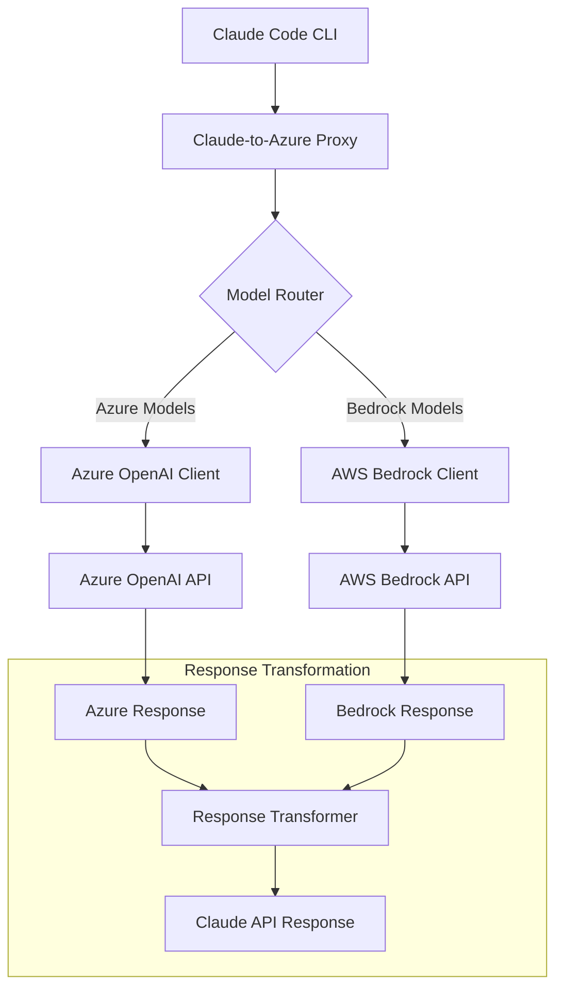
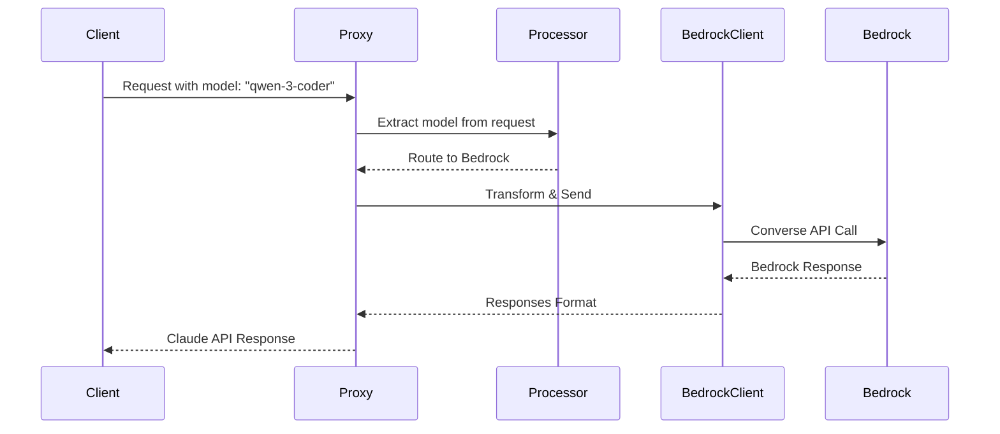

# Design Document

## Overview

This design extends the existing Claude-to-Azure OpenAI proxy to support AWS Bedrock models, specifically the Qwen 3 Coder model (qwen.qwen3-coder-480b-a35b-v1:0) in the us-west-2 region. The system will maintain the same Claude API compatibility while intelligently routing requests to either Azure OpenAI or AWS Bedrock based on the requested model name, using API key authentication for AWS Bedrock to avoid AWS credential complexity.

The design follows the existing architectural patterns established in the codebase, reusing error handling, resilience patterns, configuration management, and response transformation utilities while adding new components for AWS Bedrock integration.

## Architecture

### High-Level Architecture



### Component Integration

The design integrates with existing components:

1. **Configuration System**: Extends `src/config/index.ts` to include AWS Bedrock configuration
2. **Client Architecture**: Creates `src/clients/aws-bedrock-client.ts` following the same patterns as `AzureResponsesClient`
3. **Model Router**: Creates `src/utils/model-router.ts` to determine routing destination
4. **Request/Response Transformation**: Extends existing transformers to handle Bedrock format
5. **Error Handling**: Reuses existing error classes and factories
6. **Resilience Patterns**: Applies existing circuit breaker and retry logic to Bedrock requests

## Components and Interfaces

### 1. Configuration Extension (Reuse Existing Patterns)

**File**: `src/config/index.ts` (extended)

Extends existing configuration using the same validation patterns and Joi schemas:

```typescript
export interface Config {
  // ... existing Azure OpenAI config
  
  // AWS Bedrock Configuration (optional, follows same patterns)
  AWS_BEDROCK_API_KEY?: string;
  AWS_BEDROCK_REGION?: string;
  AWS_BEDROCK_TIMEOUT?: number;
  AWS_BEDROCK_MAX_RETRIES?: number;
}

// Reuses existing AzureOpenAIConfig pattern
export interface AWSBedrockConfig {
  readonly baseURL: string; // Constructed from region
  readonly apiKey: string;
  readonly region: string;
  readonly timeout: number;
  readonly maxRetries: number;
}
```

**Reuse Strategy**: 
- Same Joi validation patterns as Azure config
- Same environment variable validation functions
- Same configuration sanitization approach
- Same fail-fast validation principles

### 2. AWS Bedrock Client (Reuse AzureResponsesClient Patterns)

**File**: `src/clients/aws-bedrock-client.ts`

Follows identical patterns to `AzureResponsesClient` for consistency:

```typescript
export class AWSBedrockClient {
  private readonly config: AWSBedrockConfig;
  private readonly httpClient: AxiosInstance; // Reuse axios setup patterns

  constructor(config: AWSBedrockConfig);
  
  // Same interface as AzureResponsesClient (Requirement 1.3)
  public async createResponse(params: ResponsesCreateParams): Promise<ResponsesResponse>;
  public async *createResponseStream(params: ResponsesCreateParams): AsyncIterable<ResponsesStreamChunk>;
  
  // Reuse existing validation patterns
  private validateConfig(config: AWSBedrockConfig): void;
  private validateRequestParams(params: ResponsesCreateParams): void;
  private buildBedrockRequest(params: ResponsesCreateParams): BedrockConverseRequest;
  private transformBedrockResponse(response: BedrockConverseResponse): ResponsesResponse;
  
  // Streaming support with proper cleanup (Requirements 3.1, 3.4, 3.5)
  private async *handleStreamingResponse(response: BedrockStreamResponse): AsyncIterable<ResponsesStreamChunk>;
  private handleStreamingError(error: unknown): void;
  
  // Reuse existing error handling from ErrorFactory (Requirements 6.1, 6.2)
  private handleApiError(error: unknown, operation: string): Error;
  
  // Same sanitized config method as Azure client (Requirement 2.3)
  public getConfig(): Omit<AWSBedrockConfig, 'apiKey'> & { apiKey: '[REDACTED]' };
}
```

**Reuse Strategy**:
- Identical interface to `AzureResponsesClient` for drop-in compatibility
- Same validation methods and error handling patterns
- Reuse existing `ValidationError` and `ErrorFactory` classes
- Same correlation ID and logging patterns
- Same timeout and retry configuration approach

### 3. Model Router (Integrate into Existing Request Processing)

**File**: `src/utils/universal-request-processor.ts` (extended)

Instead of creating a separate router, integrate routing logic into existing request processor:

```typescript
// Extend existing UniversalRequestProcessor
export interface ProcessingResult {
  // ... existing fields
  readonly clientType: 'azure' | 'bedrock'; // New field
  readonly targetClient: AzureResponsesClient | AWSBedrockClient; // New field
  readonly requestedModel: string; // User's original model request
}

// Extend existing createUniversalRequestProcessor
export function createUniversalRequestProcessor(config: UniversalProcessorConfig) {
  // ... existing logic
  
  // Add request-based model routing logic (Requirements 7.1, 7.2, 7.3)
  const routeBasedOnRequestModel = (request: IncomingRequest): 'azure' | 'bedrock' => {
    // Extract model from request body (supports both Claude and OpenAI API formats)
    const requestBody = request.body as { model?: string };
    const requestedModel = requestBody?.model;
    
    if (!requestedModel) {
      return 'azure'; // Default to Azure if no model specified
    }
    
    // Route based on user's requested model (Requirement 7.1)
    if (requestedModel === 'qwen-3-coder' || 
        requestedModel === 'qwen.qwen3-coder-480b-a35b-v1:0' ||
        requestedModel.includes('qwen')) {
      return 'bedrock';
    }
    
    // Route Azure models (Requirement 7.2)
    if (requestedModel === 'gpt-5-codex' || requestedModel.includes('gpt')) {
      return 'azure';
    }
    
    return 'azure'; // Default to Azure for unrecognized models
  };
}
```

**Reuse Strategy**:
- Integrate routing into existing `universal-request-processor.ts`
- Reuse existing request processing pipeline
- No separate router class needed - keep it simple
- Leverage existing configuration and validation patterns

### 4. Streaming Response Handling (Critical for Requirement 3)

**Design Rationale for Streaming**:
- **Identical Behavior**: Bedrock streaming must match Azure OpenAI streaming patterns exactly (Requirement 3.3)
- **Format Transformation**: Convert Bedrock streaming chunks to Claude API format (Requirement 3.2)
- **Error Handling**: Graceful fallback and proper cleanup for streaming failures (Requirements 3.4, 3.5)
- **Connection Management**: Handle interruptions and resource cleanup properly

**Streaming Implementation Strategy**:
```typescript
// Extend existing streaming patterns from AzureResponsesClient
export class AWSBedrockClient {
  public async *createResponseStream(params: ResponsesCreateParams): AsyncIterable<ResponsesStreamChunk> {
    try {
      const bedrockRequest = this.buildBedrockRequest(params);
      const streamResponse = await this.httpClient.post('/converse-stream', bedrockRequest);
      
      // Transform Bedrock streaming format to Claude API format (Requirement 3.2)
      for await (const chunk of this.parseBedrockStream(streamResponse)) {
        yield this.transformBedrockChunkToClaudeFormat(chunk);
      }
    } catch (error) {
      // Graceful fallback with appropriate error messages (Requirement 3.4)
      this.handleStreamingError(error);
      throw this.handleApiError(error, 'streaming');
    }
  }
  
  private handleStreamingError(error: unknown): void {
    // Proper cleanup for streaming connection interruptions (Requirement 3.5)
    // Log error without exposing sensitive data
    // Clean up resources and connections
  }
}
```

### 5. Request/Response Transformation Strategy

**Design Rationale for Format Compatibility** (Requirements 1.3, 3.2):
- **Claude API Compatibility**: All Bedrock responses must be transformed to match exact Claude API format
- **Streaming Format Consistency**: Bedrock streaming chunks must be converted to Claude streaming format
- **Error Format Uniformity**: Bedrock errors must be transformed to Claude error format (Requirement 6.1)
- **Model Name Mapping**: Support both user-friendly names and full AWS model IDs (Requirements 7.1, 7.4)

**Transformation Implementation Strategy**:
```typescript
// Bedrock to Claude API transformation
export class BedrockToClaudeTransformer {
  // Transform non-streaming responses (Requirement 1.3)
  public transformResponse(bedrockResponse: BedrockConverseResponse): ClaudeResponse;
  
  // Transform streaming responses (Requirement 3.2)
  public transformStreamChunk(bedrockChunk: BedrockStreamChunk): ClaudeStreamChunk;
  
  // Transform errors to Claude format (Requirement 6.1)
  public transformError(bedrockError: BedrockError): ClaudeError;
  
  // Map model names bidirectionally (Requirements 7.1, 7.4)
  public mapModelName(userModel: string): string;
}
```

### 6. Bedrock Request/Response Types

**File**: `src/types/index.ts` (extended)

```typescript
// AWS Bedrock Converse API Types
export interface BedrockConverseRequest {
  readonly modelId: string;
  readonly messages: readonly BedrockMessage[];
  readonly inferenceConfig?: {
    readonly maxTokens?: number;
    readonly temperature?: number;
    readonly topP?: number;
    readonly stopSequences?: readonly string[];
  };
  readonly system?: readonly BedrockSystemMessage[];
  readonly toolConfig?: BedrockToolConfig;
}

export interface BedrockMessage {
  readonly role: 'user' | 'assistant';
  readonly content: readonly BedrockContentBlock[];
}

export interface BedrockContentBlock {
  readonly text?: string;
  readonly toolUse?: BedrockToolUse;
  readonly toolResult?: BedrockToolResult;
}

export interface BedrockConverseResponse {
  readonly responseId: string;
  readonly output: {
    readonly message: BedrockMessage;
  };
  readonly stopReason: 'end_turn' | 'tool_use' | 'max_tokens' | 'stop_sequence';
  readonly usage: {
    readonly inputTokens: number;
    readonly outputTokens: number;
    readonly totalTokens: number;
  };
  readonly metrics: {
    readonly latencyMs: number;
  };
}

export interface BedrockStreamChunk {
  readonly messageStart?: { readonly role: 'assistant' };
  readonly contentBlockStart?: { readonly start: { readonly toolUse?: BedrockToolUse } };
  readonly contentBlockDelta?: { readonly delta: { readonly text?: string } };
  readonly contentBlockStop?: { readonly contentBlockIndex: number };
  readonly messageStop?: { readonly stopReason: string };
  readonly metadata?: { readonly usage: BedrockUsage; readonly metrics: BedrockMetrics };
}
```

### 7. Enhanced Models Endpoint (Minimal Changes)

**File**: `src/routes/models.ts` (extended)

Extend existing static models response to include Bedrock models when configured:

```typescript
// Extend existing ClaudeModel interface with metadata for service distinction
export interface ClaudeModel {
  readonly id: string;
  readonly object: 'model';
  readonly created: number;
  readonly owned_by: string;
  readonly provider?: 'azure' | 'bedrock'; // New field for service identification
}

// Extend existing modelsHandler function
export const modelsHandler = (
  req: RequestWithCorrelationId,
  res: Response
): void => {
  // ... existing logging logic (reuse)
  
  // Build models list dynamically based on configuration
  const models: ClaudeModel[] = [
    // Existing Azure model
    {
      id: 'gpt-5-codex',
      object: 'model',
      created: 1640995200,
      owned_by: 'openai',
      provider: 'azure',
    },
  ];
  
  // Add Bedrock models if configured (Requirement 5.1, 5.4)
  if (config.AWS_BEDROCK_API_KEY) {
    models.push({
      id: 'qwen-3-coder',
      object: 'model', 
      created: 1640995200,
      owned_by: 'alibaba',
      provider: 'bedrock',
    });
    
    // Also support full model ID for direct specification (Requirement 5.2)
    models.push({
      id: 'qwen.qwen3-coder-480b-a35b-v1:0',
      object: 'model',
      created: 1640995200,
      owned_by: 'alibaba',
      provider: 'bedrock',
    });
  }
  
  // Reuse existing response format (Requirement 5.3)
  res.status(200).json({
    object: 'list',
    data: models,
  });
};
```

**Design Rationale**:
- **Model Metadata**: Added `provider` field to distinguish between Azure and Bedrock models (Requirement 5.5)
- **Multiple Model IDs**: Support both user-friendly (`qwen-3-coder`) and full model IDs (`qwen.qwen3-coder-480b-a35b-v1:0`) for flexibility (Requirement 5.2)
- **Conditional Inclusion**: Only include Bedrock models when properly configured (Requirement 5.4)

**Reuse Strategy**:
- Keep existing `ClaudeModel` interface structure with minimal extension
- Reuse existing error handling and logging patterns
- Minimal changes to existing handler function
- No new service classes needed

## Data Models

### Request Flow Data Model



### Request-Based Model Routing Strategy

The system extracts the model parameter from incoming requests and routes based on the user's specified model:

| Client Request Model | Destination | Mapped Model ID | Requirements |
|---------------------|-------------|-----------------|--------------|
| `gpt-5-codex` | Azure OpenAI | `gpt-5-codex` (deployment) | 7.2 |
| `qwen-3-coder` | AWS Bedrock | `qwen.qwen3-coder-480b-a35b-v1:0` | 7.1 |
| `qwen.qwen3-coder-480b-a35b-v1:0` | AWS Bedrock | `qwen.qwen3-coder-480b-a35b-v1:0` | 7.1 |
| `unsupported-model` | Error Response | N/A | 7.5 |

**Model Extraction Logic** (Requirements 7.3, 7.4):
- Claude API format: Extract from `request.model` field
- OpenAI API format: Extract from `request.model` field  
- Default fallback: Route to Azure OpenAI if model not recognized
- Error handling: Return appropriate error for unsupported models

**Design Rationale**:
- **Flexible Model Names**: Support both user-friendly names and full AWS model IDs for developer convenience
- **Explicit Error Handling**: Clear error responses for unsupported models prevent silent failures
- **Backward Compatibility**: Default to Azure OpenAI maintains existing behavior for unrecognized models

### Configuration Data Model

```typescript
interface ServiceConfiguration {
  azure?: {
    endpoint: string;
    apiKey: string;
    deployment: string;
    // ... other Azure config
  };
  bedrock?: {
    apiKey: string;
    region: 'us-west-2';
    timeout: number;
    maxRetries: number;
  };
}
```

## Error Handling (Maximum Code Reuse)

### Reuse Existing Error Infrastructure

The design maximally reuses existing error handling without creating new files:

1. **Extend Existing AzureErrorMapper**: `src/utils/azure-error-mapper.ts`
   - Add Bedrock error mapping to existing `AzureErrorMapper.mapError()` method
   - Reuse existing error type mappings and status code logic
   - Same correlation ID and operation tracking

2. **Extend Existing ErrorFactory**: `src/errors/index.ts`
   - Add Bedrock error methods to existing `ErrorFactory` class
   - Reuse existing `AzureOpenAIError` class for Bedrock errors (rename to `APIError`)
   - Same timeout and network error handling patterns

3. **Reuse Existing Circuit Breaker**: `src/resilience/index.ts`
   - Register `aws-bedrock-api` using existing `circuitBreakerRegistry`
   - Same failure thresholds and recovery patterns as `azure-responses-api`
   - Reuse existing retry strategies and graceful degradation

### Error Response Format (Requirements 6.1, 6.2)

**Consistent Error Transformation Strategy**:
All Bedrock errors must be transformed to match Claude API error format exactly, ensuring uniform error handling across both services.

```typescript
// Bedrock validation error -> Claude error format (Requirement 6.1)
{
  "type": "error",
  "error": {
    "type": "invalid_request_error",
    "message": "Invalid model: qwen-3-coder is not available",
    "correlationId": "uuid-here"
  }
}

// Bedrock rate limit -> Claude error format (Requirement 6.1)
{
  "type": "error",
  "error": {
    "type": "rate_limit_error", 
    "message": "Request rate limit exceeded",
    "correlationId": "uuid-here"
  }
}

// Bedrock service unavailable -> Claude error format (Requirement 6.2)
{
  "type": "error",
  "error": {
    "type": "api_error",
    "message": "AWS Bedrock service is temporarily unavailable",
    "correlationId": "uuid-here"
  }
}

// Unsupported model error -> Claude error format (Requirement 7.5)
{
  "type": "error",
  "error": {
    "type": "invalid_request_error",
    "message": "Model 'unsupported-model' is not supported. Available models: gpt-5-codex, qwen-3-coder",
    "correlationId": "uuid-here"
  }
}
```

**Error Handling Design Rationale**:
- **Uniform Error Format**: All errors follow Claude API format regardless of source service (Requirement 6.1)
- **Service Status Transparency**: Clear error messages when services are unavailable (Requirements 6.2, 6.5)
- **Model Validation**: Helpful error messages for unsupported models with available alternatives (Requirement 7.5)
- **Security**: No sensitive data exposure in error responses (Requirement 2.3)

## Testing Strategy (Reuse Existing Test Patterns)

**Quality Standards Compliance** (Requirement 8):
- All AWS Bedrock integration code must pass TypeScript type-checking with zero errors/warnings (Requirement 8.1)
- ESLint validation must pass with zero errors/warnings (Requirement 8.2)
- Minimum 80% test coverage for all Bedrock functionality (Requirement 8.3)
- All tests must pass without errors or warnings (Requirement 8.4)
- Follow existing code patterns and architectural principles (Requirement 8.5)

**Testing Implementation Strategy**:
```typescript
// Test coverage requirements for each component
describe('AWS Bedrock Integration', () => {
  // Client testing (>80% coverage required)
  describe('AWSBedrockClient', () => {
    it('should handle streaming responses identically to Azure client');
    it('should transform errors to Claude format');
    it('should validate configuration at startup');
  });
  
  // Model routing testing (>80% coverage required)
  describe('Model Routing', () => {
    it('should route qwen-3-coder to Bedrock');
    it('should route gpt-5-codex to Azure');
    it('should handle unsupported models with appropriate errors');
  });
  
  // Integration testing (>80% coverage required)
  describe('End-to-End Integration', () => {
    it('should maintain Claude API compatibility for Bedrock requests');
    it('should handle streaming responses with proper cleanup');
    it('should provide consistent error handling across services');
  });
});
```

### Unit Testing (Extend Existing Test Files)

1. **Extend Existing Client Tests**: `tests/clients/azure-responses-client.test.ts`
   - Add Bedrock client tests to existing client test patterns
   - Reuse existing test factories and mock patterns
   - Same validation and error handling test structure

2. **Extend Existing Processor Tests**: `tests/utils/universal-request-processor.test.ts`
   - Add model routing tests to existing processor tests
   - Reuse existing request processing test scenarios
   - Same configuration and validation test patterns

3. **Extend Existing Transformer Tests**: `tests/utils/response-transformer.test.ts`
   - Add Bedrock transformation tests to existing transformer tests
   - Reuse existing transformation test data and patterns
   - Same streaming response test structure

### Integration Testing (Extend Existing Integration Tests)

1. **Extend Existing Integration Tests**: `tests/integration.test.ts`
   - Add Bedrock request flow to existing integration test suite
   - Reuse existing test server setup and mock patterns
   - Same error handling and performance test structure

2. **Extend Existing Models Tests**: `tests/routes/models.test.ts` (if exists)
   - Add Bedrock model listing tests to existing models tests
   - Reuse existing route testing patterns and assertions

### Security Testing (Reuse Existing Security Tests)

1. **Extend Existing Security Tests**: `tests/security.test.ts` and `tests/enhanced-security.test.ts`
   - Add Bedrock API key validation to existing security test suite
   - Reuse existing input sanitization test patterns
   - Same error response sanitization test structure

### Performance Testing (Reuse Existing Performance Tests)

1. **Extend Existing Performance Tests**: `tests/performance-load.test.ts`
   - Add Bedrock latency tests to existing performance test suite
   - Reuse existing concurrent request test patterns
   - Same circuit breaker behavior test structure

## Implementation Phases (Emphasizing Code Reuse)

### Phase 1: Configuration and Client (Tasks 1-3)
- Extend existing configuration system with Bedrock settings
- Create AWS Bedrock client following Azure client patterns exactly
- Integrate routing logic into existing request processor

### Phase 2: Request/Response Processing (Tasks 4-6)
- Extend existing transformer utilities for Bedrock format
- Extend existing error handling classes for Bedrock errors
- Integrate Bedrock into existing resilience patterns

### Phase 3: Integration and Testing (Tasks 7-9)
- Modify existing completions endpoint to support both clients
- Extend existing models endpoint with conditional Bedrock models
- Extend existing test suites with Bedrock test cases

### Phase 4: Documentation and Deployment (Tasks 10-12)
- Update existing configuration documentation
- Extend existing API documentation with Bedrock model information
- Update existing deployment guides with Bedrock configuration

## Security Considerations (Reuse Existing Security Patterns)

### API Key Management (Same as Azure)
- Reuse existing environment variable validation patterns from `src/config/index.ts`
- Same fail-fast validation behavior as Azure configuration
- Same key sanitization in logs using existing `sanitizeConfig()` function
- Extend existing configuration validation schema with Bedrock keys

### Request Validation (Reuse Existing Middleware)
- Apply existing input sanitization middleware to Bedrock requests
- Reuse existing content security validation from `src/middleware/enhanced-security.ts`
- Apply existing rate limiting middleware equally to both services

### Error Response Sanitization (Reuse Existing Error Handling)
- Extend existing error sanitization in `AzureErrorMapper` for Bedrock
- Reuse existing correlation ID patterns from `src/utils/correlation-id.ts`
- Same error format consistency using existing error response utilities

## Performance Considerations (Reuse Existing Performance Infrastructure)

### Latency Optimization (Same Patterns as Azure)
- Reuse existing HTTP client configuration patterns from Azure client
- Same timeout configuration approach using existing config validation
- Leverage existing request processing pipeline for efficiency

### Resource Management (Reuse Existing Patterns)
- Apply existing streaming patterns from `AzureResponsesClient`
- Reuse existing HTTP connection management and cleanup
- Leverage existing circuit breaker infrastructure to prevent resource exhaustion

### Monitoring and Metrics (Extend Existing Monitoring)
- Extend existing performance monitoring in `src/monitoring/` for Bedrock (Requirement 4.2)
- Add routing decision tracking to existing request metrics with service identifiers (Requirement 4.1)
- Extend existing health monitoring to include Bedrock service status (Requirement 4.3)
- Implement separate metrics endpoints for Azure vs Bedrock usage tracking (Requirement 4.5)
- Add structured logging for Bedrock errors without exposing sensitive data (Requirement 4.4)

**Monitoring Implementation Strategy**:
```typescript
// Extend existing monitoring patterns
export class BedrockMonitor {
  // Track Bedrock-specific metrics separately (Requirement 4.2)
  public trackBedrockRequest(correlationId: string, model: string, latency: number): void;
  public trackBedrockError(correlationId: string, errorType: string, model: string): void;
  
  // Service identification in logs (Requirement 4.1)
  public logBedrockRequest(correlationId: string, serviceId: 'bedrock', requestData: SanitizedRequestData): void;
}

// Extend existing metrics collection
export interface ServiceMetrics {
  azure: {
    requestCount: number;
    averageLatency: number;
    errorRate: number;
  };
  bedrock: {
    requestCount: number;
    averageLatency: number;
    errorRate: number;
  };
}
```

## Deployment Considerations (Reuse Existing Deployment Infrastructure)

### Environment Configuration (Extend Existing Config)
- Extend existing `.env.example` with optional Bedrock variables
- Reuse existing configuration validation and error messaging patterns
- Same backward compatibility approach as other optional features

### Health Checks (Extend Existing Health Monitoring)
- Extend existing health endpoint in `src/routes/health.ts` with Bedrock status (Requirement 2.4)
- Reuse existing health check patterns and status reporting
- Same partial service availability handling as existing health checks
- Include Bedrock models in health check validation when configured (Requirement 2.4)
- Provide clear service status information when services are unavailable (Requirement 6.5)

### Scaling Considerations (Leverage Existing Architecture)
- Existing stateless design already supports mixed request handling
- Reuse existing configuration-driven patterns for service selection
- Existing load balancing and scaling patterns apply to both services