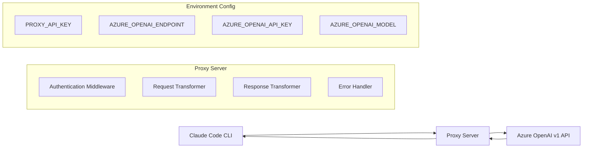

# Design Document

## Overview

The Claude-to-Azure Proxy is a lightweight HTTP server that acts as an API gateway, translating requests from Claude Code CLI format to Azure OpenAI v1 API format. The proxy provides a seamless interface that allows developers to use Claude-compatible tools while leveraging Azure OpenAI's GPT-5-Codex model.

The system consists of a single Node.js/Express server built with TypeScript that handles authentication, request transformation, and response mapping between the two API formats. Node.js 22 (latest LTS) was chosen for its excellent performance with IO-intensive tasks, fast startup times suitable for AWS App Runner, and mature HTTP handling ecosystem. TypeScript provides type safety, better developer experience, and improved code maintainability. The project uses pnpm as the package manager for faster, more efficient dependency management.

## Architecture



## Components and Interfaces

### 1. HTTP Server (Express.js with TypeScript)

**Purpose:** Main application server handling incoming requests and routing

**Key Features:**
- Express.js framework with TypeScript for type-safe HTTP handling
- Middleware pipeline for authentication and request processing
- Health check endpoint for AWS App Runner
- Graceful shutdown handling
- Compile-time type checking for enhanced reliability

**Endpoints:**
- `GET /v1/models` - Returns hardcoded model list
- `POST /v1/completions` - Proxies completion requests to Azure OpenAI
- `GET /health` - Health check for AWS App Runner

### 2. Authentication Middleware

**Purpose:** Validates client API keys before processing requests using a separate authentication layer

**Implementation:**
- Checks `Authorization: Bearer <token>` or `x-api-key: <key>` headers from client
- Validates client credentials against `PROXY_API_KEY` environment variable
- Client authentication is completely separate from Azure OpenAI authentication
- Returns 401 Unauthorized for invalid client credentials
- On successful client authentication, uses `AZURE_OPENAI_API_KEY` for backend requests

### 3. Request Transformer

**Purpose:** Converts Claude API format requests to Azure OpenAI v1 API format

**Key Transformations:**
- Maps Claude completion parameters to Azure OpenAI chat completion format
- Handles message format conversion
- Preserves streaming capabilities if supported
- Adds Azure-specific headers and authentication

**Azure OpenAI v1 API Format:**
```javascript
// Target Azure OpenAI endpoint format
const azureRequest = {
  model: process.env.AZURE_OPENAI_MODEL,
  messages: transformedMessages,
  // Other parameters mapped from Claude format
};

// Request sent to: https://{resource}.openai.azure.com/openai/v1/chat/completions
```

### 4. Response Transformer

**Purpose:** Converts Azure OpenAI responses back to Claude API format

**Key Transformations:**
- Maps Azure OpenAI response structure to Claude format
- Handles streaming responses if applicable
- Preserves error information and status codes
- Maintains response timing and metadata

### 5. Models Endpoint Handler

**Purpose:** Returns static model information compatible with Claude API

**Implementation:**
```javascript
const staticModelsResponse = {
  "object": "list",
  "data": [
    {
      "id": "claude-3-5-sonnet-20241022", // Simulated Claude model ID
      "object": "model",
      "created": 1640995200,
      "owned_by": "anthropic"
    }
  ]
};
```

### 6. Configuration Manager (TypeScript)

**Purpose:** Handles environment variable loading and validation with type safety

**Implementation:**
- TypeScript interfaces for configuration structure
- Joi schema validation for runtime type checking
- Compile-time and runtime type safety
- Immutable configuration objects

**Required Environment Variables:**
- `PROXY_API_KEY` - Client authentication key (used by developers to authenticate with the proxy)
- `AZURE_OPENAI_ENDPOINT` - Azure OpenAI resource endpoint URL
- `AZURE_OPENAI_API_KEY` - Azure OpenAI API key (backend authentication, hidden from clients)
- `AZURE_OPENAI_MODEL` - Target model deployment name in Azure OpenAI
- `PORT` - Server port (default: 8080 for AWS App Runner)

**Authentication Flow:**
1. Client sends request with `PROXY_API_KEY` in headers
2. Proxy validates client credentials against configured `PROXY_API_KEY`
3. Proxy forwards request to Azure OpenAI using `AZURE_OPENAI_API_KEY`
4. Client never sees or needs to know the Azure OpenAI credentials

## Data Models

### Claude API Request Format (Input)
```typescript
interface ClaudeCompletionRequest {
  model: string;
  prompt: string;
  max_tokens: number;
  temperature?: number;
}

// Example:
{
  "model": "claude-3-5-sonnet-20241022",
  "prompt": "Hello, world!",
  "max_tokens": 100,
  "temperature": 0.7
}
```

### Azure OpenAI v1 API Request Format (Output)
```typescript
interface AzureOpenAIRequest {
  model: string;
  messages: Array<{
    role: 'user' | 'assistant' | 'system';
    content: string;
  }>;
  max_tokens: number;
  temperature?: number;
}

// Example:
{
  "model": "gpt-5-codex", // From AZURE_OPENAI_MODEL
  "messages": [
    {
      "role": "user",
      "content": "Hello, world!"
    }
  ],
  "max_tokens": 100,
  "temperature": 0.7
}
```

### Response Transformation
```typescript
// Azure OpenAI Response
interface AzureOpenAIResponse {
  id: string;
  object: string;
  choices: Array<{
    message: {
      role: string;
      content: string;
    };
  }>;
}

// Transformed to Claude Format
interface ClaudeCompletionResponse {
  id: string;
  type: string;
  completion: string;
  model: string;
}

// Example transformation:
// Azure OpenAI Response
{
  "id": "chatcmpl-123",
  "object": "chat.completion",
  "choices": [{
    "message": {
      "role": "assistant",
      "content": "Hello! How can I help you?"
    }
  }]
}

// Transformed to Claude Format
{
  "id": "chatcmpl-123",
  "type": "completion",
  "completion": "Hello! How can I help you?",
  "model": "claude-3-5-sonnet-20241022"
}
```

## Error Handling

### Authentication Errors
- Return 401 Unauthorized with Claude-compatible error format
- Log authentication attempts for security monitoring

### Azure OpenAI API Errors
- Transform Azure error responses to Claude format
- Preserve original error codes and messages where possible
- Handle rate limiting and quota exceeded scenarios

### Configuration Errors
- Validate all required environment variables on startup
- Exit gracefully with descriptive error messages
- Log configuration issues for debugging

### Network Errors
- Implement retry logic for transient failures
- Handle connection timeouts and network issues
- Provide meaningful error responses to clients

## Testing Strategy

### Unit Tests (using Vitest with TypeScript)
- Request/response transformation logic with type safety
- Authentication middleware functionality
- Configuration validation with TypeScript interfaces
- Error handling scenarios with typed error classes

### Integration Tests
- End-to-end request flow testing
- Azure OpenAI API integration
- Health check endpoint validation
- AWS App Runner compatibility

### Load Testing
- Concurrent request handling
- Memory usage under load
- Response time benchmarks
- Connection pooling efficiency

## AWS App Runner Deployment Considerations

### Container Configuration
- Use Node.js 22 Alpine base image for minimal footprint
- Use pnpm for dependency installation in container for faster builds
- Compile TypeScript to JavaScript during build process
- Expose port from PORT environment variable (default 8080)
- Implement graceful shutdown on SIGTERM

### Health Checks
- `/health` endpoint returns 200 OK when service is ready
- Include basic connectivity checks to Azure OpenAI
- Fast response time for App Runner health monitoring

### Logging
- Structured JSON logs to stdout for CloudWatch integration
- Include request IDs for tracing
- Log levels: ERROR, WARN, INFO, DEBUG

### Environment Variables
- All configuration through environment variables
- No hardcoded secrets or endpoints
- Support for AWS Secrets Manager integration (future enhancement)

### Scaling Considerations
- Stateless design for horizontal scaling
- Connection pooling for Azure OpenAI requests
- Minimal memory footprint per instance