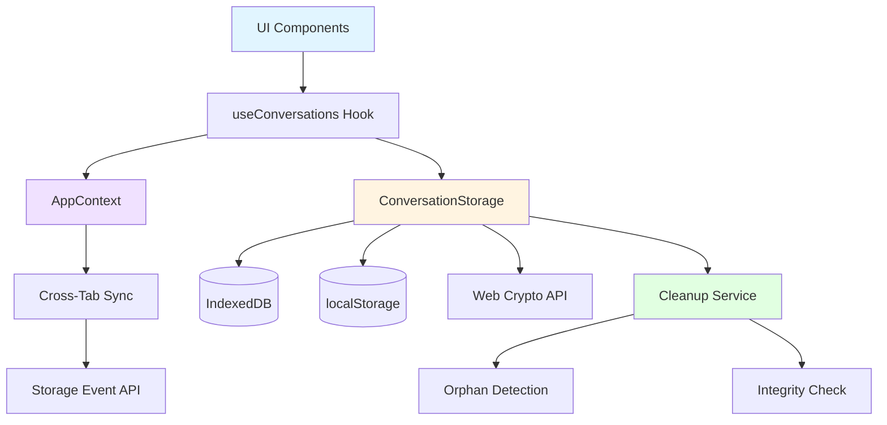
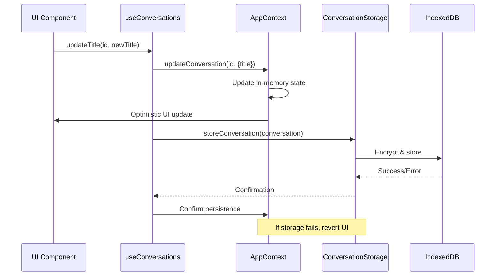

# Design Document: Conversation Persistence

## Overview

This document outlines the design for implementing robust conversation persistence in the Claude-to-Azure OpenAI Proxy web application. The system will ensure that conversation title changes persist across browser sessions, deleted conversations are completely removed from storage, and the application state remains consistent after browser refresh.

### Current State Analysis

The application already has a sophisticated storage system:
- **IndexedDB** as primary storage with localStorage fallback for conversation data
- **Encryption** using Web Crypto API (AES-GCM 256-bit) for data security
- **Compression** using native CompressionStream API for large data optimization
- **Session-based** storage with session validation
- **Hooks** (`useConversations`) for conversation management
- **Context** (`AppContext`) for global state management

### Storage Strategy

**Primary Storage: IndexedDB**
- Modern, asynchronous, high-performance storage
- Supports large data volumes (typically >50MB, often hundreds of MB)
- Structured data with indexes for efficient querying
- Transaction support for atomic operations
- Better performance for complex queries

**Fallback Storage: localStorage**
- Only used when IndexedDB is unavailable or fails
- Limited to ~5-10MB depending on browser
- Synchronous API (blocking)
- Simple key-value storage
- Used as last resort for data persistence

**Detection and Fallback Logic:**
```typescript
// Check IndexedDB availability
if ('indexedDB' in window && window.indexedDB !== null) {
  // Use IndexedDB (preferred)
  await initializeIndexedDB();
} else {
  // Fallback to localStorage
  frontendLogger.warn('IndexedDB unavailable, using localStorage fallback');
  useLocalStorageFallback();
}
```

### Gap Analysis

Current implementation gaps that need to be addressed:
1. **Title persistence**: Title updates may not immediately persist to storage
2. **Deletion cleanup**: Deletion may not clean up all associated data (messages, metadata)
3. **Cross-tab synchronization**: Changes in one tab don't propagate to other tabs
4. **Orphaned data cleanup**: No mechanism to clean up orphaned messages
5. **Optimistic updates**: UI updates before storage confirmation, leading to inconsistencies

## Architecture

### High-Level Architecture



### Component Interaction Flow



## Components and Interfaces

### 1. Enhanced ConversationStorage Service

#### Storage Priority Strategy

```typescript
/**
 * Storage backend selection with IndexedDB priority
 */
class ConversationStorage {
  private storageBackend: 'indexeddb' | 'localstorage' | null = null;
  
  /**
   * Initialize storage with IndexedDB priority
   */
  async initialize(): Promise<void> {
    // Try IndexedDB first (preferred)
    if (await this.tryInitializeIndexedDB()) {
      this.storageBackend = 'indexeddb';
      frontendLogger.info('Using IndexedDB for storage');
      return;
    }
    
    // Fallback to localStorage
    if (this.tryInitializeLocalStorage()) {
      this.storageBackend = 'localstorage';
      frontendLogger.warn('IndexedDB unavailable, using localStorage fallback');
      return;
    }
    
    // No storage available
    throw new PersistenceError(
      PersistenceErrorType.STORAGE_UNAVAILABLE,
      'No storage backend available'
    );
  }
  
  /**
   * Try to initialize IndexedDB
   */
  private async tryInitializeIndexedDB(): Promise<boolean> {
    try {
      // Check if IndexedDB is available
      if (!('indexedDB' in window) || window.indexedDB === null) {
        return false;
      }
      
      // Test IndexedDB functionality
      const testDB = await this.openTestDatabase();
      testDB.close();
      
      // Initialize actual database
      await this.openDatabase();
      
      return true;
    } catch (error) {
      frontendLogger.error('IndexedDB initialization failed', { error });
      return false;
    }
  }
  
  /**
   * Try to initialize localStorage
   */
  private tryInitializeLocalStorage(): boolean {
    try {
      // Check if localStorage is available
      if (!('localStorage' in window)) {
        return false;
      }
      
      // Test localStorage functionality
      const testKey = '__storage_test__';
      localStorage.setItem(testKey, 'test');
      localStorage.removeItem(testKey);
      
      return true;
    } catch (error) {
      frontendLogger.error('localStorage initialization failed', { error });
      return false;
    }
  }
  
  /**
   * Get current storage backend
   */
  getStorageBackend(): 'indexeddb' | 'localstorage' | null {
    return this.storageBackend;
  }
}
```

#### New Methods

```typescript
/**
 * Update conversation title with atomic operation
 * Uses IndexedDB transaction for atomicity
 */
async updateConversationTitle(
  conversationId: string,
  newTitle: string
): Promise<void>;

/**
 * Delete conversation with complete cleanup
 * Ensures all related data is removed atomically
 */
async deleteConversationComplete(
  conversationId: string
): Promise<DeleteResult>;

/**
 * Detect and clean up orphaned messages
 * Runs on startup to maintain data integrity
 */
async cleanupOrphanedData(): Promise<CleanupResult>;

/**
 * Verify data integrity
 * Checks for corrupted data and broken references
 */
async verifyIntegrity(): Promise<IntegrityReport>;

/**
 * Batch update conversations (for cross-tab sync)
 * Uses single transaction for multiple updates
 */
async batchUpdateConversations(
  updates: ConversationUpdate[]
): Promise<BatchUpdateResult>;
```

#### Enhanced Interfaces

```typescript
interface DeleteResult {
  success: boolean;
  conversationRemoved: boolean;
  messagesRemoved: number;
  metadataRemoved: boolean;
  bytesFreed: number;
  error?: string;
}

interface IntegrityReport {
  totalConversations: number;
  orphanedMessages: number;
  corruptedConversations: number;
  missingReferences: number;
  recommendations: string[];
}

interface ConversationUpdate {
  conversationId: string;
  updates: Partial<Conversation>;
  timestamp: number;
  source: 'local' | 'remote';
}

interface BatchUpdateResult {
  successful: number;
  failed: number;
  conflicts: ConversationConflict[];
}

interface ConversationConflict {
  conversationId: string;
  localVersion: Conversation;
  remoteVersion: Conversation;
  resolution: 'local' | 'remote' | 'merge';
}
```

### 2. Cross-Tab Synchronization Service

```typescript
/**
 * Cross-tab synchronization service using Storage Event API
 */
class CrossTabSyncService {
  private readonly SYNC_KEY_PREFIX = 'sync_event_';
  private readonly listeners: Map<string, Set<SyncListener>>;
  
  /**
   * Initialize cross-tab synchronization
   */
  initialize(): void;
  
  /**
   * Broadcast conversation update to other tabs
   */
  broadcastUpdate(
    conversationId: string,
    updates: Partial<Conversation>
  ): void;
  
  /**
   * Broadcast conversation deletion to other tabs
   */
  broadcastDeletion(conversationId: string): void;
  
  /**
   * Subscribe to sync events
   */
  subscribe(
    eventType: SyncEventType,
    listener: SyncListener
  ): () => void;
  
  /**
   * Handle incoming sync events from other tabs
   */
  private handleStorageEvent(event: StorageEvent): void;
  
  /**
   * Resolve conflicts when multiple tabs update same conversation
   */
  private resolveConflict(
    local: Conversation,
    remote: Conversation
  ): Conversation;
}

type SyncEventType = 'update' | 'delete' | 'create';

interface SyncListener {
  (event: SyncEvent): void;
}

interface SyncEvent {
  type: SyncEventType;
  conversationId: string;
  data?: Partial<Conversation>;
  timestamp: number;
  sourceTabId: string;
}
```

### 3. Enhanced useConversations Hook

#### Updated Methods

```typescript
/**
 * Update conversation title with persistence guarantee
 */
const updateConversationTitle = async (
  conversationId: string,
  newTitle: string
): Promise<void> => {
  // Validate title
  const sanitized = sanitizeTitle(newTitle);
  
  // Optimistic update
  updateConversationInContext(conversationId, { title: sanitized });
  
  try {
    // Persist to storage
    await storage.updateConversationTitle(conversationId, sanitized);
    
    // Broadcast to other tabs
    crossTabSync.broadcastUpdate(conversationId, { title: sanitized });
    
    // Log success
    frontendLogger.info('Title updated successfully', {
      metadata: { conversationId, newTitle: sanitized }
    });
  } catch (error) {
    // Revert optimistic update
    const original = state.conversations.conversations.get(conversationId);
    if (original) {
      updateConversationInContext(conversationId, { title: original.title });
    }
    
    // Show error to user
    dispatch({
      type: 'SET_CONVERSATIONS_ERROR',
      payload: 'Failed to update conversation title'
    });
    
    throw error;
  }
};

/**
 * Delete conversation with complete cleanup
 */
const deleteConversationComplete = async (
  conversationId: string
): Promise<void> => {
  // Optimistic removal from UI
  deleteConversationInContext(conversationId);
  
  try {
    // Delete from storage with complete cleanup
    const result = await storage.deleteConversationComplete(conversationId);
    
    if (!result.success) {
      throw new Error(result.error || 'Deletion failed');
    }
    
    // Broadcast deletion to other tabs
    crossTabSync.broadcastDeletion(conversationId);
    
    // Log success
    frontendLogger.info('Conversation deleted successfully', {
      metadata: {
        conversationId,
        messagesRemoved: result.messagesRemoved,
        bytesFreed: result.bytesFreed
      }
    });
  } catch (error) {
    // Restore conversation in UI (fetch from storage if possible)
    const restored = await storage.getConversation(conversationId);
    if (restored) {
      addConversation(restored);
    }
    
    // Show error to user
    dispatch({
      type: 'SET_CONVERSATIONS_ERROR',
      payload: 'Failed to delete conversation'
    });
    
    throw error;
  }
};
```

### 4. Local Conversation Search Service

**Design Rationale:**
The search service is designed to work seamlessly with both IndexedDB and localStorage backends, automatically detecting the available storage mechanism and adapting its strategy accordingly. This ensures consistent search functionality regardless of browser capabilities or storage availability.

**Key Design Decisions:**
1. **Automatic Backend Detection**: The service detects the storage backend from `ConversationStorage` and adapts search strategy (IndexedDB uses optional full-text index for O(log n) performance, localStorage uses in-memory index for O(n) performance)
2. **Pagination Strategy**: Load first 3 pages (60 results) immediately for instant navigation, lazy-load additional pages on demand to balance performance and user experience
3. **Dual Index Approach**: Maintain in-memory index for fast access, optionally create IndexedDB full-text index for optimized search when available
4. **Index Consistency**: Automatically update search index when conversations are created, updated, or deleted to maintain data consistency
5. **Graceful Degradation**: Fall back to in-memory search if IndexedDB full-text index creation fails

```typescript
/**
 * Local conversation search service with full-text search capabilities
 * Supports both IndexedDB and localStorage backends
 * 
 * Performance Characteristics:
 * - IndexedDB backend: O(log n) search with full-text index
 * - localStorage backend: O(n) search with in-memory index
 * - Search latency target: <500ms (Requirement 8.1)
 * - Pagination: 20 results per page (Requirement 8.9)
 * - Prefetch: First 3 pages loaded immediately (Requirement 8.10)
 */
class ConversationSearchService {
  private readonly storage: ConversationStorage;
  private searchIndex: Map<string, SearchIndexEntry> | null = null;
  private readonly RESULTS_PER_PAGE = 20; // Results per page (Requirement 8.9)
  private readonly INITIAL_PAGES = 3; // Load first 3 pages immediately (Requirement 8.10)
  private readonly CONTEXT_LENGTH = 100; // characters before/after keyword (Requirement 8.7)
  private storageBackend: 'indexeddb' | 'localstorage' | null = null;
  
  /**
   * Initialize search service and build index
   * Automatically detects storage backend from ConversationStorage
   * 
   * Requirement 8.12: Detects IndexedDB availability and uses it when available
   * Requirement 8.13: Falls back to localStorage with in-memory index when IndexedDB unavailable
   * Requirement 8.15: Rebuilds search index on initialization if corrupted or missing
   */
  async initialize(): Promise<void> {
    // Detect storage backend (Requirement 8.13)
    this.storageBackend = this.storage.getStorageBackend();
    
    if (this.storageBackend === 'indexeddb') {
      // Use IndexedDB with optional full-text index (Requirement 8.11)
      await this.initializeIndexedDBSearch();
    } else if (this.storageBackend === 'localstorage') {
      // Use localStorage with in-memory index (Requirement 8.12)
      await this.initializeLocalStorageSearch();
    } else {
      throw new Error('No storage backend available for search');
    }
    
    frontendLogger.info('Search service initialized', {
      metadata: { backend: this.storageBackend }
    });
  }
  
  /**
   * Initialize IndexedDB-based search with full-text index
   * 
   * Requirement 8.11: Uses IndexedDB full-text search index for O(log n) performance
   */
  private async initializeIndexedDBSearch(): Promise<void> {
    // Build in-memory index from IndexedDB (Requirement 8.15)
    await this.buildSearchIndex();
    
    // Optional: Create IndexedDB full-text search index for better performance (Requirement 8.11)
    await this.createFullTextIndex();
  }
  
  /**
   * Initialize localStorage-based search with in-memory index
   * 
   * Requirement 8.12: Uses in-memory search index with localStorage backend for O(n) performance
   */
  private async initializeLocalStorageSearch(): Promise<void> {
    // Build in-memory index from localStorage (Requirement 8.15)
    await this.buildSearchIndex();
    
    // localStorage doesn't support native indexing, so we rely on in-memory index (Requirement 8.12)
    frontendLogger.info('Using in-memory search index for localStorage backend');
  }
  
  /**
   * Create full-text search index in IndexedDB (optional optimization)
   */
  private async createFullTextIndex(): Promise<void> {
    // This creates an optimized index for full-text search in IndexedDB
    // Only available when using IndexedDB backend
    if (this.storageBackend !== 'indexeddb') {
      return;
    }
    
    try {
      const db = await this.storage.getDatabase();
      if (!db) {
        return;
      }
      
      // Check if full-text index store exists
      if (!db.objectStoreNames.contains('search_index')) {
        // Index will be created on next database upgrade
        frontendLogger.info('Full-text index will be created on next upgrade');
        return;
      }
      
      // Populate full-text index
      const transaction = db.transaction(['search_index'], 'readwrite');
      const store = transaction.objectStore('search_index');
      
      // Clear existing index
      await this.promisifyRequest(store.clear());
      
      // Add all conversations to index
      if (this.searchIndex) {
        for (const [conversationId, entry] of this.searchIndex.entries()) {
          await this.promisifyRequest(store.put({
            conversationId,
            titleTokens: entry.titleTokens,
            messageTokens: entry.messages.flatMap(m => m.tokens),
            lastUpdated: entry.lastUpdated.getTime()
          }));
        }
      }
      
      frontendLogger.info('Full-text index created in IndexedDB');
    } catch (error) {
      frontendLogger.warn('Failed to create full-text index, using in-memory index', {
        error: error instanceof Error ? error : new Error(String(error))
      });
    }
  }
  
  /**
   * Search conversations by keyword with pagination
   * Works with both IndexedDB and localStorage backends
   * 
   * Requirement 8.1: Searches through all conversation titles and message content within 500ms
   * Requirement 8.2: Displays matching conversations with highlighted keyword occurrences
   * Requirement 8.6: Supports case-insensitive search by default with option for case-sensitive
   * Requirement 8.9: Implements pagination with 20 results per page
   * Requirement 8.13: Automatically detects storage backend and adapts search strategy
   */
  async search(
    query: string,
    options?: SearchOptions
  ): Promise<SearchResponse> {
    const startTime = Date.now();
    
    if (this.storageBackend === 'indexeddb') {
      // Use IndexedDB search (Requirement 8.11)
      const response = await this.searchIndexedDB(query, options);
      response.searchTime = Date.now() - startTime;
      return response;
    } else if (this.storageBackend === 'localstorage') {
      // Use localStorage search (Requirement 8.12)
      const response = await this.searchLocalStorage(query, options);
      response.searchTime = Date.now() - startTime;
      return response;
    } else {
      throw new Error('Search not initialized');
    }
  }
  
  /**
   * Get all search results without pagination (for export or analysis)
   */
  async searchAll(
    query: string,
    options?: Omit<SearchOptions, 'page' | 'pageSize'>
  ): Promise<SearchResult[]> {
    // Get all results without pagination
    const response = await this.search(query, {
      ...options,
      page: 0,
      pageSize: Number.MAX_SAFE_INTEGER
    });
    
    return response.results;
  }
  
  /**
   * Search using IndexedDB backend with pagination
   * Can use native full-text index if available
   */
  private async searchIndexedDB(
    query: string,
    options?: SearchOptions
  ): Promise<SearchResponse> {
    // Try to use IndexedDB full-text index first
    const db = await this.storage.getDatabase();
    if (db && db.objectStoreNames.contains('search_index')) {
      try {
        return await this.searchWithFullTextIndex(query, options);
      } catch (error) {
        frontendLogger.warn('Full-text index search failed, falling back to in-memory', {
          error: error instanceof Error ? error : new Error(String(error))
        });
      }
    }
    
    // Fallback to in-memory search
    return await this.searchInMemory(query, options);
  }
  
  /**
   * Search using localStorage backend with pagination
   * Always uses in-memory index
   */
  private async searchLocalStorage(
    query: string,
    options?: SearchOptions
  ): Promise<SearchResponse> {
    // localStorage doesn't support native indexing
    // Always use in-memory search
    return await this.searchInMemory(query, options);
  }
  
  /**
   * Search using IndexedDB full-text index (optimized) with pagination
   */
  private async searchWithFullTextIndex(
    query: string,
    options?: SearchOptions
  ): Promise<SearchResponse> {
    const db = await this.storage.getDatabase();
    if (!db) {
      throw new Error('Database not available');
    }
    
    const page = options?.page ?? 0;
    const pageSize = options?.pageSize ?? this.RESULTS_PER_PAGE;
    const keywords = this.tokenize(query, options?.caseSensitive ?? false);
    
    const transaction = db.transaction(['search_index', 'conversations', 'messages'], 'readonly');
    const indexStore = transaction.objectStore('search_index');
    
    const allResults: SearchResult[] = [];
    
    // Search through index
    const cursor = await this.promisifyRequest(indexStore.openCursor());
    
    // Process cursor results
    // ... (implementation details to collect all matching results)
    
    // Sort by relevance
    allResults.sort((a, b) => b.relevanceScore - a.relevanceScore);
    
    // Apply pagination
    const startIndex = page * pageSize;
    const endIndex = startIndex + pageSize;
    const paginatedResults = allResults.slice(startIndex, endIndex);
    
    return {
      results: paginatedResults,
      pagination: {
        currentPage: page,
        pageSize,
        totalResults: allResults.length,
        totalPages: Math.ceil(allResults.length / pageSize),
        hasNextPage: endIndex < allResults.length,
        hasPreviousPage: page > 0
      },
      searchTime: 0 // Will be set by caller
    };
  }
  
  /**
   * Search using in-memory index with pagination (works for both backends)
   */
  private async searchInMemory(
    query: string,
    options?: SearchOptions
  ): Promise<SearchResponse> {
    const {
      caseSensitive = false,
      page = 0,
      pageSize = this.RESULTS_PER_PAGE,
      searchInTitles = true,
      searchInMessages = true,
      conversationIds
    } = options ?? {};
    
    // Validate query
    const trimmedQuery = query.trim();
    if (trimmedQuery.length === 0) {
      return {
        results: [],
        pagination: {
          currentPage: 0,
          pageSize,
          totalResults: 0,
          totalPages: 0,
          hasNextPage: false,
          hasPreviousPage: false
        },
        searchTime: 0
      };
    }
    
    // Tokenize query
    const keywords = this.tokenize(trimmedQuery, caseSensitive);
    
    // Build search index if not exists
    if (this.searchIndex === null) {
      await this.buildSearchIndex();
    }
    
    const allResults: SearchResult[] = [];
    const conversations = conversationIds
      ? conversationIds.map(id => this.searchIndex?.get(id)).filter(Boolean)
      : Array.from(this.searchIndex?.values() ?? []);
    
    // Search through conversations
    for (const entry of conversations) {
      if (!entry) continue;
      
      const matches: SearchMatch[] = [];
      
      // Search in title
      if (searchInTitles) {
        const titleMatches = this.searchInText(
          entry.title,
          keywords,
          caseSensitive
        );
        
        if (titleMatches.length > 0) {
          matches.push({
            messageId: 'title',
            messageIndex: -1,
            content: entry.title,
            context: {
              before: '',
              keyword: titleMatches[0].keyword,
              after: entry.title,
              position: titleMatches[0].start
            },
            highlights: titleMatches,
            timestamp: entry.lastUpdated,
            role: 'user'
          });
        }
      }
      
      // Search in messages
      if (searchInMessages) {
        for (const message of entry.messages) {
          const messageMatches = this.searchInText(
            message.content,
            keywords,
            caseSensitive
          );
          
          if (messageMatches.length > 0) {
            matches.push({
              messageId: message.messageId,
              messageIndex: message.messageIndex,
              content: message.content,
              context: this.extractContext(
                message.content,
                messageMatches[0].start,
                this.CONTEXT_LENGTH
              ),
              highlights: messageMatches,
              timestamp: message.timestamp,
              role: message.role
            });
          }
        }
      }
      
      // Add to results if matches found
      if (matches.length > 0) {
        allResults.push({
          conversationId: entry.conversationId,
          conversationTitle: entry.title,
          matches,
          totalMatches: matches.reduce((sum, m) => sum + m.highlights.length, 0),
          relevanceScore: this.calculateRelevance(matches, keywords)
        });
      }
    }
    
    // Sort by relevance
    allResults.sort((a, b) => b.relevanceScore - a.relevanceScore);
    
    // Apply pagination
    const startIndex = page * pageSize;
    const endIndex = startIndex + pageSize;
    const paginatedResults = allResults.slice(startIndex, endIndex);
    
    return {
      results: paginatedResults,
      pagination: {
        currentPage: page,
        pageSize,
        totalResults: allResults.length,
        totalPages: Math.ceil(allResults.length / pageSize),
        hasNextPage: endIndex < allResults.length,
        hasPreviousPage: page > 0
      },
      searchTime: 0 // Will be set by caller
    };
  }
  
  /**
   * Build search index from all conversations
   * Works with both IndexedDB and localStorage
   */
  async buildSearchIndex(): Promise<void> {
    const conversations = await this.storage.getAllConversations();
    this.searchIndex = new Map();
    
    for (const conversation of conversations) {
      const entry: SearchIndexEntry = {
        conversationId: conversation.id,
        title: conversation.title,
        titleTokens: this.tokenize(conversation.title, false),
        messages: conversation.messages.map((message, index) => ({
          messageId: message.id,
          messageIndex: index,
          content: message.content,
          tokens: this.tokenize(message.content, false),
          timestamp: message.timestamp,
          role: message.role
        })),
        lastUpdated: conversation.updatedAt
      };
      
      this.searchIndex.set(conversation.id, entry);
    }
    
    frontendLogger.info('Search index built', {
      metadata: {
        conversationCount: conversations.length,
        indexSize: this.searchIndex.size,
        backend: this.storageBackend
      }
    });
  }
  
  /**
   * Update search index when conversation changes
   * Works with both IndexedDB and localStorage
   * 
   * Requirement 8.14: Maintains search index consistency when conversations are updated
   */
  async updateIndex(conversationId: string): Promise<void> {
    const conversation = await this.storage.getConversation(conversationId);
    if (!conversation) {
      return;
    }
    
    const entry: SearchIndexEntry = {
      conversationId: conversation.id,
      title: conversation.title,
      titleTokens: this.tokenize(conversation.title, false),
      messages: conversation.messages.map((message, index) => ({
        messageId: message.id,
        messageIndex: index,
        content: message.content,
        tokens: this.tokenize(message.content, false),
        timestamp: message.timestamp,
        role: message.role
      })),
      lastUpdated: conversation.updatedAt
    };
    
    this.searchIndex?.set(conversation.id, entry);
    
    // Update IndexedDB full-text index if available (Requirement 8.14)
    if (this.storageBackend === 'indexeddb') {
      await this.updateFullTextIndex(conversationId, entry);
    }
  }
  
  /**
   * Update full-text index in IndexedDB
   */
  private async updateFullTextIndex(
    conversationId: string,
    entry: SearchIndexEntry
  ): Promise<void> {
    try {
      const db = await this.storage.getDatabase();
      if (!db || !db.objectStoreNames.contains('search_index')) {
        return;
      }
      
      const transaction = db.transaction(['search_index'], 'readwrite');
      const store = transaction.objectStore('search_index');
      
      await this.promisifyRequest(store.put({
        conversationId,
        titleTokens: entry.titleTokens,
        messageTokens: entry.messages.flatMap(m => m.tokens),
        lastUpdated: entry.lastUpdated.getTime()
      }));
    } catch (error) {
      frontendLogger.warn('Failed to update full-text index', {
        error: error instanceof Error ? error : new Error(String(error))
      });
    }
  }
  
  /**
   * Remove conversation from search index
   * Works with both IndexedDB and localStorage
   * 
   * Requirement 8.14: Maintains search index consistency when conversations are deleted
   */
  async removeFromIndex(conversationId: string): Promise<void> {
    this.searchIndex?.delete(conversationId);
    
    // Remove from IndexedDB full-text index if available (Requirement 8.14)
    if (this.storageBackend === 'indexeddb') {
      await this.removeFromFullTextIndex(conversationId);
    }
  }
  
  /**
   * Remove from full-text index in IndexedDB
   */
  private async removeFromFullTextIndex(conversationId: string): Promise<void> {
    try {
      const db = await this.storage.getDatabase();
      if (!db || !db.objectStoreNames.contains('search_index')) {
        return;
      }
      
      const transaction = db.transaction(['search_index'], 'readwrite');
      const store = transaction.objectStore('search_index');
      
      await this.promisifyRequest(store.delete(conversationId));
    } catch (error) {
      frontendLogger.warn('Failed to remove from full-text index', {
        error: error instanceof Error ? error : new Error(String(error))
      });
    }
  }
  
  /**
   * Get search suggestions based on partial query
   */
  async getSuggestions(partialQuery: string): Promise<string[]> {
    // Implementation works for both backends
    // ... (existing implementation)
  }
  
  /**
   * Highlight keyword occurrences in text
   */
  highlightKeywords(
    text: string,
    keywords: string[],
    caseSensitive: boolean
  ): HighlightedText {
    // Implementation works for both backends
    // ... (existing implementation)
  }
  
  /**
   * Extract context around keyword occurrence
   */
  private extractContext(
    text: string,
    keywordPosition: number,
    contextLength: number
  ): SearchContext {
    // Implementation works for both backends
    // ... (existing implementation)
  }
  
  /**
   * Helper to promisify IndexedDB requests
   */
  private promisifyRequest<T>(request: IDBRequest<T>): Promise<T> {
    return new Promise((resolve, reject) => {
      request.onsuccess = () => resolve(request.result);
      request.onerror = () => reject(request.error);
    });
  }
}

interface SearchOptions {
  caseSensitive?: boolean;
  page?: number; // Page number (0-based)
  pageSize?: number; // Results per page (default: 20)
  searchInTitles?: boolean;
  searchInMessages?: boolean;
  conversationIds?: string[]; // Limit search to specific conversations
}

interface SearchResponse {
  results: SearchResult[];
  pagination: {
    currentPage: number;
    pageSize: number;
    totalResults: number;
    totalPages: number;
    hasNextPage: boolean;
    hasPreviousPage: boolean;
  };
  searchTime: number; // milliseconds
}

interface SearchResult {
  conversationId: string;
  conversationTitle: string;
  matches: SearchMatch[];
  totalMatches: number;
  relevanceScore: number;
}

interface SearchMatch {
  messageId: string;
  messageIndex: number; // Position in conversation
  content: string; // Full message content
  context: SearchContext; // Text around keyword
  highlights: HighlightRange[];
  timestamp: Date;
  role: 'user' | 'assistant';
}

interface SearchContext {
  before: string; // Text before keyword
  keyword: string; // The matched keyword
  after: string; // Text after keyword
  position: number; // Character position in full text
}

interface HighlightRange {
  start: number;
  end: number;
  keyword: string;
}

interface HighlightedText {
  segments: TextSegment[];
}

interface TextSegment {
  text: string;
  isHighlight: boolean;
}

interface SearchIndexEntry {
  conversationId: string;
  title: string;
  titleTokens: string[];
  messages: MessageIndexEntry[];
  lastUpdated: Date;
}

interface MessageIndexEntry {
  messageId: string;
  messageIndex: number;
  content: string;
  tokens: string[];
  timestamp: Date;
  role: 'user' | 'assistant';
}
```

#### Search Implementation

```typescript
/**
 * Implement efficient full-text search using IndexedDB
 */
class ConversationSearchService {
  /**
   * Search conversations with keyword highlighting
   */
  async search(
    query: string,
    options: SearchOptions = {}
  ): Promise<SearchResult[]> {
    const {
      caseSensitive = false,
      maxResults = this.MAX_RESULTS,
      searchInTitles = true,
      searchInMessages = true,
      conversationIds
    } = options;
    
    // Validate query
    const trimmedQuery = query.trim();
    if (trimmedQuery.length === 0) {
      return [];
    }
    
    // Tokenize query
    const keywords = this.tokenize(trimmedQuery, caseSensitive);
    
    // Build search index if not exists
    if (this.searchIndex === null) {
      await this.buildSearchIndex();
    }
    
    const results: SearchResult[] = [];
    const conversations = conversationIds
      ? conversationIds.map(id => this.searchIndex?.get(id)).filter(Boolean)
      : Array.from(this.searchIndex?.values() ?? []);
    
    // Search through conversations
    for (const entry of conversations) {
      if (!entry) continue;
      
      const matches: SearchMatch[] = [];
      
      // Search in title
      if (searchInTitles) {
        const titleMatches = this.searchInText(
          entry.title,
          keywords,
          caseSensitive
        );
        
        if (titleMatches.length > 0) {
          // Add title as a special match
          matches.push({
            messageId: 'title',
            messageIndex: -1,
            content: entry.title,
            context: {
              before: '',
              keyword: titleMatches[0].keyword,
              after: entry.title,
              position: titleMatches[0].start
            },
            highlights: titleMatches,
            timestamp: entry.lastUpdated,
            role: 'user'
          });
        }
      }
      
      // Search in messages
      if (searchInMessages) {
        for (const message of entry.messages) {
          const messageMatches = this.searchInText(
            message.content,
            keywords,
            caseSensitive
          );
          
          if (messageMatches.length > 0) {
            matches.push({
              messageId: message.messageId,
              messageIndex: message.messageIndex,
              content: message.content,
              context: this.extractContext(
                message.content,
                messageMatches[0].start,
                this.CONTEXT_LENGTH
              ),
              highlights: messageMatches,
              timestamp: message.timestamp,
              role: message.role
            });
          }
        }
      }
      
      // Add to results if matches found
      if (matches.length > 0) {
        results.push({
          conversationId: entry.conversationId,
          conversationTitle: entry.title,
          matches,
          totalMatches: matches.reduce((sum, m) => sum + m.highlights.length, 0),
          relevanceScore: this.calculateRelevance(matches, keywords)
        });
      }
      
      // Limit results
      if (results.length >= maxResults) {
        break;
      }
    }
    
    // Sort by relevance
    results.sort((a, b) => b.relevanceScore - a.relevanceScore);
    
    return results;
  }
  
  /**
   * Search for keywords in text
   */
  private searchInText(
    text: string,
    keywords: string[],
    caseSensitive: boolean
  ): HighlightRange[] {
    const ranges: HighlightRange[] = [];
    const searchText = caseSensitive ? text : text.toLowerCase();
    
    for (const keyword of keywords) {
      const searchKeyword = caseSensitive ? keyword : keyword.toLowerCase();
      let position = 0;
      
      while ((position = searchText.indexOf(searchKeyword, position)) !== -1) {
        ranges.push({
          start: position,
          end: position + keyword.length,
          keyword
        });
        position += keyword.length;
      }
    }
    
    // Sort by position
    ranges.sort((a, b) => a.start - b.start);
    
    return ranges;
  }
  
  /**
   * Extract context around keyword
   */
  private extractContext(
    text: string,
    keywordPosition: number,
    contextLength: number
  ): SearchContext {
    const start = Math.max(0, keywordPosition - contextLength);
    const end = Math.min(text.length, keywordPosition + contextLength);
    
    const before = text.substring(start, keywordPosition);
    const after = text.substring(keywordPosition, end);
    
    // Find keyword at position
    const keywordEnd = text.indexOf(' ', keywordPosition);
    const keyword = text.substring(
      keywordPosition,
      keywordEnd === -1 ? text.length : keywordEnd
    );
    
    return {
      before: start > 0 ? '...' + before : before,
      keyword,
      after: end < text.length ? after + '...' : after,
      position: keywordPosition
    };
  }
  
  /**
   * Calculate relevance score for search results
   */
  private calculateRelevance(
    matches: SearchMatch[],
    keywords: string[]
  ): number {
    let score = 0;
    
    // Title matches are more relevant
    const titleMatches = matches.filter(m => m.messageId === 'title');
    score += titleMatches.length * 10;
    
    // Recent messages are more relevant
    const now = Date.now();
    for (const match of matches) {
      const age = now - match.timestamp.getTime();
      const ageScore = Math.max(0, 1 - age / (30 * 24 * 60 * 60 * 1000)); // 30 days
      score += ageScore;
    }
    
    // Multiple keyword matches are more relevant
    score += matches.reduce((sum, m) => sum + m.highlights.length, 0);
    
    return score;
  }
  
  /**
   * Tokenize text for search
   */
  private tokenize(text: string, caseSensitive: boolean): string[] {
    const normalized = caseSensitive ? text : text.toLowerCase();
    return normalized.split(/\s+/).filter(token => token.length > 0);
  }
  
  /**
   * Build search index from all conversations
   */
  async buildSearchIndex(): Promise<void> {
    const conversations = await this.storage.getAllConversations();
    this.searchIndex = new Map();
    
    for (const conversation of conversations) {
      const entry: SearchIndexEntry = {
        conversationId: conversation.id,
        title: conversation.title,
        titleTokens: this.tokenize(conversation.title, false),
        messages: conversation.messages.map((message, index) => ({
          messageId: message.id,
          messageIndex: index,
          content: message.content,
          tokens: this.tokenize(message.content, false),
          timestamp: message.timestamp,
          role: message.role
        })),
        lastUpdated: conversation.updatedAt
      };
      
      this.searchIndex.set(conversation.id, entry);
    }
    
    frontendLogger.info('Search index built', {
      metadata: {
        conversationCount: conversations.length,
        indexSize: this.searchIndex.size
      }
    });
  }
}
```

#### Accessibility Requirements (WCAG 2.2 AAA)

**Search UI must comply with WCAG 2.2 Level AAA standards:**

1. **Perceivable**
   - Color contrast ratio ≥ 7:1 for normal text
   - Color contrast ratio ≥ 4.5:1 for large text (18pt+)
   - Highlighted keywords use both color AND background for visibility
   - Search results include text alternatives for all non-text content
   - Support for high contrast mode and dark mode

2. **Operable**
   - All functionality available via keyboard (Tab, Enter, Arrow keys)
   - Focus indicators visible with 3:1 contrast ratio
   - No keyboard traps in search interface
   - Skip links to jump to search results
   - Sufficient time for users to read and interact with results

3. **Understandable**
   - Clear labels and instructions for search input
   - Error messages are descriptive and actionable
   - Consistent navigation and interaction patterns
   - Search suggestions help users refine queries
   - Pagination controls clearly indicate current position

4. **Robust**
   - Semantic HTML5 elements (search, nav, article)
   - ARIA labels and roles for screen readers
   - Compatible with assistive technologies
   - Progressive enhancement for older browsers

**Specific Implementation Requirements:**

```typescript
// Accessibility attributes for search components
const searchAccessibility = {
  // Search input
  searchInput: {
    role: 'searchbox',
    'aria-label': 'Search conversations',
    'aria-describedby': 'search-instructions',
    'aria-controls': 'search-results',
    'aria-expanded': 'false', // true when results shown
    'aria-activedescendant': '', // ID of focused result
  },
  
  // Search results container
  searchResults: {
    role: 'region',
    'aria-label': 'Search results',
    'aria-live': 'polite', // Announce result changes
    'aria-atomic': 'false',
    'aria-relevant': 'additions text',
  },
  
  // Individual result item
  resultItem: {
    role: 'article',
    'aria-labelledby': 'result-title-{id}',
    tabIndex: 0, // Keyboard focusable
  },
  
  // Pagination controls
  pagination: {
    role: 'navigation',
    'aria-label': 'Search results pagination',
  },
  
  // Page buttons
  pageButton: {
    'aria-label': 'Go to page {number}',
    'aria-current': 'page', // For current page
    'aria-disabled': 'true', // For disabled buttons
  },
  
  // Loading indicator
  loadingSpinner: {
    role: 'status',
    'aria-label': 'Searching conversations',
    'aria-live': 'polite',
  },
  
  // No results message
  noResults: {
    role: 'status',
    'aria-live': 'polite',
    'aria-atomic': 'true',
  },
};

// Keyboard navigation
const keyboardHandlers = {
  // Search input
  onKeyDown: (e: KeyboardEvent) => {
    switch (e.key) {
      case 'ArrowDown':
        // Move focus to first result
        e.preventDefault();
        focusFirstResult();
        break;
      case 'Escape':
        // Clear search
        clearSearch();
        break;
    }
  },
  
  // Result item
  onResultKeyDown: (e: KeyboardEvent, index: number) => {
    switch (e.key) {
      case 'ArrowDown':
        // Move to next result
        e.preventDefault();
        focusResult(index + 1);
        break;
      case 'ArrowUp':
        // Move to previous result or back to search input
        e.preventDefault();
        if (index === 0) {
          focusSearchInput();
        } else {
          focusResult(index - 1);
        }
        break;
      case 'Enter':
      case ' ':
        // Open conversation
        e.preventDefault();
        openResult(index);
        break;
    }
  },
};

// Color contrast requirements
const colorScheme = {
  // Light mode
  light: {
    background: '#FFFFFF',
    text: '#000000', // 21:1 contrast
    highlight: {
      background: '#FFEB3B', // Yellow
      text: '#000000', // 21:1 contrast
    },
    focus: {
      outline: '#0066CC', // Blue
      outlineWidth: '3px',
    },
    link: '#0066CC', // 7.5:1 contrast
    linkVisited: '#551A8B', // 7:1 contrast
  },
  
  // Dark mode
  dark: {
    background: '#000000',
    text: '#FFFFFF', // 21:1 contrast
    highlight: {
      background: '#FFD700', // Gold
      text: '#000000', // 21:1 contrast
    },
    focus: {
      outline: '#66B3FF', // Light blue
      outlineWidth: '3px',
    },
    link: '#66B3FF', // 7.5:1 contrast
    linkVisited: '#BB99FF', // 7:1 contrast
  },
  
  // High contrast mode
  highContrast: {
    background: '#000000',
    text: '#FFFFFF',
    highlight: {
      background: '#FFFF00', // Pure yellow
      text: '#000000',
    },
    focus: {
      outline: '#FFFFFF',
      outlineWidth: '4px',
    },
    link: '#FFFFFF',
    linkVisited: '#CCCCCC',
  },
};
```

**User Experience Requirements:**

1. **Visual Design**
   - Clean, uncluttered interface
   - Consistent spacing and alignment
   - Clear visual hierarchy
   - Responsive design for all screen sizes
   - Smooth animations (respecting prefers-reduced-motion)

2. **Interaction Design**
   - Instant visual feedback on interactions
   - Clear hover and focus states
   - Intuitive pagination controls
   - Keyboard shortcuts displayed in UI
   - Touch-friendly targets (44x44px minimum)

3. **Performance**
   - Search results appear within 500ms
   - Smooth scrolling and transitions
   - No layout shifts during loading
   - Optimistic UI updates

4. **Error Handling**
   - Clear error messages
   - Suggestions for fixing errors
   - Graceful degradation
   - Retry mechanisms

#### Search UI Component

**Design Rationale:**
The search UI is designed to provide an intuitive, accessible, and performant search experience that meets all WCAG 2.2 AAA accessibility requirements while delivering instant feedback and smooth interactions.

**Key Design Decisions:**
1. **Debounced Search**: 300ms debounce on search input to reduce unnecessary searches while typing (Requirement 8.1)
2. **Keyword Highlighting**: Visual highlighting of matched keywords in both titles and message content (Requirement 8.2, 8.4)
3. **Context Display**: Show 100 characters before and after keyword for context (Requirement 8.7)
4. **Pagination Controls**: Clear navigation with page numbers and previous/next buttons (Requirement 8.9)
5. **Keyboard Navigation**: Full keyboard support with arrow keys, Enter, and Escape (Requirement 8.5)
6. **No Results Handling**: Helpful message with suggestions when no results found (Requirement 8.8)
7. **Loading States**: Clear visual feedback during search operations
8. **Scroll to Match**: Automatically scroll to first keyword occurrence when opening conversation (Requirement 8.3)

```typescript
/**
 * Search UI component with paginated results display
 * 
 * Requirement 8.1: Searches within 500ms with debouncing
 * Requirement 8.2: Displays matching conversations with highlighted keywords
 * Requirement 8.3: Opens conversation and scrolls to first keyword occurrence
 * Requirement 8.4: Highlights all keyword occurrences in conversation
 * Requirement 8.5: Provides navigation controls to jump between occurrences
 * Requirement 8.6: Supports case-insensitive search by default
 * Requirement 8.7: Displays context (100 chars before/after keyword)
 * Requirement 8.8: Shows "No results found" with suggestions
 * Requirement 8.9: Implements pagination with 20 results per page
 * Requirement 8.10: Loads first 3 pages immediately, lazy-loads additional pages
 */
function ConversationSearch() {
  const [query, setQuery] = useState('');
  const [searchResponse, setSearchResponse] = useState<SearchResponse | null>(null);
  const [isSearching, setIsSearching] = useState(false);
  const [currentPage, setCurrentPage] = useState(0);
  const [selectedResult, setSelectedResult] = useState<SearchMatch | null>(null);
  const searchService = useRef(new ConversationSearchService(getConversationStorage()));
  
  // Debounced search
  const debouncedSearch = useMemo(
    () => debounce(async (searchQuery: string, page: number = 0) => {
      if (searchQuery.trim().length === 0) {
        setSearchResponse(null);
        return;
      }
      
      setIsSearching(true);
      try {
        const response = await searchService.current.search(searchQuery, {
          caseSensitive: false,
          page,
          pageSize: 20
        });
        setSearchResponse(response);
        
        frontendLogger.info('Search completed', {
          metadata: {
            query: searchQuery,
            totalResults: response.pagination.totalResults,
            searchTime: response.searchTime
          }
        });
      } catch (error) {
        frontendLogger.error('Search failed', { error });
      } finally {
        setIsSearching(false);
      }
    }, 300),
    []
  );
  
  // Handle search input change
  const handleSearchChange = (e: React.ChangeEvent<HTMLInputElement>) => {
    const newQuery = e.target.value;
    setQuery(newQuery);
    setCurrentPage(0); // Reset to first page
    debouncedSearch(newQuery, 0);
  };
  
  // Handle page change
  const handlePageChange = (newPage: number) => {
    setCurrentPage(newPage);
    debouncedSearch(query, newPage);
    
    // Scroll to top of results
    document.querySelector('.search-results')?.scrollTo({ top: 0, behavior: 'smooth' });
  };
  
  // Handle result click (Requirement 8.3)
  const handleResultClick = async (result: SearchResult, match: SearchMatch) => {
    setSelectedResult(match);
    
    // Open conversation (Requirement 8.3)
    await openConversation(result.conversationId);
    
    // Scroll to message and highlight keywords (Requirement 8.3, 8.4)
    if (match.messageId !== 'title') {
      scrollToMessage(match.messageId);
      highlightKeywordsInConversation(query);
    }
  };
  
  // Handle keyboard navigation (Requirement 8.5)
  const handleKeyDown = (e: React.KeyboardEvent) => {
    switch (e.key) {
      case 'ArrowDown':
        // Move to next result
        e.preventDefault();
        focusNextResult();
        break;
      case 'ArrowUp':
        // Move to previous result
        e.preventDefault();
        focusPreviousResult();
        break;
      case 'Enter':
        // Open selected result
        if (selectedResult) {
          handleResultClick(selectedResult.result, selectedResult.match);
        }
        break;
      case 'Escape':
        // Clear search
        setQuery('');
        setSearchResponse(null);
        break;
      case 'Home':
        // Jump to first result
        e.preventDefault();
        focusFirstResult();
        break;
      case 'End':
        // Jump to last result
        e.preventDefault();
        focusLastResult();
        break;
    }
  };
  
  return (
    <div className="conversation-search" onKeyDown={handleKeyDown}>
      <div className="search-header">
        <input
          type="text"
          value={query}
          onChange={handleSearchChange}
          placeholder="Search conversations..."
          className="search-input"
          aria-label="Search conversations"
          aria-describedby="search-instructions"
          role="searchbox"
        />
        <div id="search-instructions" className="sr-only">
          Type to search through conversation titles and messages. 
          Use arrow keys to navigate results, Enter to open, Escape to clear.
        </div>
        
        {searchResponse && (
          <div className="search-stats">
            <span>{searchResponse.pagination.totalResults} results</span>
            <span>({searchResponse.searchTime}ms)</span>
          </div>
        )}
      </div>
      
      {isSearching && <LoadingSpinner />}
      
      {searchResponse && searchResponse.results.length > 0 && (
        <>
          <div className="search-results">
            {searchResponse.results.map(result => (
              <SearchResultItem
                key={result.conversationId}
                result={result}
                onMatchClick={(match) => handleResultClick(result, match)}
              />
            ))}
          </div>
          
          {/* Pagination controls */}
          <div className="search-pagination">
            <button
              onClick={() => handlePageChange(currentPage - 1)}
              disabled={!searchResponse.pagination.hasPreviousPage}
              className="pagination-button"
              aria-label="Previous page"
            >
              Previous
            </button>
            
            <span className="pagination-info">
              Page {searchResponse.pagination.currentPage + 1} of{' '}
              {searchResponse.pagination.totalPages}
            </span>
            
            <button
              onClick={() => handlePageChange(currentPage + 1)}
              disabled={!searchResponse.pagination.hasNextPage}
              className="pagination-button"
              aria-label="Next page"
            >
              Next
            </button>
          </div>
        </>
      )}
      
      {!isSearching && query.trim().length > 0 && searchResponse?.results.length === 0 && (
        <div className="no-results" role="status" aria-live="polite">
          <p>No results found for "{query}"</p>
          <div className="search-suggestions">
            <p>Suggestions:</p>
            <ul>
              <li>Try different keywords</li>
              <li>Check your spelling</li>
              <li>Use fewer or more general terms</li>
              <li>Search for partial words</li>
            </ul>
          </div>
        </div>
      )}
    </div>
  );
}

/**
 * Hook for managing search with pagination and prefetching
 */
function useSearchWithPrefetch(searchService: ConversationSearchService) {
  const [cache, setCache] = useState<Map<string, SearchResponse>>(new Map());
  const INITIAL_PAGES = 3; // Prefetch first 3 pages
  
  /**
   * Search with automatic prefetching of initial pages
   */
  const searchWithPrefetch = useCallback(async (
    query: string,
    page: number = 0
  ): Promise<SearchResponse> => {
    const cacheKey = `${query}:${page}`;
    
    // Check cache first
    if (cache.has(cacheKey)) {
      return cache.get(cacheKey)!;
    }
    
    // Perform search
    const response = await searchService.search(query, { page });
    
    // Cache result
    setCache(prev => new Map(prev).set(cacheKey, response));
    
    // Prefetch next pages if this is the first page
    if (page === 0 && response.pagination.totalPages > 1) {
      const pagesToPrefetch = Math.min(INITIAL_PAGES - 1, response.pagination.totalPages - 1);
      
      for (let i = 1; i <= pagesToPrefetch; i++) {
        searchService.search(query, { page: i }).then(prefetchedResponse => {
          setCache(prev => new Map(prev).set(`${query}:${i}`, prefetchedResponse));
        }).catch(error => {
          frontendLogger.warn('Prefetch failed', { error, page: i });
        });
      }
    }
    
    return response;
  }, [cache, searchService]);
  
  /**
   * Clear cache when query changes
   */
  const clearCache = useCallback(() => {
    setCache(new Map());
  }, []);
  
  return { searchWithPrefetch, clearCache };
}

/**
 * Conversation view integration for keyword highlighting
 * 
 * Requirement 8.3: Opens conversation and scrolls to first keyword occurrence
 * Requirement 8.4: Highlights all keyword occurrences in conversation
 * Requirement 8.5: Provides navigation controls to jump between occurrences
 */
function ConversationViewWithHighlights({
  conversationId,
  searchQuery
}: {
  conversationId: string;
  searchQuery?: string;
}) {
  const [currentHighlightIndex, setCurrentHighlightIndex] = useState(0);
  const [totalHighlights, setTotalHighlights] = useState(0);
  const highlightRefs = useRef<HTMLElement[]>([]);
  
  useEffect(() => {
    if (searchQuery) {
      // Highlight all keyword occurrences (Requirement 8.4)
      const highlights = highlightKeywordsInDOM(searchQuery);
      setTotalHighlights(highlights.length);
      highlightRefs.current = highlights;
      
      // Scroll to first occurrence (Requirement 8.3)
      if (highlights.length > 0) {
        scrollToHighlight(0);
      }
    }
  }, [conversationId, searchQuery]);
  
  // Navigate to next highlight (Requirement 8.5)
  const goToNextHighlight = () => {
    const nextIndex = (currentHighlightIndex + 1) % totalHighlights;
    setCurrentHighlightIndex(nextIndex);
    scrollToHighlight(nextIndex);
  };
  
  // Navigate to previous highlight (Requirement 8.5)
  const goToPreviousHighlight = () => {
    const prevIndex = (currentHighlightIndex - 1 + totalHighlights) % totalHighlights;
    setCurrentHighlightIndex(prevIndex);
    scrollToHighlight(prevIndex);
  };
  
  const scrollToHighlight = (index: number) => {
    const element = highlightRefs.current[index];
    if (element) {
      element.scrollIntoView({ behavior: 'smooth', block: 'center' });
      element.focus();
    }
  };
  
  return (
    <div className="conversation-view">
      {searchQuery && totalHighlights > 0 && (
        <div className="highlight-navigation" role="navigation" aria-label="Keyword navigation">
          <button
            onClick={goToPreviousHighlight}
            aria-label="Previous keyword occurrence"
            disabled={totalHighlights === 0}
          >
            Previous
          </button>
          <span aria-live="polite">
            {currentHighlightIndex + 1} of {totalHighlights}
          </span>
          <button
            onClick={goToNextHighlight}
            aria-label="Next keyword occurrence"
            disabled={totalHighlights === 0}
          >
            Next
          </button>
        </div>
      )}
      
      {/* Conversation messages with highlighted keywords */}
      <ConversationMessages conversationId={conversationId} />
    </div>
  );
}

/**
 * Search result item component
 * 
 * Requirement 8.2: Displays matching conversations with highlighted keywords
 * Requirement 8.7: Shows context (100 chars before/after keyword)
 */
function SearchResultItem({
  result,
  onMatchClick
}: {
  result: SearchResult;
  onMatchClick: (match: SearchMatch) => void;
}) {
  return (
    <div className="search-result-item">
      <h3 className="result-title">{result.conversationTitle}</h3>
      <p className="result-meta">
        {result.totalMatches} {result.totalMatches === 1 ? 'match' : 'matches'}
      </p>
      
      <div className="result-matches">
        {result.matches.slice(0, 3).map((match, index) => (
          <div
            key={`${match.messageId}-${index}`}
            className="match-item"
            onClick={() => onMatchClick(match)}
          >
            <p className="match-context">
              {match.context.before}
              <mark>{match.context.keyword}</mark>
              {match.context.after}
            </p>
            <p className="match-meta">
              {match.role === 'user' ? 'You' : 'Assistant'} • {
                match.timestamp.toLocaleString()
              }
            </p>
          </div>
        ))}
        
        {result.matches.length > 3 && (
          <p className="more-matches">
            +{result.matches.length - 3} more {result.matches.length - 3 === 1 ? 'match' : 'matches'}
          </p>
        )}
      </div>
    </div>
  );
}
```

### 5. Data Integrity Service

```typescript
/**
 * Data integrity and cleanup service
 */
class DataIntegrityService {
  private readonly storage: ConversationStorage;
  
  /**
   * Run integrity check on application initialization
   */
  async runStartupCheck(): Promise<IntegrityReport>;
  
  /**
   * Detect orphaned messages (messages without parent conversation)
   */
  async detectOrphanedMessages(): Promise<string[]>;
  
  /**
   * Clean up orphaned messages
   */
  async cleanupOrphanedMessages(messageIds: string[]): Promise<number>;
  
  /**
   * Verify conversation-message relationships
   */
  async verifyRelationships(): Promise<RelationshipReport>;
  
  /**
   * Repair corrupted conversations
   */
  async repairCorruptedConversations(): Promise<RepairResult>;
  
  /**
   * Validate data schema
   */
  async validateSchema(): Promise<ValidationResult>;
}

interface RelationshipReport {
  validConversations: number;
  orphanedMessages: number;
  missingConversations: number;
  brokenReferences: number;
}

interface RepairResult {
  conversationsRepaired: number;
  conversationsRemoved: number;
  messagesRepaired: number;
  messagesRemoved: number;
}

interface ValidationResult {
  valid: boolean;
  errors: ValidationError[];
  warnings: ValidationWarning[];
}
```

## Data Models

### Enhanced Conversation Model

```typescript
interface Conversation {
  id: string;
  title: string;
  selectedModel: string;
  createdAt: Date;
  updatedAt: Date;
  sessionId: string;
  messages: Message[];
  isStreaming: boolean;
  modelHistory: ModelChange[];
  contextUsage: ContextUsage;
  compressionHistory: CompressionEvent[];
  
  // New fields for persistence tracking
  lastSyncedAt?: Date;
  syncVersion?: number;
  isDirty?: boolean; // Has unsaved changes
  persistenceStatus?: 'synced' | 'pending' | 'error';
}
```

### Storage Metadata Enhancement

```typescript
interface StorageMetadata {
  version: number;
  sessionId: string;
  createdAt: number;
  lastAccessed: number;
  encryptionKeyId: string;
  totalSize: number;
  conversationCount: number;
  
  // New fields
  lastIntegrityCheck?: number;
  lastCleanup?: number;
  orphanedMessageCount?: number;
  corruptedConversationCount?: number;
}
```

## Error Handling

### Error Classification

```typescript
enum PersistenceErrorType {
  STORAGE_FULL = 'storage_full',
  ENCRYPTION_FAILED = 'encryption_failed',
  WRITE_FAILED = 'write_failed',
  READ_FAILED = 'read_failed',
  VALIDATION_FAILED = 'validation_failed',
  CONFLICT = 'conflict',
  CORRUPTED_DATA = 'corrupted_data',
  NETWORK_ERROR = 'network_error'
}

class PersistenceError extends Error {
  constructor(
    public readonly type: PersistenceErrorType,
    message: string,
    public readonly conversationId?: string,
    public readonly retryable: boolean = false
  ) {
    super(message);
    this.name = 'PersistenceError';
  }
}
```

### Error Recovery Strategies

```typescript
interface ErrorRecoveryStrategy {
  /**
   * Attempt to recover from persistence error
   */
  recover(error: PersistenceError): Promise<RecoveryResult>;
  
  /**
   * Determine if error is retryable
   */
  isRetryable(error: PersistenceError): boolean;
  
  /**
   * Get user-friendly error message
   */
  getUserMessage(error: PersistenceError): string;
}

interface RecoveryResult {
  success: boolean;
  action: 'retry' | 'revert' | 'ignore' | 'manual';
  message: string;
}
```

### Retry Logic with Exponential Backoff

```typescript
class RetryManager {
  private readonly maxAttempts = 3;
  private readonly baseDelay = 500; // ms
  
  async executeWithRetry<T>(
    operation: () => Promise<T>,
    errorType: PersistenceErrorType
  ): Promise<T> {
    let lastError: Error;
    
    for (let attempt = 1; attempt <= this.maxAttempts; attempt++) {
      try {
        return await operation();
      } catch (error) {
        lastError = error as Error;
        
        if (attempt < this.maxAttempts && this.isRetryable(error)) {
          const delay = this.baseDelay * Math.pow(2, attempt - 1);
          await this.sleep(delay);
          continue;
        }
        
        break;
      }
    }
    
    throw new PersistenceError(
      errorType,
      `Operation failed after ${this.maxAttempts} attempts`,
      undefined,
      false
    );
  }
  
  private isRetryable(error: unknown): boolean {
    if (error instanceof PersistenceError) {
      return error.retryable;
    }
    return false;
  }
  
  private sleep(ms: number): Promise<void> {
    return new Promise(resolve => setTimeout(resolve, ms));
  }
}
```

## Testing Strategy

### Unit Tests

```typescript
describe('ConversationStorage', () => {
  describe('updateConversationTitle', () => {
    it('should update title and persist to IndexedDB', async () => {
      // Test implementation
    });
    
    it('should sanitize title input', async () => {
      // Test implementation
    });
    
    it('should handle encryption errors gracefully', async () => {
      // Test implementation
    });
  });
  
  describe('deleteConversationComplete', () => {
    it('should remove conversation and all messages', async () => {
      // Test implementation
    });
    
    it('should clean up metadata', async () => {
      // Test implementation
    });
    
    it('should handle deletion errors and rollback', async () => {
      // Test implementation
    });
  });
  
  describe('cleanupOrphanedData', () => {
    it('should detect orphaned messages', async () => {
      // Test implementation
    });
    
    it('should remove orphaned messages', async () => {
      // Test implementation
    });
  });
});
```

### Integration Tests

```typescript
describe('Conversation Persistence Integration', () => {
  it('should persist title changes across browser refresh', async () => {
    // 1. Create conversation
    // 2. Update title
    // 3. Simulate browser refresh (reload storage)
    // 4. Verify title persisted
  });
  
  it('should not show deleted conversations after refresh', async () => {
    // 1. Create conversation
    // 2. Delete conversation
    // 3. Simulate browser refresh
    // 4. Verify conversation not loaded
  });
  
  it('should sync changes across multiple tabs', async () => {
    // 1. Open two simulated tabs
    // 2. Update title in tab 1
    // 3. Verify update appears in tab 2
  });
});
```

### End-to-End Tests

```typescript
describe('Conversation Persistence E2E', () => {
  it('should handle complete user workflow', async () => {
    // 1. User creates conversation
    // 2. User sends messages
    // 3. User renames conversation
    // 4. User refreshes browser
    // 5. Verify all data persisted
    // 6. User deletes conversation
    // 7. User refreshes browser
    // 8. Verify conversation removed
  });
});
```

## Performance Considerations

### Optimization Strategies

1. **Debounced Title Updates**
   - Debounce title input changes (300ms)
   - Only persist after user stops typing
   - Show "saving..." indicator during persistence

2. **Batch Operations**
   - Batch multiple storage operations
   - Use IndexedDB transactions for atomicity
   - Reduce number of encryption/decryption cycles

3. **Lazy Loading**
   - Load conversation list without messages
   - Load messages only when conversation is opened
   - Implement virtual scrolling for large lists

4. **Caching Strategy**
   - Cache frequently accessed conversations in memory
   - Implement LRU cache with size limits
   - Invalidate cache on updates

5. **Indexing**
   - Create indexes on frequently queried fields
   - Use compound indexes for complex queries
   - Optimize index usage for search operations

### Performance Metrics

```typescript
interface PerformanceMetrics {
  titleUpdateLatency: number; // ms
  deletionLatency: number; // ms
  loadAllConversationsLatency: number; // ms
  crossTabSyncLatency: number; // ms
  integrityCheckDuration: number; // ms
}

// Target metrics
const PERFORMANCE_TARGETS: PerformanceMetrics = {
  titleUpdateLatency: 500, // 500ms max
  deletionLatency: 500, // 500ms max
  loadAllConversationsLatency: 2000, // 2s max
  crossTabSyncLatency: 1000, // 1s max
  integrityCheckDuration: 5000, // 5s max
};
```

## Security Considerations

### Modern Security Best Practices

**1. Content Security Policy (CSP)**
- Enforce strict CSP headers to prevent XSS attacks
- Use nonce-based script execution
- Disable inline scripts and styles

**2. Secure Encryption**
- Use Web Crypto API (AES-GCM 256-bit) for all sensitive data
- Generate cryptographically secure random IVs for each encryption
- Store encryption keys in sessionStorage (cleared on tab close)
- Never expose encryption keys in logs or error messages

**3. Input Validation and Sanitization**
- Validate all user inputs before storage
- Use DOMPurify for HTML sanitization (if needed)
- Implement strict length limits (title: 200 chars)
- Reject malicious patterns (script tags, event handlers)

**4. Session Security**
- Validate session ownership before all storage operations
- Implement session timeout and automatic cleanup
- Use secure session ID generation (crypto.randomUUID())
- Prevent cross-session data access

### Data Sanitization

```typescript
/**
 * Sanitize conversation title to prevent XSS
 * Uses modern best practices for input sanitization
 */
function sanitizeTitle(title: string): string {
  // Validate input type
  if (typeof title !== 'string') {
    throw new PersistenceError(
      PersistenceErrorType.VALIDATION_FAILED,
      'Title must be a string'
    );
  }
  
  // Remove HTML tags using DOMParser (safer than regex)
  const doc = new DOMParser().parseFromString(title, 'text/html');
  const withoutTags = doc.body.textContent || '';
  
  // Escape special characters
  const escaped = withoutTags
    .replace(/&/g, '&amp;')
    .replace(/</g, '&lt;')
    .replace(/>/g, '&gt;')
    .replace(/"/g, '&quot;')
    .replace(/'/g, '&#x27;')
    .replace(/\//g, '&#x2F;'); // Forward slash
  
  // Trim whitespace and limit length
  const trimmed = escaped.trim();
  
  // Validate length
  if (trimmed.length === 0) {
    throw new PersistenceError(
      PersistenceErrorType.VALIDATION_FAILED,
      'Title cannot be empty'
    );
  }
  
  if (trimmed.length > 200) {
    frontendLogger.warn('Title truncated to 200 characters', {
      metadata: { originalLength: trimmed.length }
    });
  }
  
  return trimmed.substring(0, 200);
}

/**
 * Validate conversation data before storage
 */
function validateConversationData(conversation: Conversation): void {
  // Validate required fields
  if (!conversation.id || typeof conversation.id !== 'string') {
    throw new PersistenceError(
      PersistenceErrorType.VALIDATION_FAILED,
      'Invalid conversation ID'
    );
  }
  
  if (!conversation.sessionId || typeof conversation.sessionId !== 'string') {
    throw new PersistenceError(
      PersistenceErrorType.VALIDATION_FAILED,
      'Invalid session ID'
    );
  }
  
  // Validate title
  if (!conversation.title || typeof conversation.title !== 'string') {
    throw new PersistenceError(
      PersistenceErrorType.VALIDATION_FAILED,
      'Invalid conversation title'
    );
  }
  
  // Validate dates
  if (!(conversation.createdAt instanceof Date) || isNaN(conversation.createdAt.getTime())) {
    throw new PersistenceError(
      PersistenceErrorType.VALIDATION_FAILED,
      'Invalid createdAt date'
    );
  }
  
  if (!(conversation.updatedAt instanceof Date) || isNaN(conversation.updatedAt.getTime())) {
    throw new PersistenceError(
      PersistenceErrorType.VALIDATION_FAILED,
      'Invalid updatedAt date'
    );
  }
  
  // Validate messages array
  if (!Array.isArray(conversation.messages)) {
    throw new PersistenceError(
      PersistenceErrorType.VALIDATION_FAILED,
      'Messages must be an array'
    );
  }
}
```

### Encryption Validation

```typescript
/**
 * Validate encryption key before operations
 */
async function validateEncryptionKey(key: CryptoKey): Promise<boolean> {
  try {
    // Test encryption/decryption
    const testData = 'test';
    const iv = crypto.getRandomValues(new Uint8Array(12));
    const encrypted = await crypto.subtle.encrypt(
      { name: 'AES-GCM', iv },
      key,
      new TextEncoder().encode(testData)
    );
    const decrypted = await crypto.subtle.decrypt(
      { name: 'AES-GCM', iv },
      key,
      encrypted
    );
    const result = new TextDecoder().decode(decrypted);
    
    return result === testData;
  } catch {
    return false;
  }
}
```

### Session Validation

```typescript
/**
 * Validate session access before storage operations
 */
function validateSessionAccess(
  conversationSessionId: string,
  currentSessionId: string
): boolean {
  // Ensure conversation belongs to current session
  if (conversationSessionId !== currentSessionId) {
    frontendLogger.warn('Session mismatch detected', {
      metadata: {
        conversationSessionId,
        currentSessionId
      }
    });
    return false;
  }
  
  return true;
}
```

## Migration Strategy

### Schema Versioning

```typescript
interface MigrationStrategy {
  fromVersion: number;
  toVersion: number;
  migrate(data: unknown): Promise<unknown>;
}

const migrations: MigrationStrategy[] = [
  {
    fromVersion: 1,
    toVersion: 2,
    async migrate(data: unknown) {
      // Add new fields for persistence tracking
      const conversation = data as Conversation;
      return {
        ...conversation,
        lastSyncedAt: new Date(),
        syncVersion: 1,
        isDirty: false,
        persistenceStatus: 'synced'
      };
    }
  }
];
```

### Backward Compatibility

```typescript
/**
 * Ensure backward compatibility with old data format
 */
async function migrateConversationData(
  stored: unknown
): Promise<Conversation> {
  const data = stored as Record<string, unknown>;
  
  // Check version
  const version = data.version as number || 1;
  
  // Apply migrations
  let migrated = data;
  for (const migration of migrations) {
    if (version >= migration.fromVersion && version < migration.toVersion) {
      migrated = await migration.migrate(migrated);
    }
  }
  
  return migrated as Conversation;
}
```

## Monitoring and Observability

### Logging Strategy

```typescript
// Log all persistence operations
frontendLogger.info('Conversation title updated', {
  metadata: {
    conversationId,
    oldTitle,
    newTitle,
    latency: Date.now() - startTime
  }
});

frontendLogger.info('Conversation deleted', {
  metadata: {
    conversationId,
    messagesRemoved,
    bytesFreed,
    latency: Date.now() - startTime
  }
});

frontendLogger.error('Persistence operation failed', {
  metadata: {
    operation: 'updateTitle',
    conversationId,
    errorType: error.type,
    retryable: error.retryable
  },
  error
});
```

### Metrics Collection

```typescript
interface PersistenceMetrics {
  titleUpdates: {
    total: number;
    successful: number;
    failed: number;
    averageLatency: number;
  };
  deletions: {
    total: number;
    successful: number;
    failed: number;
    averageLatency: number;
  };
  integrityChecks: {
    total: number;
    orphanedMessagesFound: number;
    corruptedConversationsFound: number;
    averageDuration: number;
  };
  crossTabSync: {
    eventsSent: number;
    eventsReceived: number;
    conflicts: number;
    averageLatency: number;
  };
}
```

## Modern Coding Best Practices

### TypeScript Best Practices

**1. Strict Type Safety**
```typescript
// Enable strict mode in tsconfig.json
{
  "compilerOptions": {
    "strict": true,
    "noImplicitAny": true,
    "strictNullChecks": true,
    "strictFunctionTypes": true,
    "strictBindCallApply": true,
    "strictPropertyInitialization": true,
    "noImplicitThis": true,
    "alwaysStrict": true
  }
}

// Use explicit return types
async function updateTitle(id: string, title: string): Promise<void> {
  // Implementation
}

// Use readonly for immutable data
interface Conversation {
  readonly id: string;
  readonly createdAt: Date;
  title: string; // Mutable
}

// Use const assertions for literal types
const STORAGE_BACKENDS = ['indexeddb', 'localstorage'] as const;
type StorageBackend = typeof STORAGE_BACKENDS[number];
```

**2. Modern ES2022+ Features**
```typescript
// Use optional chaining
const title = conversation?.title ?? 'Untitled';

// Use nullish coalescing
const timeout = config.timeout ?? 5000;

// Use private class fields
class ConversationStorage {
  #encryptionKey: CryptoKey | null = null;
  #db: IDBDatabase | null = null;
  
  async #encryptData(data: string): Promise<EncryptedData> {
    // Private method
  }
}

// Use top-level await (ES2022)
const storage = await ConversationStorage.getInstance();

// Use Array.at() for negative indexing
const lastMessage = messages.at(-1);
```

**3. Async/Await Best Practices**
```typescript
// Always handle errors in async functions
async function persistConversation(conversation: Conversation): Promise<void> {
  try {
    await storage.storeConversation(conversation);
  } catch (error) {
    // Handle error appropriately
    frontendLogger.error('Failed to persist conversation', { error });
    throw new PersistenceError(
      PersistenceErrorType.WRITE_FAILED,
      'Failed to persist conversation',
      conversation.id,
      true // retryable
    );
  }
}

// Use Promise.allSettled for parallel operations
const results = await Promise.allSettled([
  updateConversation(id1, updates1),
  updateConversation(id2, updates2),
  updateConversation(id3, updates3)
]);

// Check results
results.forEach((result, index) => {
  if (result.status === 'rejected') {
    frontendLogger.error(`Update ${index} failed`, { error: result.reason });
  }
});

// Use AbortController for cancellable operations
const controller = new AbortController();
const signal = controller.signal;

try {
  await fetchWithTimeout('/api/conversations', { signal }, 5000);
} catch (error) {
  if (error.name === 'AbortError') {
    frontendLogger.info('Request cancelled');
  }
}
```

**4. Immutability Patterns**
```typescript
// Use Object.freeze for immutable objects
const config = Object.freeze({
  maxRetries: 3,
  timeout: 5000,
  backoffMultiplier: 2
});

// Use spread operator for updates
const updatedConversation = {
  ...conversation,
  title: newTitle,
  updatedAt: new Date()
};

// Use Array methods instead of mutations
const filteredMessages = messages.filter(msg => !msg.isDeleted);
const sortedConversations = [...conversations].sort((a, b) => 
  b.updatedAt.getTime() - a.updatedAt.getTime()
);
```

### React Best Practices

**1. Modern Hooks Patterns**
```typescript
// Use useCallback for stable function references
const updateTitle = useCallback(async (id: string, title: string) => {
  await storage.updateConversationTitle(id, title);
}, []); // Empty deps - function never changes

// Use useMemo for expensive computations
const filteredConversations = useMemo(() => {
  return conversations.filter(conv => 
    conv.title.toLowerCase().includes(searchQuery.toLowerCase())
  );
}, [conversations, searchQuery]);

// Use useRef for mutable values that don't trigger re-renders
const storageRef = useRef(getConversationStorage());
const abortControllerRef = useRef<AbortController | null>(null);

// Custom hooks for reusable logic
function useConversationPersistence(conversationId: string) {
  const [isPersisting, setIsPersisting] = useState(false);
  const [error, setError] = useState<Error | null>(null);
  
  const persist = useCallback(async (updates: Partial<Conversation>) => {
    setIsPersisting(true);
    setError(null);
    
    try {
      await storage.updateConversation(conversationId, updates);
    } catch (err) {
      setError(err as Error);
      throw err;
    } finally {
      setIsPersisting(false);
    }
  }, [conversationId]);
  
  return { persist, isPersisting, error };
}
```

**2. Error Boundaries**
```typescript
// Implement error boundary for persistence errors
class PersistenceErrorBoundary extends React.Component<
  { children: React.ReactNode },
  { hasError: boolean; error: Error | null }
> {
  constructor(props: { children: React.ReactNode }) {
    super(props);
    this.state = { hasError: false, error: null };
  }
  
  static getDerivedStateFromError(error: Error) {
    return { hasError: true, error };
  }
  
  componentDidCatch(error: Error, errorInfo: React.ErrorInfo) {
    frontendLogger.error('Persistence error caught by boundary', {
      error,
      errorInfo
    });
  }
  
  render() {
    if (this.state.hasError) {
      return <PersistenceErrorFallback error={this.state.error} />;
    }
    
    return this.props.children;
  }
}
```

### Performance Best Practices

**1. Debouncing and Throttling**
```typescript
// Debounce title updates
function useDebouncedTitle(conversationId: string, delay: number = 300) {
  const [title, setTitle] = useState('');
  const timeoutRef = useRef<number | null>(null);
  
  const updateTitle = useCallback((newTitle: string) => {
    setTitle(newTitle);
    
    // Clear previous timeout
    if (timeoutRef.current !== null) {
      clearTimeout(timeoutRef.current);
    }
    
    // Set new timeout
    timeoutRef.current = window.setTimeout(async () => {
      try {
        await storage.updateConversationTitle(conversationId, newTitle);
      } catch (error) {
        frontendLogger.error('Failed to update title', { error });
      }
    }, delay);
  }, [conversationId, delay]);
  
  return { title, updateTitle };
}
```

**2. Lazy Loading and Code Splitting**
```typescript
// Lazy load heavy components
const ConversationList = React.lazy(() => 
  import('./components/ConversationList')
);

// Use Suspense for loading states
<Suspense fallback={<LoadingSpinner />}>
  <ConversationList />
</Suspense>

// Dynamic imports for utilities
async function getCompressionUtility() {
  const { compress } = await import('./utils/compression');
  return compress;
}
```

**3. Virtual Scrolling for Large Lists**
```typescript
// Use react-window for large conversation lists
import { FixedSizeList } from 'react-window';

function ConversationList({ conversations }: { conversations: Conversation[] }) {
  const Row = ({ index, style }: { index: number; style: React.CSSProperties }) => (
    <div style={style}>
      <ConversationItem conversation={conversations[index]} />
    </div>
  );
  
  return (
    <FixedSizeList
      height={600}
      itemCount={conversations.length}
      itemSize={80}
      width="100%"
    >
      {Row}
    </FixedSizeList>
  );
}
```

### Security Best Practices

**1. Secure Random Generation**
```typescript
// Use crypto.randomUUID() for IDs
const conversationId = crypto.randomUUID();

// Use crypto.getRandomValues() for random data
const iv = crypto.getRandomValues(new Uint8Array(12));

// Never use Math.random() for security-sensitive operations
```

**2. Content Security Policy**
```typescript
// Set CSP headers in index.html
<meta http-equiv="Content-Security-Policy" 
      content="default-src 'self'; 
               script-src 'self' 'nonce-{random}'; 
               style-src 'self' 'nonce-{random}'; 
               img-src 'self' data: https:; 
               connect-src 'self' https://api.example.com;">
```

**3. Secure Data Handling**
```typescript
// Never log sensitive data
frontendLogger.info('Conversation updated', {
  metadata: {
    conversationId, // OK
    // title: conversation.title, // Don't log user content
    // messages: conversation.messages, // Don't log messages
    messageCount: conversation.messages.length // OK
  }
});

// Clear sensitive data from memory
function clearSensitiveData(data: Uint8Array): void {
  data.fill(0);
}
```

### Testing Best Practices

**1. Modern Testing Patterns**
```typescript
// Use Vitest with modern assertions
import { describe, it, expect, beforeEach, afterEach, vi } from 'vitest';

describe('ConversationStorage', () => {
  let storage: ConversationStorage;
  
  beforeEach(async () => {
    storage = ConversationStorage.getInstance();
    await storage.initialize();
  });
  
  afterEach(async () => {
    await storage.clearAllData();
    storage.destroy();
  });
  
  it('should update title atomically', async () => {
    const conversation = await createTestConversation();
    const newTitle = 'Updated Title';
    
    await storage.updateConversationTitle(conversation.id, newTitle);
    
    const updated = await storage.getConversation(conversation.id);
    expect(updated?.title).toBe(newTitle);
  });
  
  it('should handle concurrent updates', async () => {
    const conversation = await createTestConversation();
    
    // Simulate concurrent updates
    const updates = Array.from({ length: 10 }, (_, i) => 
      storage.updateConversationTitle(conversation.id, `Title ${i}`)
    );
    
    await Promise.allSettled(updates);
    
    // Verify final state is consistent
    const final = await storage.getConversation(conversation.id);
    expect(final).toBeDefined();
  });
});
```

**2. Mock Modern APIs**
```typescript
// Mock IndexedDB
vi.mock('fake-indexeddb', () => ({
  default: indexedDB,
  IDBKeyRange: IDBKeyRange
}));

// Mock Web Crypto API
vi.spyOn(crypto.subtle, 'encrypt').mockResolvedValue(new ArrayBuffer(32));
vi.spyOn(crypto.subtle, 'decrypt').mockResolvedValue(new ArrayBuffer(32));
```

## Implementation Phases

### Phase 1: Core Persistence (Week 1)
- Enhance `ConversationStorage` with atomic title updates
- Implement complete deletion with cleanup
- Add retry logic with exponential backoff
- Write unit tests for storage operations

### Phase 2: Cross-Tab Synchronization (Week 1-2)
- Implement `CrossTabSyncService`
- Add Storage Event API listeners
- Implement conflict resolution
- Write integration tests for sync

### Phase 3: Data Integrity (Week 2)
- Implement `DataIntegrityService`
- Add orphaned data detection
- Implement startup integrity check
- Add repair mechanisms

### Phase 4: Error Handling & Recovery (Week 2-3)
- Implement error classification
- Add recovery strategies
- Implement user-friendly error messages
- Add error logging and monitoring

### Phase 5: Testing & Optimization (Week 3)
- Complete test coverage (>90%)
- Performance optimization
- Security audit
- Documentation

## Success Criteria

1. **Persistence**: Title changes persist across browser refresh (100% success rate)
2. **Cleanup**: Deleted conversations don't reappear after refresh (100% success rate)
3. **Performance**: Title updates complete within 500ms (95th percentile)
4. **Performance**: Deletions complete within 500ms (95th percentile)
5. **Sync**: Cross-tab updates propagate within 1 second (95th percentile)
6. **Integrity**: Orphaned data detected and cleaned up on startup
7. **Reliability**: <0.1% data corruption rate
8. **Test Coverage**: >90% code coverage for persistence logic
