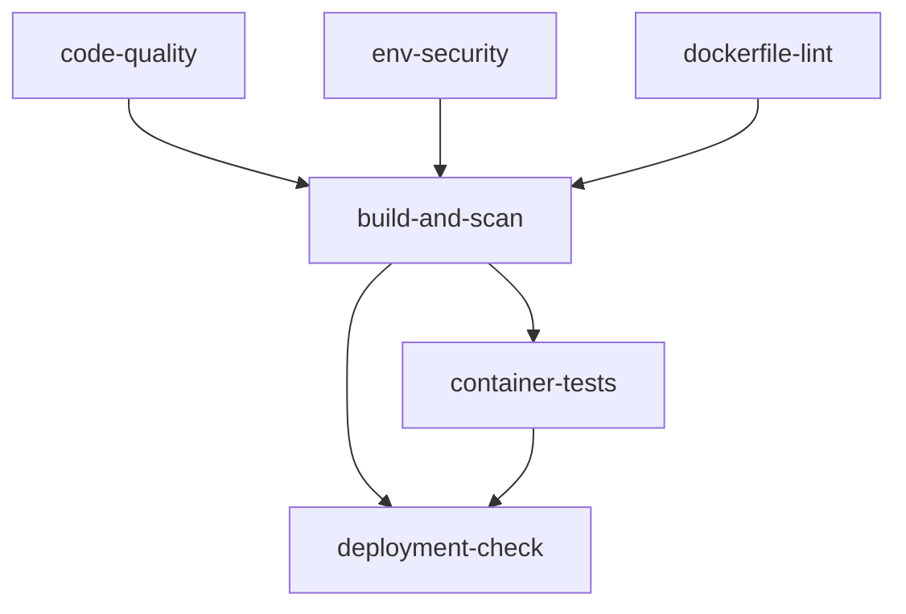

# GitHub Actions CI/CD Workflows

This project provides multiple GitHub Actions workflows for different deployment scenarios, with optimized performance and security features.

## 📋 Available Workflows

### 1. GitHub Container Registry Pipeline (`.github/workflows/ci-cd.yml`)

**Purpose**: Deploy to GitHub Container Registry (GHCR) for open-source projects or GitHub ecosystem integration.

**Trigger Conditions:**
- Push to `main` or `develop` branches
- Pull Request to `main` branch
- Scheduled security scan every Sunday at 2 AM UTC

**Job Structure:**


### 2. AWS ECR Pipeline (`.github/workflows/build-push-ecr.yml`)

**Purpose**: Deploy to AWS Elastic Container Registry (ECR) using secure STS authentication.

**Trigger Conditions:**
- Push to `main`, `develop` branches
- Tags starting with `v` (e.g., `v1.0.0`)
- Pull Request to `main` branch

**Security Features:**
- ✅ AWS STS authentication (no long-term credentials)
- ✅ OIDC integration between GitHub and AWS
- ✅ Minimal IAM permissions
- ✅ Multi-architecture builds (AMD64/ARM64)

### 3. Security Scan (`.github/workflows/security-scan.yml`)

**Purpose**: Periodic security scanning and vulnerability assessment.

**Features:**
- Container vulnerability scanning with Trivy
- Secret detection with TruffleHog
- Dependency security audit
- Automated security reporting

## 🚀 AWS ECR Setup Guide

### Prerequisites

- AWS Account with ECR access
- GitHub repository with Actions enabled
- AWS CLI installed and configured (for setup)

### Step 1: Automated AWS Resource Setup

Use the provided setup script to create all necessary AWS resources:

```bash
# Make script executable
chmod +x scripts/setup-aws-github-actions.sh

# Run interactive setup
./scripts/setup-aws-github-actions.sh
```

The script will create:
- GitHub OIDC Provider in AWS IAM
- IAM Role for GitHub Actions
- IAM Policy with ECR permissions
- ECR Repository with security scanning enabled

### Step 2: Manual AWS Resource Setup (Alternative)

If you prefer manual setup, follow these steps:

#### Create GitHub OIDC Provider

```bash
# Create OIDC Provider (one-time setup per AWS account)
aws iam create-open-id-connect-provider \
  --url https://token.actions.githubusercontent.com \
  --client-id-list sts.amazonaws.com \
  --thumbprint-list 6938fd4d98bab03faadb97b34396831e3780aea1
```

#### Create IAM Role

```bash
# Create trust policy file
cat > github-actions-trust-policy.json << EOF
{
  "Version": "2012-10-17",
  "Statement": [
    {
      "Effect": "Allow",
      "Principal": {
        "Federated": "arn:aws:iam::YOUR_ACCOUNT_ID:oidc-provider/token.actions.githubusercontent.com"
      },
      "Action": "sts:AssumeRole",
      "Condition": {
        "StringEquals": {
          "token.actions.githubusercontent.com:aud": "sts.amazonaws.com"
        },
        "StringLike": {
          "token.actions.githubusercontent.com:sub": "repo:YOUR_GITHUB_USERNAME/YOUR_REPO_NAME:*"
        }
      }
    }
  ]
}
EOF

# Create IAM Role
aws iam create-role \
  --role-name GitHubActions-ECR-Role \
  --assume-role-policy-document file://github-actions-trust-policy.json \
  --description "Role for GitHub Actions to push to ECR"
```

#### Create IAM Policy

```bash
# Create ECR permissions policy
cat > ecr-policy.json << EOF
{
  "Version": "2012-10-17",
  "Statement": [
    {
      "Effect": "Allow",
      "Action": [
        "ecr:GetAuthorizationToken"
      ],
      "Resource": "*"
    },
    {
      "Effect": "Allow",
      "Action": [
        "ecr:BatchCheckLayerAvailability",
        "ecr:GetDownloadUrlForLayer",
        "ecr:BatchGetImage",
        "ecr:InitiateLayerUpload",
        "ecr:UploadLayerPart",
        "ecr:CompleteLayerUpload",
        "ecr:PutImage",
        "ecr:StartImageScan",
        "ecr:DescribeImageScanFindings",
        "ecr:DescribeImages",
        "ecr:DescribeRepositories"
      ],
      "Resource": "arn:aws:ecr:*:YOUR_ACCOUNT_ID:repository/YOUR_ECR_REPO_NAME"
    }
  ]
}
EOF

# Create and attach policy
aws iam create-policy \
  --policy-name GitHubActions-ECR-Policy \
  --policy-document file://ecr-policy.json

aws iam attach-role-policy \
  --role-name GitHubActions-ECR-Role \
  --policy-arn arn:aws:iam::YOUR_ACCOUNT_ID:policy/GitHubActions-ECR-Policy
```

#### Create ECR Repository

```bash
# Create ECR repository
aws ecr create-repository \
  --repository-name claude-to-azure-proxy \
  --region us-east-1 \
  --image-scanning-configuration scanOnPush=true \
  --encryption-configuration encryptionType=AES256

# Set lifecycle policy to manage image retention
cat > lifecycle-policy.json << EOF
{
  "rules": [
    {
      "rulePriority": 1,
      "description": "Keep last 10 images",
      "selection": {
        "tagStatus": "tagged",
        "countType": "imageCountMoreThan",
        "countNumber": 10
      },
      "action": {
        "type": "expire"
      }
    },
    {
      "rulePriority": 2,
      "description": "Delete untagged images older than 1 day",
      "selection": {
        "tagStatus": "untagged",
        "countType": "sinceImagePushed",
        "countUnit": "days",
        "countNumber": 1
      },
      "action": {
        "type": "expire"
      }
    }
  ]
}
EOF

aws ecr put-lifecycle-policy \
  --repository-name claude-to-azure-proxy \
  --lifecycle-policy-text file://lifecycle-policy.json
```

### Step 3: Configure GitHub Repository

In your GitHub repository, go to **Settings > Secrets and variables > Actions** and add these **Repository Secrets**:

| Secret Name | Description | Example Value |
|-------------|-------------|---------------|
| `AWS_REGION` | AWS region for ECR | `us-east-1` |
| `AWS_ROLE_ARN` | IAM Role ARN for GitHub Actions | `arn:aws:iam::123456789012:role/GitHubActions-ECR-Role` |
| `ECR_REPOSITORY_NAME` | ECR repository name | `claude-to-azure-proxy` |

**Optional Secrets:**
| Secret Name | Description |
|-------------|-------------|
| `CODECOV_TOKEN` | Codecov token for coverage reports |

> **Security Note**: All AWS-related configuration is stored as Repository Secrets to ensure sensitive information like Role ARNs are properly protected. Even though some values like region names are not highly sensitive, using secrets provides consistency and better security practices.

### Step 4: Verify Setup

Use the verification script to ensure everything is configured correctly:

```bash
# Run verification
./scripts/verify-aws-setup.sh

# With custom parameters
./scripts/verify-aws-setup.sh \
  --role-name GitHubActions-ECR-Role \
  --repo-name claude-to-azure-proxy \
  --region us-east-1
```

## 🔄 Workflow Details

### ECR Pipeline Jobs

#### `test`
- Node.js 22 environment setup
- pnpm dependency installation
- ESLint linting
- TypeScript type checking
- Unit tests with coverage
- Coverage upload to Codecov

#### `build`
- Docker Buildx setup
- Multi-platform image build (AMD64/ARM64)
- Trivy security scanning
- Container functionality testing
- Security scan results upload

#### `push-ecr` (Production branches only)
- AWS STS authentication via OIDC
- ECR login and authentication
- Multi-architecture image push
- ECR vulnerability scan initiation
- Deployment information output

#### `notify`
- Deployment status summary
- Success/failure notifications
- Deployment readiness confirmation

### Supported Tag Strategies

The ECR workflow supports multiple tagging strategies:

| Git Reference | Generated Tags | Description |
|---------------|----------------|-------------|
| `main` branch | `latest`, `main-<sha>`, `YYYY-MM-DD-HHmmss` | Production releases |
| `develop` branch | `develop-<sha>`, `YYYY-MM-DD-HHmmss` | Development builds |
| `v1.2.3` tag | `1.2.3`, `1.2`, `latest` | Semantic versioning |
| Feature branch | `feature-name-<sha>` | Feature development |

### Container Registry Comparison

| Feature | GitHub Container Registry | AWS ECR |
|---------|---------------------------|---------|
| **Cost** | Free for public repos | Pay per GB stored |
| **Security** | Basic scanning | Advanced scanning + compliance |
| **Integration** | GitHub ecosystem | AWS ecosystem |
| **Performance** | Global CDN | Regional, faster in AWS |
| **Authentication** | GitHub tokens | IAM roles, more secure |
| **Use Case** | Open source, GitHub-centric | Production, AWS-native |

## 🏷️ Version Release Workflow

### Semantic Versioning

Create and push version tags to trigger automated releases:

```bash
# Create a new version tag
git tag v1.0.0
git push origin v1.0.0

# This triggers the ECR workflow and creates multiple tags:
# - v1.0.0
# - 1.0.0  
# - 1.0
# - latest (if this is the newest version)
```

### Development Releases

```bash
# Push to develop branch
git push origin develop

# Creates development build with tags:
# - develop-<git-sha>
# - YYYY-MM-DD-HHmmss timestamp
```

## 🔍 Local Testing and Development

### Pre-commit Checks

Run the same checks locally before pushing:

```bash
# Install dependencies
pnpm install

# Run all quality checks
pnpm run quality:all

# Run security checks  
pnpm run security:all

# Type checking
pnpm run type-check

# Test with coverage
pnpm run test:coverage

# Build Docker image locally
docker build -t claude-proxy:local .

# Test container locally
docker run -d -p 8080:8080 \
  -e PROXY_API_KEY=test-key-32-characters-long \
  -e AZURE_OPENAI_ENDPOINT=https://test.openai.azure.com \
  -e AZURE_OPENAI_API_KEY=test-key \
  -e AZURE_OPENAI_MODEL=test-model \
  claude-proxy:local
```

### Local AWS Testing

Test AWS ECR authentication locally:

```bash
# Test STS assume role
aws sts assume-role \
  --role-arn arn:aws:iam::YOUR_ACCOUNT_ID:role/GitHubActions-ECR-Role \
  --role-session-name test-session

# Test ECR login
aws ecr get-login-password --region us-east-1 | \
  docker login --username AWS --password-stdin YOUR_ACCOUNT_ID.dkr.ecr.us-east-1.amazonaws.com

# Test image push
docker tag claude-proxy:local YOUR_ACCOUNT_ID.dkr.ecr.us-east-1.amazonaws.com/claude-to-azure-proxy:test
docker push YOUR_ACCOUNT_ID.dkr.ecr.us-east-1.amazonaws.com/claude-to-azure-proxy:test
```

## 🚨 Troubleshooting

### Common GitHub Actions Issues

#### 1. AWS STS Authentication Failure

**Error**: `Error: Could not assume role with OIDC`

**Solutions**:
- Verify `AWS_ROLE_ARN` variable is correct
- Check OIDC Provider exists in AWS IAM
- Ensure IAM Role trust policy includes correct GitHub repository path
- Verify repository name format: `owner/repository`

#### 2. ECR Push Permission Denied

**Error**: `denied: User is not authorized to perform ecr:InitiateLayerUpload`

**Solutions**:
- Check IAM Policy includes all required ECR permissions
- Verify ECR repository exists in the specified region
- Ensure AWS region matches in all configurations
- Check IAM Role has the policy attached

#### 3. Docker Build Failures

**Error**: `failed to solve: process "/bin/sh -c pnpm run build" did not complete successfully`

**Solutions**:
- Test Docker build locally first
- Check Dockerfile syntax and commands
- Verify all dependencies are available
- Review build logs for specific error messages

#### 4. Test Failures in CI

**Error**: Tests pass locally but fail in GitHub Actions

**Solutions**:
- Check Node.js version consistency
- Verify environment variables in test environment
- Review test timeouts and async operations
- Check for race conditions in tests

### Performance Optimization

#### Build Speed Improvements

- **GitHub Actions Cache**: Automatically caches Docker layers and pnpm dependencies
- **Parallel Jobs**: Independent jobs run in parallel for faster feedback
- **Conditional Execution**: ECR push only runs for production branches
- **Multi-stage Builds**: Optimized Docker builds with layer caching

#### Resource Usage

- **Memory Limits**: Containers run with appropriate memory constraints
- **CPU Optimization**: Multi-architecture builds use efficient build strategies
- **Network Optimization**: Minimal external dependencies during build

### Monitoring and Alerts

#### GitHub Actions Monitoring

- **Actions Tab**: Monitor workflow execution status
- **Security Tab**: Review security scan results
- **Insights**: Analyze workflow performance and success rates

#### AWS ECR Monitoring

```bash
# Check ECR repository status
aws ecr describe-repositories --repository-names claude-to-azure-proxy

# View recent images
aws ecr describe-images \
  --repository-name claude-to-azure-proxy \
  --max-items 10

# Check scan results
aws ecr describe-image-scan-findings \
  --repository-name claude-to-azure-proxy \
  --image-id imageTag=latest
```

#### Automated Notifications

Set up notifications for workflow failures:

```yaml
# Add to workflow for Slack notifications
- name: Notify on failure
  if: failure()
  uses: 8398a7/action-slack@v3
  with:
    status: failure
    webhook_url: ${{ secrets.SLACK_WEBHOOK }}
```

## 🔐 Security Best Practices

### GitHub Actions Security

1. **Use STS Instead of Long-term Credentials**
   - ✅ OIDC with IAM Roles
   - ❌ AWS Access Keys in Secrets

2. **Minimal Permissions**
   - Only grant necessary ECR permissions
   - Restrict resource access with ARN patterns
   - Use separate roles for different environments

3. **Secret Management**
   - Store sensitive data in GitHub Secrets
   - Use Variables for non-sensitive configuration
   - Rotate credentials regularly

4. **Workflow Security**
   - Pin action versions to specific commits
   - Review third-party actions before use
   - Enable branch protection rules

### Container Security

1. **Image Scanning**
   - Trivy scans for vulnerabilities
   - ECR native scanning enabled
   - Fail builds on critical vulnerabilities

2. **Runtime Security**
   - Non-root user execution
   - Minimal base images
   - Security context restrictions

3. **Supply Chain Security**
   - Dependency scanning
   - License compliance checking
   - SBOM (Software Bill of Materials) generation

## 📚 Additional Resources

### AWS Documentation
- [IAM Roles for GitHub Actions](https://docs.github.com/en/actions/deployment/security-hardening-your-deployments/configuring-openid-connect-in-amazon-web-services)
- [Amazon ECR User Guide](https://docs.aws.amazon.com/ecr/latest/userguide/)
- [AWS App Runner Developer Guide](https://docs.aws.amazon.com/apprunner/latest/dg/)

### GitHub Actions Documentation
- [GitHub Actions Documentation](https://docs.github.com/en/actions)
- [Docker Build and Push Action](https://github.com/docker/build-push-action)
- [AWS Actions](https://github.com/aws-actions)

### Security Resources
- [GitHub Security Best Practices](https://docs.github.com/en/actions/security-guides)
- [Container Security Best Practices](https://docs.docker.com/develop/security-best-practices/)
- [AWS Security Best Practices](https://aws.amazon.com/architecture/security-identity-compliance/)

### Related Documentation
- [Deployment Guide](./DEPLOYMENT_GUIDE.md) - Comprehensive deployment instructions
- [Security Guide](../SECURITY.md) - Security configuration and best practices
- [Troubleshooting Guide](./TROUBLESHOOTING.md) - Common issues and solutions