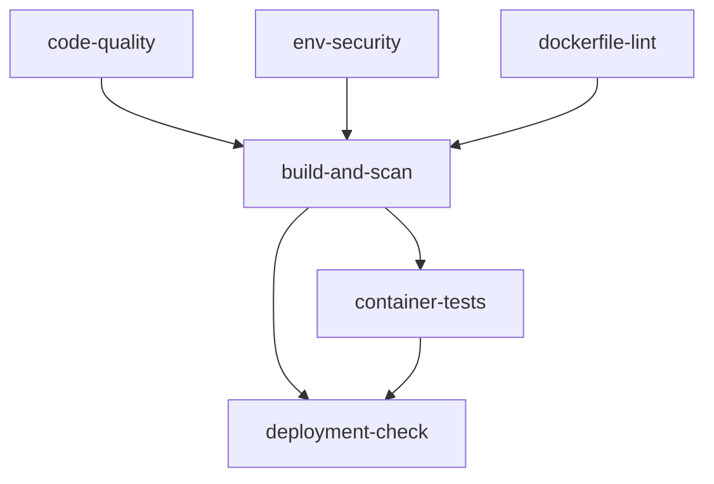

# GitHub Actions 工作流程

本项目使用优化的 GitHub Actions 工作流程，消除了重复操作并提高了效率。

## 工作流程概览

### 1. CI/CD Pipeline (`.github/workflows/ci-cd.yml`)

**触发条件：**
- Push 到 `main` 或 `develop` 分支
- Pull Request 到 `main` 分支
- 每周日凌晨 2 点定时运行

**Jobs 结构：**



#### Job 详情：

**`code-quality`**
- Node.js 环境设置和依赖安装
- ESLint 代码检查
- TypeScript 类型检查
- 单元测试和覆盖率报告
- 上传覆盖率到 Codecov

**`env-security`**
- 检查 `.env` 文件安全配置
- 验证 `.gitignore` 和 `.dockerignore`
- 确保敏感文件不被提交

**`dockerfile-lint`**
- 使用 Hadolint 检查 Dockerfile 语法
- 验证 Docker 最佳实践

**`build-and-scan`**
- 构建多架构 Docker 镜像 (amd64/arm64)
- 使用 Trivy 进行漏洞扫描
- 推送镜像到 GitHub Container Registry
- 上传安全扫描结果到 GitHub Security

**`container-tests`**
- 验证容器以非 root 用户运行
- 测试健康检查端点
- 检查镜像大小和层数优化
- 测试容器启动时间

**`deployment-check`** (仅在 main 分支)
- 验证 `apprunner.yaml` 配置
- 检查部署文档完整性
- 提供部署就绪状态报告

### 2. Security Scan (`.github/workflows/security-scan.yml`)

**触发条件：**
- 每日凌晨 3 点定时运行
- 手动触发

**功能：**
- 全面的容器漏洞扫描
- 代码库密钥检测 (TruffleHog)
- 依赖项安全审计
- 定期安全状态报告

## 优化改进

### 消除的重复操作

1. **Docker 构建优化**
   - 旧版本：构建两次（扫描 + 推送）
   - 新版本：一次构建，多次使用

2. **Trivy 扫描优化**
   - 旧版本：两次独立扫描
   - 新版本：一次扫描，两种输出格式

3. **Job 依赖优化**
   - 并行执行独立检查
   - 串行执行依赖任务
   - 失败快速反馈

### 新增功能

1. **代码质量检查**
   - TypeScript 类型检查
   - 测试覆盖率报告
   - 代码复杂度分析

2. **容器测试增强**
   - 启动时间测试
   - 镜像效率分析
   - 多架构支持

3. **部署就绪检查**
   - App Runner 配置验证
   - 文档完整性检查
   - 部署状态报告

4. **安全扫描分离**
   - 独立的定期安全扫描
   - 密钥泄露检测
   - 依赖项漏洞监控

## 使用指南

### 本地开发

```bash
# 运行所有质量检查
pnpm run quality:all

# 运行安全检查
pnpm run security:all

# 类型检查
pnpm run type-check

# 测试覆盖率
pnpm run test:coverage
```

### CI/CD 状态检查

- **绿色 ✅**: 所有检查通过，可以部署
- **黄色 ⚠️**: 有警告但不阻塞部署
- **红色 ❌**: 有错误，需要修复后才能部署

### 安全报告

- 查看 **Security** 标签页获取详细的安全扫描结果
- Trivy 扫描结果会自动上传到 GitHub Security
- 密钥扫描结果会在 Actions 日志中显示

## 故障排除

### 常见问题

1. **pnpm 安装失败**
   - 检查 `package.json` 中的 `packageManager` 字段
   - 确保使用正确的 pnpm 版本

2. **Docker 构建失败**
   - 检查 Dockerfile 语法
   - 验证多架构构建支持

3. **测试失败**
   - 检查测试环境配置
   - 确保所有依赖项已安装

4. **安全扫描警告**
   - 查看 Security 标签页的详细报告
   - 更新有漏洞的依赖项

### 性能优化

- 使用 GitHub Actions 缓存加速构建
- 并行执行独立任务
- 智能跳过不必要的步骤
- 多架构构建优化

## 监控和维护

- 定期检查 Actions 运行状态
- 监控安全扫描结果
- 更新依赖项和 Actions 版本
- 优化构建时间和资源使用