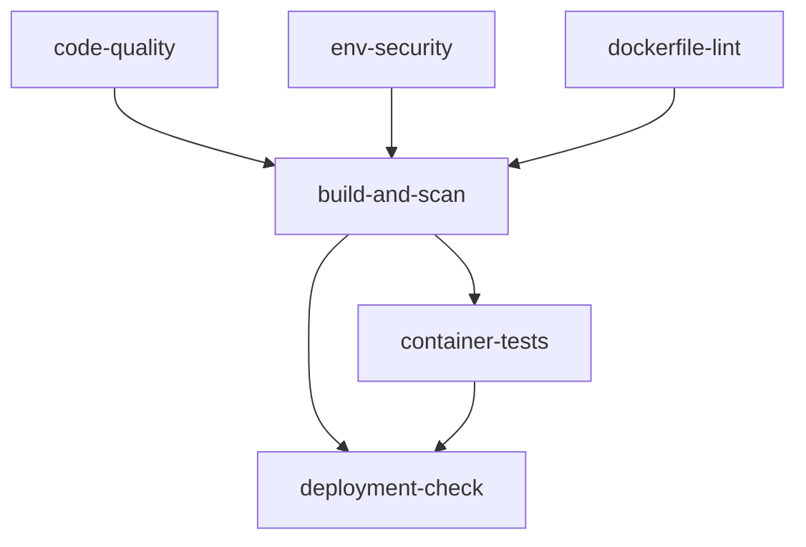

# GitHub Actions Workflows

This project uses optimized GitHub Actions workflows that eliminate redundant operations and improve efficiency.

## Workflow Overview

### 1. CI/CD Pipeline (`.github/workflows/ci-cd.yml`)

**Trigger Conditions:**
- Push to `main` or `develop` branches
- Pull Request to `main` branch
- Scheduled run every Sunday at 2 AM UTC

**Job Structure:**



#### Job Details:

**`code-quality`**
- Node.js environment setup and dependency installation
- ESLint code linting
- TypeScript type checking
- Unit tests and coverage reporting
- Upload coverage to Codecov

**`env-security`**
- Check `.env` file security configuration
- Validate `.gitignore` and `.dockerignore`
- Ensure sensitive files are not committed

**`dockerfile-lint`**
- Use Hadolint to check Dockerfile syntax
- Validate Docker best practices

**`build-and-scan`**
- Build multi-architecture Docker images (amd64/arm64)
- Vulnerability scanning with Trivy
- Push images to GitHub Container Registry
- Upload security scan results to GitHub Security

**`container-tests`**
- Verify container runs as non-root user
- Test health check endpoints
- Check image size and layer optimization
- Test container startup time

**`deployment-check`** (main branch only)
- Validate `apprunner.yaml` configuration
- Check deployment documentation completeness
- Provide deployment readiness report

### 2. Security Scan (`.github/workflows/security-scan.yml`)

**Trigger Conditions:**
- Scheduled run daily at 3 AM UTC
- Manual trigger

**Features:**
- Comprehensive container vulnerability scanning
- Repository secret detection (TruffleHog)
- Dependency security audit
- Regular security status reporting

## Optimization Improvements

### Eliminated Redundant Operations

1. **Docker Build Optimization**
   - Old version: Build twice (scan + push)
   - New version: Build once, use multiple times

2. **Trivy Scan Optimization**
   - Old version: Two independent scans
   - New version: One scan, two output formats

3. **Job Dependency Optimization**
   - Parallel execution of independent checks
   - Serial execution of dependent tasks
   - Fast failure feedback

### New Features

1. **Code Quality Checks**
   - TypeScript type checking
   - Test coverage reporting
   - Code complexity analysis

2. **Enhanced Container Testing**
   - Startup time testing
   - Image efficiency analysis
   - Multi-architecture support

3. **Deployment Readiness Checks**
   - App Runner configuration validation
   - Documentation completeness check
   - Deployment status reporting

4. **Separated Security Scanning**
   - Independent periodic security scans
   - Secret leak detection
   - Dependency vulnerability monitoring

## Usage Guide

### Local Development

```bash
# Run all quality checks
pnpm run quality:all

# Run security checks
pnpm run security:all

# Type checking
pnpm run type-check

# Test coverage
pnpm run test:coverage
```

### CI/CD Status Checks

- **Green ✅**: All checks passed, ready to deploy
- **Yellow ⚠️**: Warnings present but deployment not blocked
- **Red ❌**: Errors present, must fix before deployment

### Security Reports

- Check the **Security** tab for detailed security scan results
- Trivy scan results are automatically uploaded to GitHub Security
- Secret scan results are displayed in Actions logs

## Troubleshooting

### Common Issues

1. **pnpm Installation Failure**
   - Check the `packageManager` field in `package.json`
   - Ensure correct pnpm version is used

2. **Docker Build Failure**
   - Check Dockerfile syntax
   - Verify multi-architecture build support

3. **Test Failures**
   - Check test environment configuration
   - Ensure all dependencies are installed

4. **Security Scan Warnings**
   - Review detailed reports in Security tab
   - Update vulnerable dependencies

### Performance Optimization

- Use GitHub Actions cache to accelerate builds
- Parallel execution of independent tasks
- Smart skipping of unnecessary steps
- Multi-architecture build optimization

## Monitoring and Maintenance

- Regularly check Actions execution status
- Monitor security scan results
- Update dependencies and Actions versions
- Optimize build time and resource usage